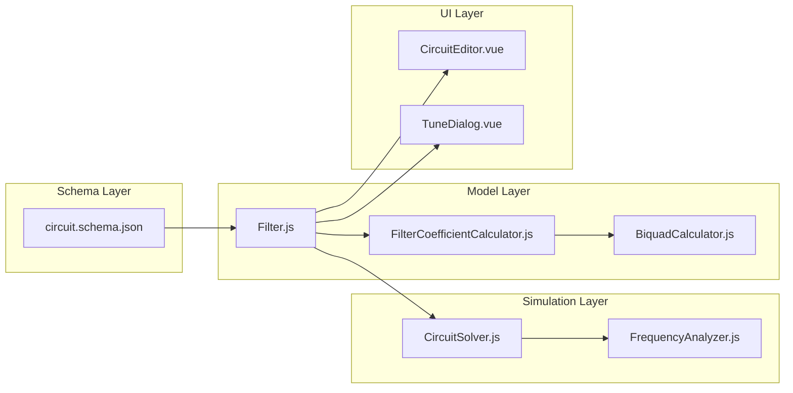
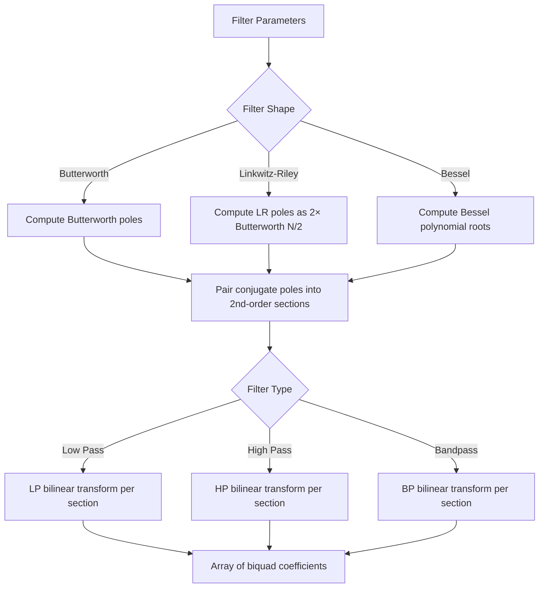

# Design Document: Active Filter

## Overview

The Active Filter is a DSP-based component that implements classic analog filter shapes (Butterworth, Linkwitz-Riley, Bessel) as cascaded biquad sections within the crossover network simulator. Like the existing PEQ component, it operates as a **Voltage-Controlled Voltage Source (VCVS)** in the MNA framework, with a complex transfer function H(f) evaluated at each simulation frequency.

Key differences from PEQ:
- **Higher-level interface**: User specifies filter shape, type, order, and turn frequency rather than individual biquad sections
- **Automatic pole computation**: A new `FilterCoefficientCalculator` module computes cascaded biquad coefficients from analog prototype poles
- **High-order support**: Orders 1–40, decomposed into cascaded 2nd-order sections
- **Rendering**: Displays "H(f)" inside the triangle symbol instead of "PEQ"
- **Shared "A" label prefix**: Both PEQ and Filter share the same label counter (A0, A1, A2, ...)

The component shares the same 4-terminal differential layout (+in, -in, +out, -out) and VCVS solver integration as PEQ. The solver stamps are identical — only the transfer function computation differs.

## Architecture

### High-Level Data Flow

```mermaid
graph TD
    A[User edits Filter parameters in TuneDialog] --> B[Vuex store dispatches updateComponentTuning]
    B --> C[Filter.evaluateTransferFunction called per frequency]
    C --> D[FilterCoefficientCalculator computes biquad sections]
    D --> E[BiquadCalculator.evaluateTransferFunction per section]
    E --> F[Product of all section H(z) × gain × delay]
    F --> G[CircuitSolver stamps VCVS into MNA matrix]
    G --> H[Solve MNA system via LU decomposition]
    H --> I[FrequencyAnalyzer calculates SPL/phase]
    I --> J[Graph renders updated frequency response]
```

### Component Integration Points



### VCVS MNA Stamping (Identical to PEQ)

The Active Filter uses the same VCVS stamping as PEQ. For gain `G = H(f)`:

- **Input terminals**: +in (node `ni+`), -in (node `ni-`)
- **Output terminals**: +out (node `no+`), -out (node `no-`)
- **Constraint**: V(no+) - V(no-) = G × [V(ni+) - V(ni-)]

MNA stamps (one extra row/column for branch current `I_vcvs`):

| Row/Col | no+ | no- | ni+ | ni- | I_vcvs |
|---------|-----|-----|-----|-----|--------|
| no+     |     |     |     |     | +1     |
| no-     |     |     |     |     | -1     |
| I_vcvs  | +1  | -1  | -G  | +G  |        |

The solver already handles this via `stampPEQ()`. The Filter component simply needs to implement `evaluateTransferFunction(frequency)` returning `{ re, im }`, and the solver will treat it identically to PEQ.

### Coefficient Computation Pipeline



## Components and Interfaces

### New Files

| File | Purpose |
|------|---------|
| `src/models/Filter.js` | Filter component model extending Component |
| `src/simulation/FilterCoefficientCalculator.js` | Pole computation and biquad coefficient generation for Butterworth/LR/Bessel |

### Modified Files

| File | Changes |
|------|---------|
| `server/schemas/circuit.schema.json` | Add "filter" type, `filterParameters` definition, conditional validation |
| `src/simulation/CircuitSolver.js` | Add Filter to VCVS handling (same path as PEQ) |
| `src/renderer/components/CircuitEditor.vue` | Add `renderFilter()` method, update label assignment to share "A" prefix |
| `src/renderer/components/TuneDialog.vue` | Add Filter parameter editing section |
| `src/models/Circuit.js` | Import Filter in `fromJSON` for deserialization |

### Key Interfaces

#### FilterCoefficientCalculator

```javascript
class FilterCoefficientCalculator {
  /**
   * Compute cascaded biquad coefficients for a filter.
   * @param {Object} params - { filterShape, filterType, filterOrder, turnFrequency }
   * @param {number} dspRate - Sample rate in Hz
   * @returns {{ sections: Array<{ b0, b1, b2, a1, a2 }> }} Array of biquad coefficients
   */
  static computeFilterCoefficients(params, dspRate) {}

  /**
   * Compute Butterworth analog prototype poles for order N.
   * Poles at angles θ_k = π(2k + N - 1) / (2N) for k = 1..N on unit circle.
   * @param {number} order - Filter order (1–40)
   * @returns {Array<{ re: number, im: number }>} Analog prototype poles (left half-plane only)
   */
  static computeButterworthPoles(order) {}

  /**
   * Compute Linkwitz-Riley analog prototype poles for order N.
   * Equivalent to two cascaded Butterworth filters of order N/2.
   * @param {number} order - Filter order (must be even, 2–40)
   * @returns {Array<{ re: number, im: number }>} Analog prototype poles (doubled Butterworth N/2)
   */
  static computeLinkwitzRileyPoles(order) {}

  /**
   * Compute Bessel analog prototype poles for order N.
   * Poles from roots of reverse Bessel polynomial of degree N.
   * @param {number} order - Filter order (1–40)
   * @returns {Array<{ re: number, im: number }>} Analog prototype poles
   */
  static computeBesselPoles(order) {}

  /**
   * Convert analog prototype poles to digital biquad coefficients
   * using bilinear transform with frequency pre-warping.
   * @param {Array<{ re: number, im: number }>} poles - Analog prototype poles
   * @param {string} filterType - "lowPass", "highPass", or "bandpass"
   * @param {number} turnFrequency - Turn frequency in Hz
   * @param {number} dspRate - Sample rate in Hz
   * @returns {Array<{ b0, b1, b2, a1, a2 }>} Digital biquad coefficients
   */
  static convertPolesToBiquads(poles, filterType, turnFrequency, dspRate) {}
}
```

#### Filter Model

```javascript
class Filter extends Component {
  constructor(x, y) {}

  /**
   * Evaluate the combined transfer function at a frequency.
   * Computes cascaded biquad sections via FilterCoefficientCalculator,
   * then evaluates each via BiquadCalculator.evaluateTransferFunction.
   * @param {number} frequency - Hz
   * @returns {{ re: number, im: number }} Complex transfer function value
   */
  evaluateTransferFunction(frequency) {}

  validate() {}
  toJSON() {}
  static fromJSON(json) {}
}
```

## Data Models

### Filter Parameters Schema

```json
{
  "filterParameters": {
    "type": "object",
    "required": ["filterShape", "filterType", "filterOrder", "turnFrequency", "gain", "delay", "muted"],
    "properties": {
      "filterShape": {
        "type": "string",
        "enum": ["butterworth", "linkwitzRiley", "bessel"],
        "description": "Filter shape determining pole placement"
      },
      "filterType": {
        "type": "string",
        "enum": ["lowPass", "highPass", "bandpass"],
        "description": "Filter passband type"
      },
      "filterOrder": {
        "type": "integer",
        "minimum": 1,
        "maximum": 40,
        "description": "Filter order (steepness)"
      },
      "turnFrequency": {
        "type": "number",
        "exclusiveMinimum": 0,
        "description": "Corner/crossover frequency in Hz"
      },
      "gain": {
        "type": "number",
        "description": "Global gain in dB"
      },
      "delay": {
        "type": "number",
        "minimum": 0,
        "description": "Signal delay in seconds"
      },
      "muted": {
        "type": "boolean",
        "description": "Mute flag"
      }
    }
  }
}
```

### Filter Default Parameters

```javascript
{
  filterShape: 'butterworth',
  filterType: 'lowPass',
  filterOrder: 2,
  turnFrequency: 1000,  // Hz
  gain: 0,              // dB
  delay: 0,             // seconds
  muted: false
}
```

### Terminal Layout (Same as PEQ)

```
Terminal 0: +in  → { x: -2, y: -2 }  (top-left)
Terminal 1: -in  → { x: -2, y:  2 }  (bottom-left)
Terminal 2: +out → { x:  2, y: -2 }  (top-right)
Terminal 3: -out → { x:  2, y:  2 }  (bottom-right)
```

### Pole Computation Formulas

#### Butterworth Order N

Poles are equally spaced on the left half of the unit circle in the s-plane:

```
θ_k = π × (2k + N - 1) / (2N)    for k = 1, 2, ..., N

s_k = -sin(θ_k) + j × cos(θ_k)   (left half-plane)
```

For even N, poles come in conjugate pairs. For odd N, there is one real pole at s = -1 plus (N-1)/2 conjugate pairs.

#### Linkwitz-Riley Order N (N must be even)

Equivalent to two cascaded Butterworth filters of order N/2. The poles are the Butterworth N/2 poles, each with multiplicity 2:

```
LR_poles(N) = Butterworth_poles(N/2) ∪ Butterworth_poles(N/2)
```

This produces N poles total (N/2 unique pole positions, each doubled).

#### Bessel Order N

Poles are the roots of the reverse Bessel polynomial of degree N. The reverse Bessel polynomial θ_n(s) is defined recursively:

```
θ_0(s) = 1
θ_1(s) = s + 1
θ_n(s) = (2n - 1) × θ_{n-1}(s) + s² × θ_{n-2}(s)
```

The poles are found by computing the roots of θ_N(s). For numerical stability at high orders, the Aberth-Ehrlich method or companion matrix eigenvalue approach is used.

**Known Bessel poles for low orders** (used as reference/validation):
- Order 1: s = -1
- Order 2: s = -1.1016 ± j0.6368
- Order 3: s = -1.3226, s = -1.0474 ± j0.9992
- Order 4: s = -1.3700 ± j0.4102, s = -0.9953 ± j1.2571

### Bilinear Transform (Analog → Digital)

For each analog 2nd-order section with poles at s = σ ± jω, the analog transfer function is:

```
H_a(s) = ω_n² / (s² - 2σs + (σ² + ω²))
```

where ω_n² = σ² + ω² (normalized to unity DC gain for low-pass).

The bilinear transform with pre-warping at turn frequency f_c:

```
K = tan(π × f_c / dspRate)

s → (1/K) × (z - 1) / (z + 1)
```

For a **low-pass** 2nd-order section with analog poles at s = σ ± jω (normalized to unit circle):

```
// Pre-warp and scale poles
σ_w = σ × K
ω_w = ω × K

// Denominator: (z-1)² + 2|σ_w|(z²-1) + (σ_w² + ω_w²)(z+1)²
// After expansion and normalization:
a0 = 1 + 2×|σ_w| + (σ_w² + ω_w²)    [normalization factor]
a1 = (2×(σ_w² + ω_w²) - 2) / a0
a2 = (1 - 2×|σ_w| + (σ_w² + ω_w²)) / a0

b0 = K² / a0                           [for low-pass]
b1 = 2 × K² / a0
b2 = K² / a0
```

For a **high-pass** 2nd-order section, apply the LP→HP transform s → ω_c/s before bilinear:

```
b0 = 1 / a0                            [for high-pass]
b1 = -2 / a0
b2 = 1 / a0
```

For a **bandpass** 2nd-order section, the LP prototype is transformed using s → (s² + ω_c²) / (s × BW), which doubles the order. Each 2nd-order LP section becomes a 4th-order BP section (two biquads).

For a **first-order section** (odd-order filters have one real pole at s = -p):

```
// Low-pass first-order:
K = tan(π × f_c / dspRate)
p_w = p × K

b0 = p_w / (1 + p_w)
b1 = p_w / (1 + p_w)
b2 = 0
a1 = (p_w - 1) / (1 + p_w)
a2 = 0

// High-pass first-order:
b0 = 1 / (1 + p_w)
b1 = -1 / (1 + p_w)
b2 = 0
a1 = (p_w - 1) / (1 + p_w)
a2 = 0
```

### Transfer Function Evaluation

The Filter's combined transfer function at frequency f:

```
H(f) = G × e^(-j×2π×f×delay) × ∏ H_section_i(f)
```

where:
- G = 10^(gain_dB / 20)
- The product is over all biquad sections computed by FilterCoefficientCalculator
- Each H_section_i(f) is evaluated via BiquadCalculator.evaluateTransferFunction(coeffs, f, dspRate)

If `muted = true`, H(f) = 0 for all f.

### Coefficient Caching Strategy

Since filter parameters change infrequently (only on user edit), the biquad coefficients are cached on the Filter instance:

```javascript
// In Filter.evaluateTransferFunction(frequency):
if (this._cachedCoefficients === null || this._parametersDirty) {
  this._cachedCoefficients = FilterCoefficientCalculator.computeFilterCoefficients(
    this.parameters, this.parameters.dspRate || 48000
  );
  this._parametersDirty = false;
}
```

The cache is invalidated when any parameter changes (detected via a dirty flag set in the TuneDialog update path).

### Label Assignment (Shared "A" Prefix)

The existing label assignment logic in `CircuitEditor.vue` assigns labels based on component type:

```javascript
const prefix = {
  resistor: 'R', capacitor: 'C', inductor: 'L', speaker: 'S', peq: 'A',
}[componentType] || '';
```

This must be updated to include `filter: 'A'` and the counter must consider both `peq` and `filter` components when finding the next available number:

```javascript
const prefix = {
  resistor: 'R', capacitor: 'C', inductor: 'L', speaker: 'S', peq: 'A', filter: 'A',
}[componentType] || '';

// For shared "A" prefix, count across both peq and filter types
const typesToCount = prefix === 'A' ? ['peq', 'filter'] : [componentType];
const existingNumbers = circuit.components
  .filter((c) => typesToCount.includes(c.type) && c.label)
  .map((c) => {
    const match = c.label.match(new RegExp(`^${prefix}(\\d+)$`));
    return match ? parseInt(match[1], 10) : -1;
  })
  .filter((n) => n >= 0);
```

### CircuitSolver Integration

The solver already handles PEQ via `peqCurrentMap` and the `peqCache` array. The Filter component needs to be included in the same path. The minimal change is:

1. In `buildNodeMap()`: Include `filter` type alongside `peq` when assigning VCVS branch current indices
2. In `solveAllFrequencies()`: Include `filter` components in the `peqCache` array (since they have the same 4-terminal VCVS structure and `evaluateTransferFunction` interface)

Since both PEQ and Filter implement `evaluateTransferFunction(frequency) → { re, im }`, the solver code is polymorphic — no type-specific branching needed.

## Correctness Properties

*A property is a characteristic or behavior that should hold true across all valid executions of a system — essentially, a formal statement about what the system should do. Properties serve as the bridge between human-readable specifications and machine-verifiable correctness guarantees.*

### Property 1: Filter Serialization Round-Trip

*For any* valid Filter component instance with arbitrary parameters (filterShape, filterType, filterOrder 1–40, turnFrequency > 0, gain, delay ≥ 0, muted), serializing via `toJSON()` then deserializing via `fromJSON()` shall produce a Filter instance with identical parameters to the original.

**Validates: Requirements 2.10, 2.11, 2.12, 9.1, 9.2, 9.3**

### Property 2: Filter Validation Correctness

*For any* Filter parameter object, `validate()` shall return `valid: true` if and only if: filterShape is one of {butterworth, linkwitzRiley, bessel}, filterType is one of {lowPass, highPass, bandpass}, filterOrder is an integer 1–40 (and even when shape is linkwitzRiley), turnFrequency is positive, gain is finite, and delay is non-negative. Conversely, if any constraint is violated, `validate()` shall return `valid: false`.

**Validates: Requirements 2.4, 2.5, 2.6, 2.7, 2.8, 2.9**

### Property 3: Coefficient Numerical Stability

*For any* valid filter parameters (all three shapes, all three types, orders 1–40, turnFrequency between 1 Hz and 95% of Nyquist), the coefficient calculator shall produce biquad coefficients where every value (b0, b1, b2, a1, a2) is a finite number (no NaN or Infinity).

**Validates: Requirements 3.11**

### Property 4: Correct Biquad Section Decomposition

*For any* filter of order N, the coefficient calculator shall produce exactly ⌈N/2⌉ biquad sections: N/2 second-order sections when N is even, or (N-1)/2 second-order sections plus one first-order section when N is odd.

**Validates: Requirements 3.4, 3.5**

### Property 5: Low-Pass Filter DC Passthrough

*For any* low-pass filter (any shape, any order 1–40, any turn frequency between 20 Hz and 20 kHz with dspRate 48000), the magnitude of the transfer function at a frequency well below the turn frequency (f = turnFrequency / 100, minimum 1 Hz) shall be approximately unity (0 dB ± 0.1 dB).

**Validates: Requirements 3.6**

### Property 6: High-Pass Filter DC Blocking

*For any* high-pass filter (any shape, any order 1–40, any turn frequency between 20 Hz and 20 kHz with dspRate 48000), the magnitude of the transfer function at a frequency well below the turn frequency (f = turnFrequency / 100, minimum 1 Hz) shall be significantly attenuated (below -20 dB for order ≥ 2, below -10 dB for order 1).

**Validates: Requirements 3.7**

### Property 7: Butterworth -3 dB at Turn Frequency

*For any* Butterworth low-pass or high-pass filter (any order 1–40, any turn frequency between 20 Hz and 20 kHz with dspRate 48000), the magnitude at the turn frequency shall be approximately -3.01 dB (within ±0.5 dB tolerance to account for bilinear transform warping at high frequencies relative to Nyquist).

**Validates: Requirements 4.7**

### Property 8: Linkwitz-Riley -6 dB at Turn Frequency

*For any* Linkwitz-Riley low-pass or high-pass filter (any even order 2–40, any turn frequency between 20 Hz and 20 kHz with dspRate 48000), the magnitude at the turn frequency shall be approximately -6.02 dB (within ±0.5 dB tolerance).

**Validates: Requirements 4.8**

### Property 9: Linkwitz-Riley Equals Squared Butterworth

*For any* Linkwitz-Riley filter of order N and *for any* evaluation frequency f, the transfer function magnitude shall equal the square of the Butterworth order N/2 transfer function magnitude at the same frequency (within floating-point tolerance of ±0.01 dB).

**Validates: Requirements 3.2**

### Property 10: Combined Transfer Function Equals Product of Sections

*For any* Filter configuration and *for any* evaluation frequency f, the combined transfer function (excluding global gain and delay) shall equal the product of the individual biquad section transfer functions evaluated via `BiquadCalculator.evaluateTransferFunction`.

**Validates: Requirements 4.1**

### Property 11: Gain Scales Magnitude

*For any* Filter configuration and *for any* evaluation frequency f, changing the global gain from 0 dB to G dB shall scale the transfer function magnitude by exactly 10^(G/20), without affecting the relative phase contribution of the filter sections.

**Validates: Requirements 4.3**

### Property 12: Delay Preserves Magnitude

*For any* Filter configuration with delay D > 0 and *for any* evaluation frequency f, the magnitude |H(f)| shall be identical whether delay is 0 or D. Delay shall only affect the phase component.

**Validates: Requirements 4.4**

### Property 13: Mute Produces Zero Output

*For any* Filter configuration with `muted = true` and *for any* evaluation frequency f, the transfer function shall return zero (both real and imaginary parts equal to zero).

**Validates: Requirements 4.5**

## Error Handling

### FilterCoefficientCalculator

| Error Condition | Handling |
|----------------|----------|
| Turn frequency ≥ Nyquist (dspRate/2) | Clamp to 95% of Nyquist, log warning via `console.warn` |
| Odd order with Linkwitz-Riley shape | Rejected by validation; if reached at runtime, round up to next even order and log warning |
| Order 0 or negative | Rejected by validation; if reached at runtime, default to order 2 |
| Bessel polynomial root-finding fails to converge | Fall back to pre-computed pole table for orders 1–25; for orders > 25, use iterative refinement with increased iterations |
| NaN/Infinity in computed coefficients | Return unity coefficients (b0=1, others=0) for that section and log error |

### Filter Model

| Error Condition | Handling |
|----------------|----------|
| Invalid filterShape | `validate()` returns error; `evaluateTransferFunction` returns unity |
| Invalid filterType | `validate()` returns error; `evaluateTransferFunction` returns unity |
| filterOrder out of range | `validate()` returns error |
| turnFrequency ≤ 0 | `validate()` returns error |
| gain is NaN/Infinity | `validate()` returns error |
| delay is negative | `validate()` returns error |

### Circuit Solver Integration

| Error Condition | Handling |
|----------------|----------|
| Filter with fewer than 4 connected terminals | Skip during simulation, log warning (same as PEQ behavior) |
| Filter in disconnected island | Excluded by existing `groundedReps` reachability check |
| H(f) returns NaN | Treat as unity gain for that frequency point, log warning |

### UI Error Handling

| Error Condition | Handling |
|----------------|----------|
| User enters turn frequency > Nyquist in TuneDialog | Display orange warning indicator; do not prevent entry |
| User selects Linkwitz-Riley with odd order | Auto-round up to next even value |
| User enters non-numeric value | Revert to previous valid value on blur |
| User enters order > 40 or < 1 | Clamp to valid range via input min/max attributes |

## Testing Strategy

### Unit Tests (Jest)

Unit tests cover specific examples, edge cases, and integration points:

- **FilterCoefficientCalculator**: Test each shape with known reference values (e.g., Butterworth order 2 poles at ±45°, Bessel order 2 poles at known positions)
- **Filter Model**: Test constructor defaults, validation edge cases, terminal positions
- **Schema Validation**: Test that valid Filter JSON passes and invalid JSON fails
- **Label Assignment**: Test shared "A" counter between PEQ and Filter
- **Solver Integration**: Test Filter in circuit produces correct output voltage

### Property-Based Tests (fast-check)

Property-based tests verify universal correctness properties across randomized inputs. Each property test runs a minimum of 100 iterations.

**Library**: `fast-check` (already available as dev dependency)

**Test Configuration**:
- Minimum 100 iterations per property
- Each test tagged with: `Feature: active-filter, Property N: <title>`

**Properties to implement**:

1. **Serialization round-trip** — Generate random valid Filter instances, verify `fromJSON(toJSON(filter))` produces equivalent parameters
2. **Validation correctness** — Generate both valid and invalid parameter objects, verify `validate()` correctly classifies them
3. **Coefficient numerical stability** — Generate random valid filter params across all shapes/types/orders, verify no NaN/Infinity in coefficients
4. **Correct biquad section decomposition** — Generate random orders, verify section count matches ⌈N/2⌉
5. **Low-pass DC passthrough** — Generate random LP filters, verify |H(f_low)| ≈ 1
6. **High-pass DC blocking** — Generate random HP filters, verify |H(f_low)| ≈ 0
7. **Butterworth -3 dB at turn frequency** — Generate random Butterworth filters, verify |H(fc)| ≈ -3 dB
8. **Linkwitz-Riley -6 dB at turn frequency** — Generate random LR filters, verify |H(fc)| ≈ -6 dB
9. **Linkwitz-Riley equals squared Butterworth** — Generate random LR filters, verify magnitude equals Butterworth² at random frequencies
10. **Combined TF = product of sections** — Generate random filters, verify product property
11. **Gain scales magnitude** — Generate filters with varying gain, verify scaling
12. **Delay preserves magnitude** — Generate filters with delay, verify magnitude unchanged
13. **Mute produces zero** — Generate muted filters, verify H(f) = 0

### Integration Tests

- Full circuit simulation with Filter: verify output voltage = input × H(f)
- Filter + PEQ in series: verify cascaded effect
- Filter with passive components: verify correct interaction in MNA solution
- Save/load circuit with Filter: verify file round-trip
- Shared label assignment: verify PEQ and Filter share "A" counter correctly

### Test File Structure

```
tests/unit/
├── FilterCoefficientCalculator.spec.js   # Unit + property tests for coefficient calculation
├── Filter.spec.js                        # Unit + property tests for Filter model
├── Filter-integration.spec.js            # Integration tests with CircuitSolver
└── (existing files updated)
    ├── TuneDialog.spec.js                # Add Filter dialog tests
    └── CircuitEditor.spec.js             # Add Filter rendering tests
```
