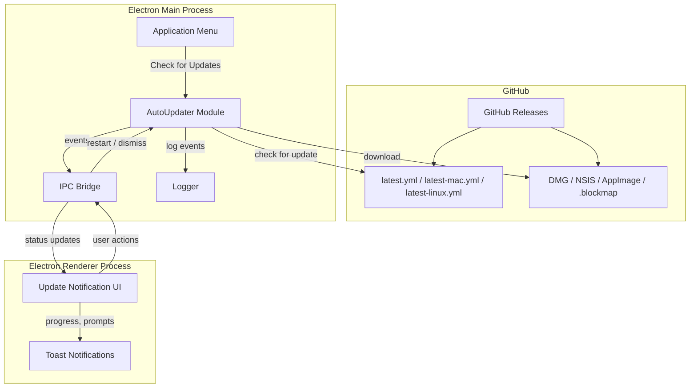
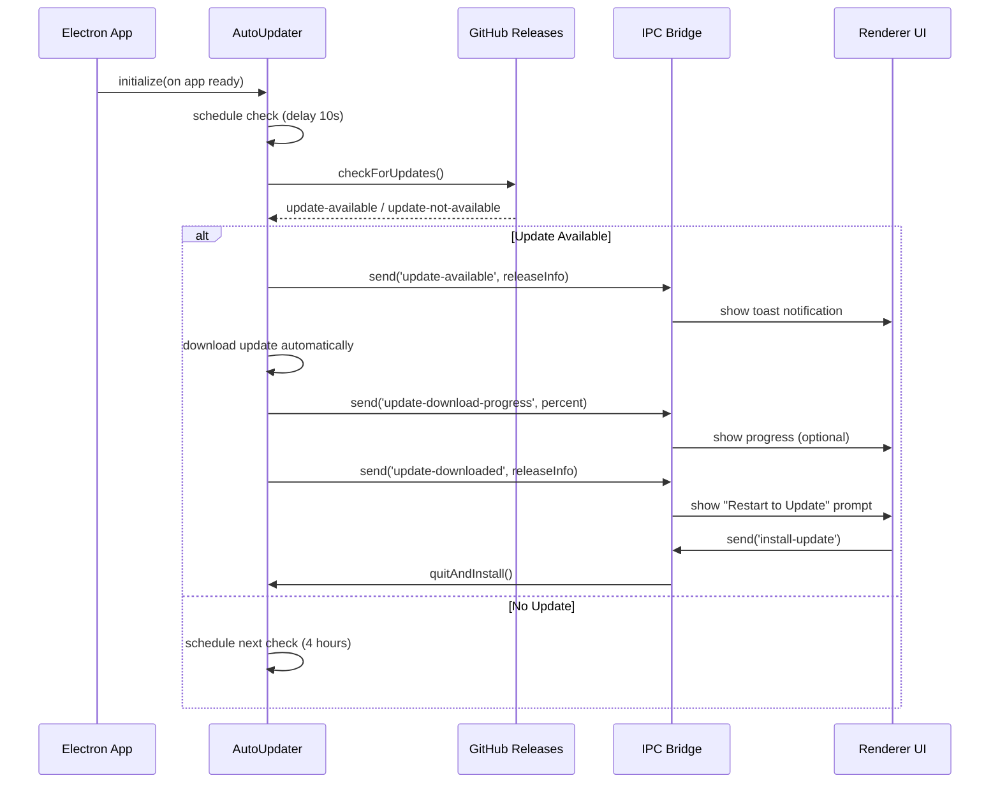
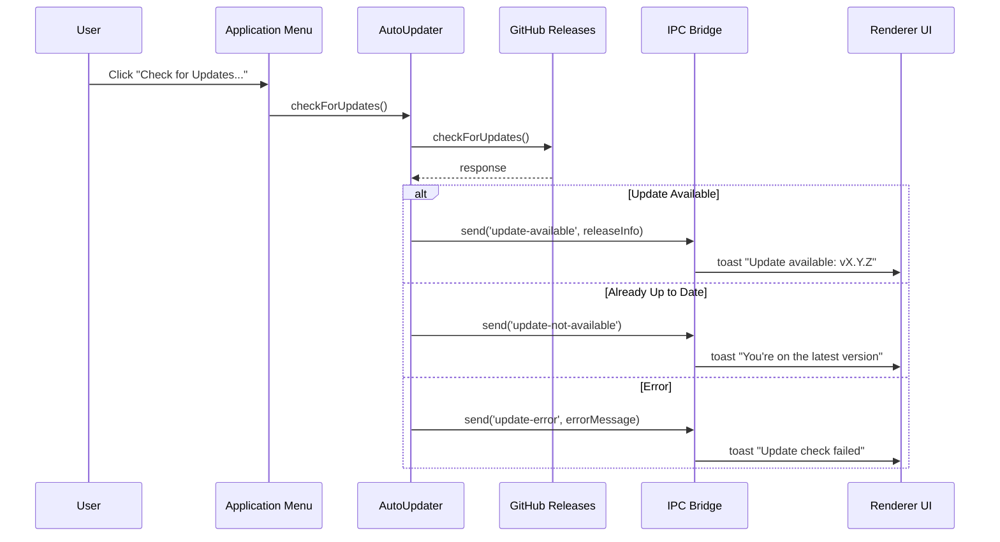

# Design Document: Auto-Update

## Overview

This feature adds automatic update checking and installation to the xoxo Electron desktop app using `electron-updater`. The app will check GitHub Releases for new versions on startup (and periodically), notify the user when an update is available, download it in the background, and prompt the user to restart to apply the update. The existing electron-builder release workflow already publishes platform-specific artifacts and metadata files (`latest.yml`, `latest-mac.yml`, `latest-linux.yml`) to GitHub Releases, so this feature adds the client-side consumer of those artifacts.

macOS auto-update requires the app to be code-signed. On Windows and Linux, updates work without code signing. The design accommodates this by gracefully handling signature verification failures on macOS when running unsigned development builds.

## Architecture



## Sequence Diagrams

### Startup Update Check



### Manual Update Check (Menu)



## Components and Interfaces

### Component 1: AutoUpdater Module (`src/main/auto-updater.js`)

**Purpose**: Wraps `electron-updater`'s `autoUpdater` singleton, manages update lifecycle, and emits events to the renderer via IPC.

**Interface**:
```javascript
/**
 * Initialize the auto-updater and wire up event handlers.
 * @param {BrowserWindow} mainWindow - The main application window
 * @param {Function} updateMenuCallback - Called to refresh the menu state
 */
function setupAutoUpdater(mainWindow, updateMenuCallback)

/**
 * Manually trigger an update check.
 * @returns {Promise<UpdateCheckResult|null>}
 */
function checkForUpdates()

/**
 * Get current updater status.
 * @returns {'idle'|'checking'|'available'|'downloading'|'downloaded'|'error'}
 */
function getUpdateStatus()
```

**Responsibilities**:
- Configure `autoUpdater` with GitHub provider settings
- Delay initial check to avoid slowing app startup
- Schedule periodic checks (every 4 hours)
- Forward all updater events to the renderer via IPC
- Expose manual check trigger for the menu
- Log all update events via the app logger
- Handle errors gracefully (network failures, signature issues on unsigned macOS builds)

### Component 2: IPC Bridge (update channels)

**Purpose**: Defines the IPC channels used for update communication between main and renderer processes.

**Interface**:

| Direction | Channel | Payload |
|-----------|---------|---------|
| Main → Renderer | `update-available` | `{ version, releaseNotes, releaseDate }` |
| Main → Renderer | `update-not-available` | `{ version }` (current version) |
| Main → Renderer | `update-download-progress` | `{ percent, bytesPerSecond, transferred, total }` |
| Main → Renderer | `update-downloaded` | `{ version, releaseNotes, releaseDate }` |
| Main → Renderer | `update-error` | `{ message, code }` |
| Renderer → Main | `install-update` | (none) |
| Renderer → Main | `check-for-updates` | (none) |

**Responsibilities**:
- Provide a clean contract between main and renderer
- Keep payloads minimal and serializable

### Component 3: Update Notification UI (Renderer)

**Purpose**: Displays update status to the user via toast notifications and provides action buttons.

**Interface**:
```javascript
/**
 * Listen for update events and show appropriate UI.
 * Uses vue-toastification for non-blocking notifications.
 */
function setupUpdateListeners()
```

**Responsibilities**:
- Show toast when update is available (informational)
- Show toast with progress during download (optional, for large updates)
- Show persistent toast with "Restart Now" / "Later" actions when download completes
- Show error toast if update check fails (non-critical, dismissible)
- Handle "Later" by suppressing the prompt until next app launch

### Component 4: Menu Integration

**Purpose**: Adds a "Check for Updates..." menu item under the Help menu.

**Responsibilities**:
- Add menu item that triggers a manual update check
- Disable the item while a check is already in progress
- Update label to reflect state ("Checking...", "Restart to Update", "Check for Updates...")

## Data Models

### UpdateInfo (from electron-updater, subset used)

```javascript
/**
 * @typedef {Object} UpdateInfo
 * @property {string} version - New version string (e.g., "1.2.0")
 * @property {string} releaseDate - ISO date string of the release
 * @property {string|null} releaseNotes - Markdown release notes or null
 */
```

### UpdateProgress

```javascript
/**
 * @typedef {Object} UpdateProgress
 * @property {number} percent - Download progress 0-100
 * @property {number} bytesPerSecond - Download speed
 * @property {number} transferred - Bytes downloaded so far
 * @property {number} total - Total bytes to download
 */
```

### UpdateStatus (internal state)

```javascript
/**
 * @typedef {'idle'|'checking'|'available'|'downloading'|'downloaded'|'error'} UpdateStatus
 */
```

## Error Handling

### Error Scenario 1: Network Failure

**Condition**: No internet connection or GitHub API unreachable during update check
**Response**: Log the error, send `update-error` to renderer with a user-friendly message, schedule retry at next interval
**Recovery**: Automatic retry on next scheduled check; user can also retry manually via menu

### Error Scenario 2: Code Signing Verification Failure (macOS)

**Condition**: App is not code-signed (development builds) and macOS rejects the update
**Response**: Log warning, send `update-error` with message explaining code signing requirement, do not crash
**Recovery**: No auto-update possible without signing; user must download manually from GitHub Releases

### Error Scenario 3: Download Interrupted

**Condition**: Network drops during update download
**Response**: `electron-updater` handles partial downloads and resumes automatically using `.blockmap` differential downloads
**Recovery**: Automatic resume on next check; if file is corrupted, full re-download on next attempt

### Error Scenario 4: Insufficient Disk Space

**Condition**: Not enough space to download/extract the update
**Response**: `electron-updater` emits an error event; log it and notify user via toast
**Recovery**: User frees disk space; next check will retry the download

## Testing Strategy

### Unit Testing Approach

- Mock `electron-updater`'s `autoUpdater` object to test event handling logic
- Verify that each updater event (checking, available, not-available, progress, downloaded, error) correctly dispatches the corresponding IPC message
- Test the scheduling logic (initial delay, periodic interval)
- Test menu state transitions based on updater status

### Property-Based Testing Approach

**Property Test Library**: fast-check (already in devDependencies)

- Generate arbitrary progress objects and verify the IPC payload is always well-formed
- Generate arbitrary version strings and verify comparison logic handles them correctly

### Integration Testing Approach

- End-to-end test with a local update server (electron-updater supports custom URLs)
- Verify full cycle: check → download → notify → quit-and-install signal
- Platform-specific testing for macOS (signed builds), Windows (NSIS), Linux (AppImage)

## Correctness Properties

*A property is a characteristic or behavior that should hold true across all valid executions of a system — essentially, a formal statement about what the system should do. Properties serve as the bridge between human-readable specifications and machine-verifiable correctness guarantees.*

### Property 1: Update check delay

*For any* application startup, the initial update check SHALL be scheduled with a delay of at least 10 seconds after app ready, never during the startup critical path.

**Validates: Requirements 1.1**

### Property 2: Periodic scheduling (no duplicate timers)

*For any* sequence of update check completions (whether success or failure), there SHALL be at most one pending periodic timer at any point in time, and it SHALL be set to the configured 4-hour interval.

**Validates: Requirements 2.1, 2.2, 8.2**

### Property 3: IPC event completeness

*For any* `autoUpdater` event (`checking-for-update`, `update-available`, `update-not-available`, `download-progress`, `update-downloaded`, `error`), a corresponding IPC message SHALL be sent to the renderer and the event SHALL be logged. No event is silently swallowed.

**Validates: Requirements 6.6, 11.1, 11.2**

### Property 4: IPC payload well-formedness

*For any* IPC message sent from the AutoUpdater to the renderer, the payload SHALL conform to its documented schema — `update-available` and `update-downloaded` contain version, releaseNotes, and releaseDate; `update-not-available` contains the current version; `update-download-progress` contains numeric percent in [0, 100] with transferred ≤ total and bytesPerSecond ≥ 0; `update-error` contains a message string and error code.

**Validates: Requirements 6.1, 6.2, 6.3, 6.4, 6.5**

### Property 5: State machine validity

*For any* sequence of events received by the AutoUpdater, the status transitions SHALL follow a valid path: `idle → checking → available → downloading → downloaded`, or `idle → checking → idle` (no update), or `* → error → idle` (on retry). No transition skips an intermediate state, and the status SHALL always be one of the defined values: idle, checking, available, downloading, downloaded, or error.

**Validates: Requirements 7.1, 7.2, 7.3**

### Property 6: Error graceful degradation

*For any* error during update check or download (network failure, code signing failure, disk space, or any other error), the AutoUpdater SHALL: (a) log the error with full details, (b) send an `update-error` IPC message to the renderer, and (c) return to a state where the next scheduled or manual check can proceed. The app SHALL never crash or become unresponsive due to an update failure.

**Validates: Requirements 8.1, 8.2, 8.3, 9.1, 9.2, 10.2**

### Property 7: Menu state consistency

*For any* UpdateStatus value, the "Check for Updates..." menu item SHALL be disabled if and only if the status is `checking` or `downloading`. The menu label SHALL correctly reflect the current state (e.g., "Checking...", "Restart to Update", "Check for Updates...").

**Validates: Requirements 3.4, 3.5**

### Property 8: quitAndInstall guard

*For any* updater state that is NOT `downloaded`, calling quitAndInstall SHALL be a no-op or rejected. `quitAndInstall()` SHALL only proceed when the UpdateStatus is `downloaded`.

**Validates: Requirements 5.5**

## Performance Considerations

- Initial update check is delayed 10 seconds after app ready to avoid impacting startup time
- Differential downloads via `.blockmap` files minimize bandwidth usage (~small delta instead of full binary)
- Download happens in the background with no impact on renderer performance
- Periodic checks every 4 hours are lightweight (single HTTPS request to GitHub API)

## Security Considerations

- `electron-updater` verifies package signatures by default; updates are rejected if signatures don't match
- Updates are served over HTTPS from GitHub Releases
- The `GH_TOKEN` is only needed at build/publish time, not at runtime (public repos serve releases without auth)
- For private repos, a runtime token would need to be configured in `autoUpdater` — not applicable here since the repo is public

## Dependencies

| Dependency | Purpose | Version |
|------------|---------|---------|
| `electron-updater` | Core auto-update library for Electron apps | ^6.x (compatible with electron-builder ^26) |

**Note**: `electron-updater` is a runtime dependency (must be in `dependencies`, not `devDependencies`) because it runs in the packaged app.

## electron-builder Configuration Changes

The existing `build` config in `package.json` needs a `publish` field to tell `electron-updater` where to look for updates:

```json
{
  "build": {
    "publish": {
      "provider": "github",
      "owner": "acl0056",
      "repo": "xoxo"
    }
  }
}
```

The release workflow also needs to publish the update metadata files (`latest.yml`, `latest-mac.yml`, `latest-linux.yml`) alongside the artifacts. This may require adjusting the workflow to use `electron-builder --publish always` instead of the separate `softprops/action-gh-release` step, or ensuring the yml files are included in the artifact upload.
