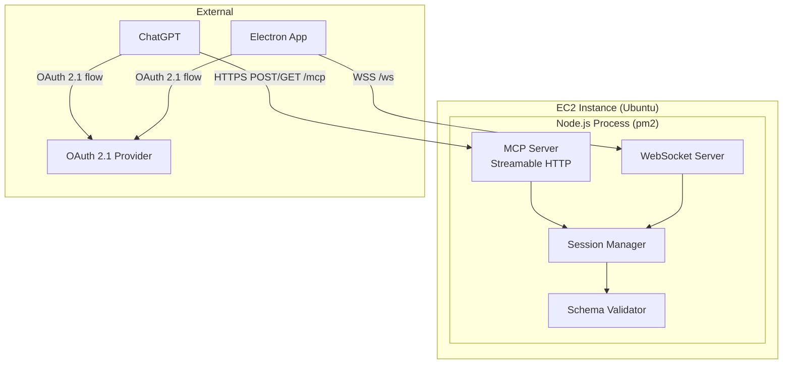
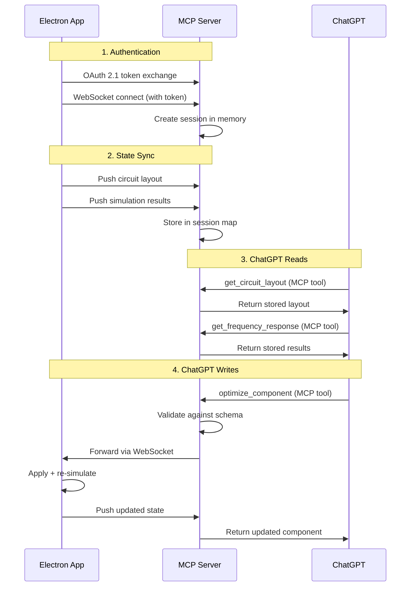

# Design Document: ChatGPT MCP Server

## Overview

This design describes a remote MCP (Model Context Protocol) server that bridges the xoxo Electron app with ChatGPT. The server is a Node.js process on an Ubuntu EC2 instance, managed by pm2, that:

1. Accepts state pushes from the Electron app over WebSocket (circuit layouts, simulation results, FRD data)
2. Exposes that state to ChatGPT via MCP tools over Streamable HTTP transport
3. Forwards component optimization requests from ChatGPT back to the Electron app
4. Authenticates users via OAuth 2.1

The server holds all session state in process memory — no database, no persistence. If the server restarts, Electron apps must reconnect and resync.

### Key Design Decisions

- **Single `/mcp` endpoint** for all MCP Streamable HTTP communication (POST for requests, GET for SSE streams)
- **Separate WebSocket endpoint** (`/ws`) for Electron app connections
- **`@modelcontextprotocol/sdk`** as the MCP protocol implementation library
- **`ws`** library for WebSocket server
- **`ajv`** for JSON Schema validation (already a project dependency)
- **Auth0** as the OAuth 2.1 provider (supports Dynamic Client Registration, PKCE, token refresh)
- **Shared schemas** imported directly from `src/schemas/` — no duplication

## Architecture



### Data Flow



## Components and Interfaces

### Directory Structure

```
server/
├── index.js              # Entry point, starts HTTP + WS servers
├── config.js             # All configuration values
├── pm2-config.json       # pm2 process management config
├── package.json          # Server-specific dependencies
├── mcp/
│   ├── server.js         # MCP server setup (tools, resources)
│   ├── tools/
│   │   ├── getCircuitLayout.js
│   │   ├── getFrequencyResponse.js
│   │   ├── getImpedanceResponse.js
│   │   ├── getOffAxisFrd.js
│   │   └── optimizeComponent.js
│   └── resources/
│       └── schemas.js    # Schema resource definitions
├── ws/
│   ├── handler.js        # WebSocket connection handler
│   └── messages.js       # Message type definitions
├── auth/
│   ├── middleware.js     # Token validation middleware
│   └── oauth.js          # OAuth 2.1 flow helpers
├── session/
│   ├── manager.js        # Session CRUD operations
│   └── store.js          # In-memory session store
└── validation/
    └── validator.js      # AJV schema validation wrapper
```

### Component Descriptions

#### `server/index.js` — Entry Point

Creates an HTTPS server with two concerns:
- Mounts the MCP Streamable HTTP handler at `/mcp`
- Attaches a WebSocket server at `/ws`
- Loads configuration from `config.js`

#### `server/config.js` — Configuration

Centralizes all runtime configuration:

```javascript
module.exports = {
	port: process.env.PORT || 3000,
	host: process.env.HOST || '0.0.0.0',
	oauth: {
		issuer: process.env.OAUTH_ISSUER,
		audience: process.env.OAUTH_AUDIENCE,
		jwksUri: process.env.OAUTH_JWKS_URI,
		tokenLifetimeSeconds: 3600,
	},
	ws: {
		heartbeatIntervalMs: 30000,
		requestTimeoutMs: 30000,
	},
	chatgptConversationUrl: process.env.CHATGPT_CONVERSATION_URL,
	schemasPath: '../src/schemas',
};
```

#### `server/session/store.js` — In-Memory Session Store

```javascript
// Map<userId, SessionData>
// SessionData: { circuitLayout, simulationResults, frdData, wsConnection }
```

Key behaviors:
- One session per user identity (keyed by user ID from OAuth token)
- Stores circuit layout, simulation results, and FRD data
- Holds reference to the active WebSocket connection
- Entire map lives in process memory — lost on restart

#### `server/session/manager.js` — Session Manager

Provides the interface between MCP tools, WebSocket handler, and the store:
- `getSession(userId)` — retrieve session data
- `updateCircuitLayout(userId, layout)` — validate and store
- `updateSimulationResults(userId, results)` — validate and store
- `updateFrdData(userId, speakerId, angle, data)` — validate and store
- `getElectronConnection(userId)` — get WebSocket for forwarding

#### `server/mcp/server.js` — MCP Server Setup

Uses `@modelcontextprotocol/sdk` to create the MCP server instance:
- Registers all tools (get_circuit_layout, get_frequency_response, get_impedance_response, get_off_axis_frd, optimize_component)
- Registers schema resources (circuit.schema.json, simulation-results.schema.json, frd-data.schema.json)
- Configures Streamable HTTP transport on the `/mcp` endpoint
- Handles MCP session management (Mcp-Session-Id header)

#### `server/auth/middleware.js` — Token Validation

Validates Bearer tokens on every request:
- Verifies JWT signature against JWKS endpoint
- Checks token expiry
- Validates issuer and audience claims
- Returns categorized errors (malformed, expired, unrecognized)

#### `server/validation/validator.js` — Schema Validator

Wraps AJV to validate data against shared schemas:

```javascript
const Ajv = require('ajv');
const addFormats = require('ajv-formats');
const circuitSchema = require('../../src/schemas/circuit.schema.json');
const simulationResultsSchema = require('../../src/schemas/simulation-results.schema.json');
const frdDataSchema = require('../../src/schemas/frd-data.schema.json');

const ajv = new Ajv({ allErrors: true });
addFormats(ajv);

const validators = {
	circuitLayout: ajv.compile(circuitSchema),
	simulationResults: ajv.compile(simulationResultsSchema),
	frdData: ajv.compile(frdDataSchema),
};
```

#### `server/ws/handler.js` — WebSocket Handler

Manages persistent connections from Electron apps:
- Authenticates on connection (validates token from query param or first message)
- Handles incoming state pushes (circuit layout, simulation results, FRD data)
- Forwards optimize_component requests to the connected Electron app
- Implements heartbeat/ping-pong for connection health
- Handles disconnection cleanup

#### MCP Tools

Each tool follows the same pattern:
1. Extract user identity from the authenticated MCP session
2. Retrieve session data from the session manager
3. Return data or error

**`get_circuit_layout`** — Returns the current circuit layout for the session
**`get_frequency_response`** — Returns the frequency response portion of simulation results
**`get_impedance_response`** — Returns the impedance response portion of simulation results
**`get_off_axis_frd`** — Returns FRD data for a specific speaker/angle, or lists available angles
**`optimize_component`** — Validates and forwards component updates to the Electron app, waits for response

### Electron App Changes

#### Menu Addition

A "ChatGPT" menu is added to `src/main/menu.js`, positioned after the "Circuit Blocks" menu:

```javascript
{
	label: 'ChatGPT',
	submenu: [
		{
			id: 'open-chatgpt',
			label: 'Open Conversation...',
			enabled: false, // Enabled when connected
			click: () => handlers.openChatGPT(),
		},
	],
}
```

The menu item is enabled/disabled based on the WebSocket connection state. When clicked, it calls `shell.openExternal(config.chatgptConversationUrl)`.

#### WebSocket Client

A new module in the Electron app manages the server connection:
- Connects after OAuth authentication
- Pushes full state on connect and reconnect
- Pushes incremental updates on circuit/simulation changes (debounced, within 2 seconds)
- Implements exponential backoff reconnection (1s, 2s, 4s, 8s, 16s, 30s, 30s, 30s, 30s, 30s — max 10 attempts)
- Handles optimize_component requests from the server

## Data Models

### Session Data (In-Memory)

```javascript
// Keyed by userId (string from OAuth token sub claim)
{
	userId: 'auth0|abc123',
	circuitLayout: { /* circuit.schema.json */ },
	simulationResults: { /* simulation-results.schema.json */ },
	frdData: {
		// Map<speakerId, Map<angle, frdDataObject>>
		'speaker-1': {
			15: { frequencies: [...], magnitudes: [...], phases: [...] },
			30: { frequencies: [...], magnitudes: [...], phases: [...] },
		}
	},
	wsConnection: WebSocket, // Active Electron app connection
	mcpSessionId: 'uuid-string',
	connectedAt: '2025-01-01T00:00:00Z',
}
```

### WebSocket Message Protocol

Messages between Electron app and server use a simple envelope:

```javascript
{
	type: 'string',    // Message type identifier
	payload: {},       // Type-specific payload
	requestId: 'string' // Optional, for request/response correlation
}
```

**Electron → Server messages:**
- `state:circuit` — Full circuit layout push
- `state:simulation` — Full simulation results push
- `state:frd` — FRD data push (includes speakerId and angle)
- `response:optimize` — Response to an optimize_component request

**Server → Electron messages:**
- `request:optimize` — Forward optimize_component request
- `error:validation` — Validation error on received state

### MCP Tool Schemas

**get_circuit_layout** — No input parameters

**get_frequency_response** — No input parameters

**get_impedance_response** — No input parameters

**get_off_axis_frd:**
```javascript
{
	speakerId: { type: 'string', description: 'Component ID of the speaker' },
	angle: { type: 'number', minimum: 0, maximum: 180, description: 'Off-axis angle in degrees (optional — omit to list available angles)' }
}
```

**optimize_component:**
```javascript
{
	componentId: { type: 'string', description: 'ID of the component to update' },
	parameters: { type: 'object', description: 'New parameter values to apply' }
}
```

## Correctness Properties

*A property is a characteristic or behavior that should hold true across all valid executions of a system — essentially, a formal statement about what the system should do. Properties serve as the bridge between human-readable specifications and machine-verifiable correctness guarantees.*

### Property 1: MCP Request Validation

*For any* incoming HTTP request to the `/mcp` endpoint, if the request body is a valid JSON-RPC 2.0 message conforming to the MCP protocol, the server SHALL process it; if the request body is malformed or does not conform to the MCP protocol, the server SHALL return an MCP error response with an appropriate error code identifying the specific validation failure.

**Validates: Requirements 1.3, 1.4**

### Property 2: Token Validation and Error Categorization

*For any* access token presented to the MCP server, if the token is unexpired, correctly signed, and issued by the configured OAuth provider, the request SHALL be processed; otherwise the server SHALL return a 401 response that correctly categorizes the failure as malformed (invalid JWT structure), expired (valid structure but past expiry), or unrecognized (valid structure but wrong issuer/audience).

**Validates: Requirements 2.2, 2.5**

### Property 3: Per-Session Data Isolation

*For any* two distinct authenticated sessions (different user IDs), data stored in one session (circuit layout, simulation results, FRD data) SHALL NOT be accessible when querying MCP tools from the other session.

**Validates: Requirements 2.4, 10.4**

### Property 4: Circuit Layout Schema Conformance

*For any* circuit layout object that validates against circuit.schema.json, storing it in a session and then retrieving it via the get_circuit_layout tool SHALL return data that also validates against circuit.schema.json and is deeply equal to the stored object.

**Validates: Requirements 3.4, 4.1, 4.2, 4.3**

### Property 5: Simulation Results Round-Trip with Array Length Invariant

*For any* simulation results object that validates against simulation-results.schema.json, storing it in a session and then retrieving the frequency response via get_frequency_response SHALL return data where the frequencies, spl, and phase arrays all have the same length, and each speaker's spl and phase arrays also have that same length.

**Validates: Requirements 3.5, 5.1, 5.2, 5.3**

### Property 6: Impedance Response Round-Trip with Array Length Invariant

*For any* simulation results object that validates against simulation-results.schema.json, storing it in a session and then retrieving the impedance response via get_impedance_response SHALL return data where the frequencies, impedances, and phases arrays all have the same length.

**Validates: Requirements 6.1, 6.2**

### Property 7: Exponential Backoff Calculation

*For any* reconnection attempt number N (1 ≤ N ≤ 10), the backoff delay SHALL equal min(2^(N-1) × 1000, 30000) milliseconds.

**Validates: Requirements 3.6**

### Property 8: FRD Data Lookup Correctness

*For any* FRD data object conforming to frd-data.schema.json stored for a given speaker ID and angle, invoking get_off_axis_frd with that speaker ID and angle SHALL return data deeply equal to the stored object and conforming to frd-data.schema.json.

**Validates: Requirements 7.1, 7.3**

### Property 9: Angle Parameter Validation

*For any* numeric value outside the range [0, 180], invoking get_off_axis_frd with that value as the angle parameter SHALL return a validation error; for any numeric value within [0, 180], the angle SHALL be accepted as valid input (though the data may not exist).

**Validates: Requirements 7.2, 7.7**

### Property 10: Available Angles Listing

*For any* set of FRD data stored for a speaker (at various angles), invoking get_off_axis_frd with that speaker ID but without an angle parameter SHALL return a list containing exactly the angles for which data has been stored.

**Validates: Requirements 7.5**

### Property 11: Optimize Component Input Validation

*For any* component ID that does not exist in the current circuit layout, OR any parameter values that violate the constraints defined in circuit.schema.json for the target component type, the optimize_component tool SHALL reject the request with a descriptive error identifying the specific failure, and SHALL NOT forward the request to the Electron app.

**Validates: Requirements 8.2, 8.3, 8.6, 8.7**

### Property 12: Optimize Component Success Response

*For any* valid component update (existing component ID, schema-conformant parameters) that the Electron app successfully applies, the optimize_component tool SHALL return the full updated component object including id, type, label, x, y, rotation, and parameters.

**Validates: Requirements 8.5**

### Property 13: Schema Resource Content Fidelity

*For any* schema resource exposed by the MCP server (circuit.schema.json, simulation-results.schema.json, frd-data.schema.json), requesting that resource SHALL return content byte-for-byte identical to the corresponding file in `src/schemas/`.

**Validates: Requirements 9.4**

## Error Handling

### Error Categories

| Layer | Error Type | Response |
|-------|-----------|----------|
| Transport | Malformed JSON-RPC | MCP error, code -32700 (Parse error) |
| Transport | Invalid MCP method | MCP error, code -32601 (Method not found) |
| Auth | Missing token | HTTP 401, `{"error": "missing_token"}` |
| Auth | Expired token | HTTP 401, `{"error": "token_expired"}` |
| Auth | Invalid signature | HTTP 401, `{"error": "invalid_token"}` |
| Auth | Wrong issuer/audience | HTTP 401, `{"error": "unrecognized_token"}` |
| Tool | No data available | MCP tool error, descriptive message |
| Tool | Validation failure | MCP tool error, lists specific constraint violations |
| Tool | Electron app timeout | MCP tool error, "Electron app did not respond within 30 seconds" |
| Tool | Simulation failure | MCP tool error, "Simulation failed, component reverted" |
| WebSocket | Invalid state push | `error:validation` message with AJV error details |
| Internal | Unexpected error | MCP error, code -32603 (Internal error), no implementation details exposed |

### Error Response Format

All MCP errors follow JSON-RPC 2.0 error format:

```javascript
{
	jsonrpc: '2.0',
	id: requestId,
	error: {
		code: -32600,
		message: 'Human-readable error description',
		data: { /* optional structured details */ }
	}
}
```

### Resilience Patterns

- **WebSocket reconnection**: Exponential backoff (1s → 30s cap, 10 attempts max)
- **Request timeout**: 30-second timeout for optimize_component round-trips
- **Graceful degradation**: If Electron app disconnects, MCP tools return "no data available" errors rather than hanging
- **State preservation**: Internal errors never corrupt session state; optimize_component failures trigger rollback in the Electron app

## Testing Strategy

### Property-Based Testing

This feature is well-suited for property-based testing. The server has clear input/output behavior, schema-validated data structures, and universal properties that hold across a wide input space.

**Library**: `fast-check` (already a devDependency in the project)

**Configuration**:
- Minimum 100 iterations per property test
- Each test tagged with: `Feature: chatgpt-mcp-server, Property {N}: {title}`

**Key generators needed**:
- Valid circuit layout generator (based on circuit.schema.json constraints)
- Valid simulation results generator (based on simulation-results.schema.json)
- Valid FRD data generator (based on frd-data.schema.json)
- Invalid/malformed token generator
- Random component parameter generator (both valid and invalid)

### Unit Tests (Example-Based)

- OAuth flow endpoint responses (specific scenarios)
- Menu item enabled/disabled state transitions
- WebSocket message parsing for specific message types
- Error response format for specific failure modes
- Schema resource descriptions (>= 20 characters)
- Manifest endpoint content

### Integration Tests

- Full OAuth 2.1 flow with Auth0 (token exchange, refresh)
- WebSocket connection lifecycle (connect, push state, disconnect, reconnect)
- End-to-end optimize_component flow (ChatGPT → Server → Electron → Server → ChatGPT)
- 100 concurrent sessions load test
- TLS/HTTPS connectivity verification

### Test File Organization

```
tests/unit/server/
├── session/
│   ├── store.spec.js
│   └── manager.spec.js
├── mcp/
│   ├── tools/
│   │   ├── getCircuitLayout.spec.js
│   │   ├── getFrequencyResponse.spec.js
│   │   ├── getImpedanceResponse.spec.js
│   │   ├── getOffAxisFrd.spec.js
│   │   └── optimizeComponent.spec.js
│   └── resources/
│       └── schemas.spec.js
├── auth/
│   └── middleware.spec.js
├── validation/
│   └── validator.spec.js
├── ws/
│   └── handler.spec.js
└── properties/
    ├── dataIsolation.spec.js
    ├── roundTrip.spec.js
    ├── validation.spec.js
    └── backoff.spec.js
```
