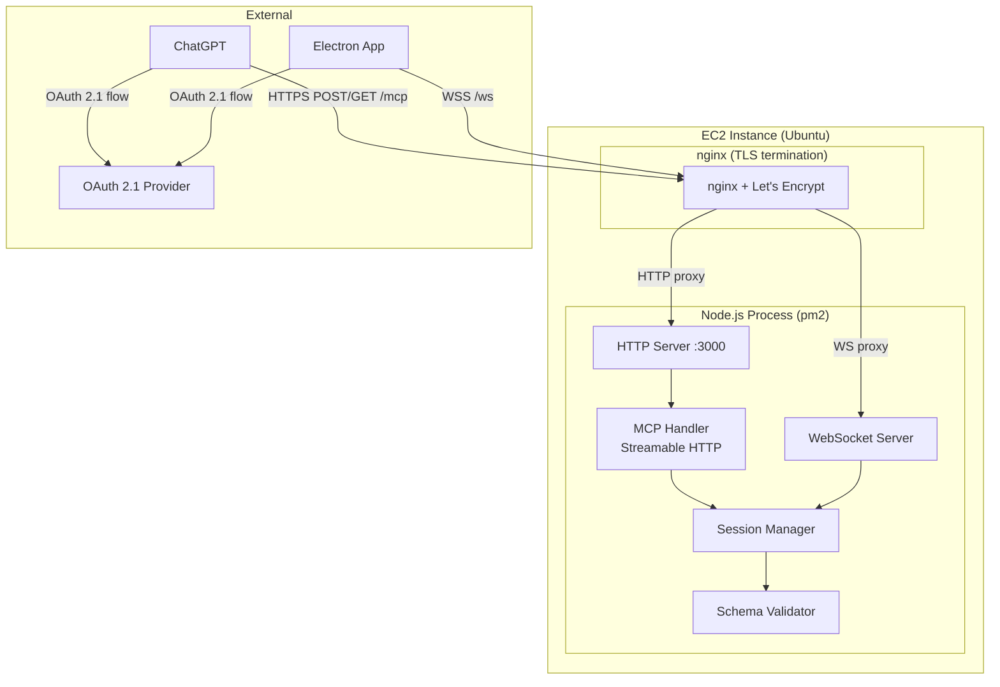
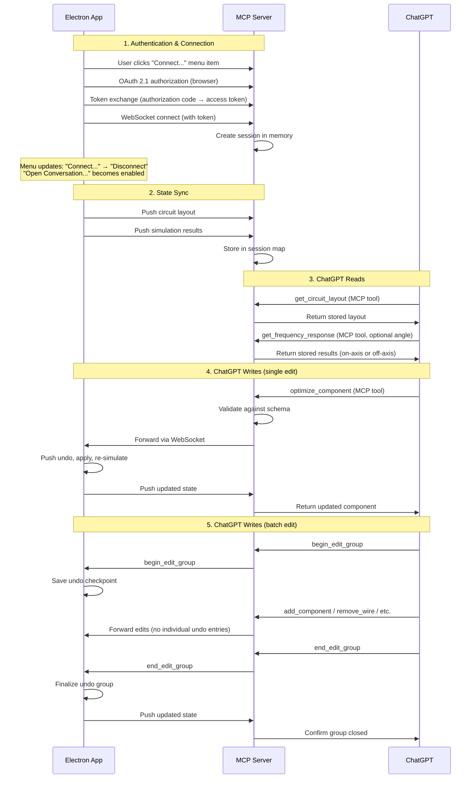

# Design Document: ChatGPT MCP Server

## Overview

This design describes a remote MCP (Model Context Protocol) server that bridges the xoxo Electron app with ChatGPT. The server is a Node.js process on an Ubuntu EC2 instance, managed by pm2, that:

1. Accepts state pushes from the Electron app over WebSocket (circuit layouts, simulation results, FRD data)
2. Exposes that state to ChatGPT via MCP tools over Streamable HTTP transport
3. Forwards circuit modifications from ChatGPT back to the Electron app (component optimization, full layout replacement, granular edits, batch undo grouping)
4. Authenticates users via OAuth 2.1
5. Provides domain knowledge and schema resources so ChatGPT can reason about crossover designs

The server holds all session state in process memory — no database, no persistence. If the server restarts, Electron apps must reconnect and resync.

### Key Design Decisions

- **Single `/mcp` endpoint** for all MCP Streamable HTTP communication (POST for requests, GET for SSE streams)
- **Separate WebSocket endpoint** (`/ws`) for Electron app connections
- **`@modelcontextprotocol/sdk`** as the MCP protocol implementation library
- **`socket.io`** for WebSocket communication between the Electron app and server (provides automatic reconnection, event-based messaging, and room support)
- **`ajv`** for JSON Schema validation (already a project dependency)
- **Auth0** as the OAuth 2.1 provider (supports PKCE, token refresh)
- **Shared schemas** imported directly from `src/schemas/` — no duplication
- **TLS via nginx reverse proxy** with Let's Encrypt — Node.js listens on HTTP only; nginx terminates TLS and proxies to the local port
- **Sensitive config via `process.env`** — `config.js` is committed to the public repo but reads secrets from environment variables set on the server
- **Granular editing tools** alongside full layout replacement — ChatGPT can make targeted edits (add/remove components, add/remove wires, move components) or replace the entire layout
- **Batch undo grouping** — `begin_edit_group` / `end_edit_group` tools allow multiple edits to be undone as a single operation, with a 60-second timeout safety net
- **Domain knowledge resource** — a versioned markdown file served as an MCP resource, maintainable independently of application code

## Architecture



### Data Flow



## Components and Interfaces

### Directory Structure

```
server/
├── index.js                  # Entry point, starts HTTP + WS servers
├── config.js                 # All configuration (secrets from process.env)
├── pm2-config.json           # pm2 process management config
├── package.json              # Server-specific dependencies
├── domain-knowledge.md       # Versioned domain knowledge resource
├── mcp/
│   ├── server.js             # MCP server setup (tools, resources)
│   ├── tools/
│   │   ├── getCircuitLayout.js
│   │   ├── getFrequencyResponse.js
│   │   ├── getImpedanceResponse.js
│   │   ├── optimizeComponent.js
│   │   ├── setCircuitLayout.js
│   │   ├── addComponent.js
│   │   ├── removeComponent.js
│   │   ├── addWire.js
│   │   ├── removeWire.js
│   │   ├── moveComponent.js
│   │   ├── beginEditGroup.js
│   │   └── endEditGroup.js
│   └── resources/
│       ├── schemas.js        # Schema resource definitions
│       └── domainKnowledge.js # Domain knowledge resource
├── ws/
│   ├── handler.js            # WebSocket connection handler
│   └── messages.js           # Message type definitions
├── auth/
│   ├── middleware.js         # Token validation middleware
│   └── oauth.js              # OAuth 2.1 flow helpers
├── session/
│   ├── manager.js            # Session CRUD operations
│   └── store.js              # In-memory session store
└── validation/
    └── validator.js          # AJV schema validation wrapper
```

### Component Descriptions

#### `server/index.js` — Entry Point

Creates an HTTP server (not HTTPS — TLS is handled by nginx) with two concerns:
- Mounts the MCP Streamable HTTP handler at `/mcp`
- Attaches a WebSocket server at `/ws`
- Loads configuration from `config.js`

#### `server/config.js` — Configuration

Centralizes all runtime configuration. This file is committed to the public repo; sensitive values are read from `process.env`:

```javascript
module.exports = {
	port: process.env.PORT || 3000,
	host: process.env.HOST || '0.0.0.0',
	oauth: {
		issuer: process.env.OAUTH_ISSUER,
		audience: process.env.OAUTH_AUDIENCE,
		clientId: process.env.OAUTH_CLIENT_ID,
		clientSecret: process.env.OAUTH_CLIENT_SECRET,
		jwksUri: process.env.OAUTH_JWKS_URI,
		tokenLifetimeSeconds: 3600,
		refreshTokenMaxLifetimeDays: 30,
	},
	ws: {
		heartbeatIntervalMs: 30000,
		requestTimeoutMs: 30000,
	},
	editGroup: {
		timeoutMs: 60000,
	},
	chatgptConversationUrl: 'https://chatgpt.com',
	schemasPath: '../src/schemas',
	domainKnowledgePath: './domain-knowledge.md',
};
```

#### `server/domain-knowledge.md` — Domain Knowledge Resource

A versioned markdown file containing loudspeaker crossover design guidance. Served as an MCP resource at `resource://crossover-domain-knowledge`. Includes:

- Version string (semver) at the top of the document
- Guidance about delays in multi-way systems (likely user error if no driver has a delay set)
- Standard component value series (E12, E24, E48) for suggesting real-world purchasable values
- Empty document state guidance (only a voltage source present → ask user what kind of crossover they want)
- Instruction to wrap multi-step edits in `begin_edit_group` / `end_edit_group`

This file is maintainable independently of application code — new guidance can be added without code changes.

#### `server/session/store.js` — In-Memory Session Store

```javascript
// Map<userId, SessionData>
// SessionData: { circuitLayout, simulationResults, wsConnection, editGroupState }
```

Key behaviors:
- One session per user identity (keyed by user ID from OAuth token)
- Stores circuit layout and simulation results (which include per-angle frequency response data)
- Holds reference to the active WebSocket connection
- Tracks edit group state (active/inactive, start timestamp for timeout enforcement)
- Entire map lives in process memory — lost on restart

#### `server/session/manager.js` — Session Manager

Provides the interface between MCP tools, WebSocket handler, and the store:
- `getSession(userId)` — retrieve session data
- `updateCircuitLayout(userId, layout)` — validate and store
- `updateSimulationResults(userId, results)` — validate and store
- `getElectronConnection(userId)` — get WebSocket for forwarding
- `beginEditGroup(userId, description)` — mark edit group active, record timestamp
- `endEditGroup(userId)` — mark edit group inactive
- `isEditGroupActive(userId)` — check if an edit group is currently open
- `checkEditGroupTimeout(userId)` — auto-close if 60 seconds elapsed

#### `server/mcp/server.js` — MCP Server Setup

Uses `@modelcontextprotocol/sdk` to create the MCP server instance:
- Registers all tools:
  - `get_circuit_layout` — read current layout
  - `get_frequency_response` — read on-axis or off-axis frequency response, or list available angles
  - `get_impedance_response` — read impedance data
  - `optimize_component` — update a single component's parameters
  - `set_circuit_layout` — replace entire layout
  - `add_component` — add a component to the layout
  - `remove_component` — remove a component (disconnects referencing wires)
  - `add_wire` — add a wire to the layout
  - `remove_wire` — remove a wire from the layout
  - `move_component` — change a component's position
  - `begin_edit_group` — start a batch undo group
  - `end_edit_group` — end a batch undo group
- Registers resources:
  - `resource://schema/circuit.schema.json`
  - `resource://schema/simulation-results.schema.json`
  - `resource://schema/frd-data.schema.json`
  - `resource://crossover-domain-knowledge`
- Configures Streamable HTTP transport on the `/mcp` endpoint
- Handles MCP session management (Mcp-Session-Id header)

#### `server/auth/middleware.js` — Token Validation

Validates Bearer tokens on every request:
- Verifies JWT signature against JWKS endpoint
- Checks token expiry (max 60 minutes)
- Validates issuer and audience claims
- Returns categorized errors (malformed, expired, unrecognized)

#### `server/validation/validator.js` — Schema Validator

Wraps AJV to validate data against shared schemas:

```javascript
const Ajv = require('ajv');
const addFormats = require('ajv-formats');
const circuitSchema = require('../../src/schemas/circuit.schema.json');
const simulationResultsSchema = require('../../src/schemas/simulation-results.schema.json');
const frdDataSchema = require('../../src/schemas/frd-data.schema.json');

const ajv = new Ajv({ allErrors: true });
addFormats(ajv);

const validators = {
	circuitLayout: ajv.compile(circuitSchema),
	simulationResults: ajv.compile(simulationResultsSchema),
	frdData: ajv.compile(frdDataSchema),
};
```

#### `server/ws/handler.js` — WebSocket Handler

Manages persistent connections from Electron apps:
- Authenticates on connection (validates token from query param or first message)
- Handles incoming state pushes (circuit layout, simulation results)
- Forwards tool requests to the connected Electron app (optimize, set_circuit_layout, granular edits, edit group signals)
- Implements heartbeat/ping-pong for connection health
- Handles disconnection cleanup

#### MCP Tools

Each tool follows the same pattern:
1. Extract user identity from the authenticated MCP session
2. Retrieve session data from the session manager
3. Validate inputs against schema
4. Forward to Electron app if needed, wait for response (30s timeout)
5. Return data or error

**`get_circuit_layout`** — Returns the current circuit layout for the session. No input parameters.

**`get_frequency_response`** — Accepts optional `angle` (number) and optional `listAngles` (boolean) parameters:
- No parameters or `angle: 0` → returns on-axis frequency response
- `angle: N` → returns frequency response at that off-axis angle
- `listAngles: true` → returns list of available angles (intersection of angles where all drivers have FRD data)
- If requested angle is unavailable → error listing available angles

**`get_impedance_response`** — Returns impedance response. No input parameters.

**`optimize_component`** — Validates component ID exists and parameters conform to schema, forwards to Electron app, pushes to undo stack, returns updated component.

**`set_circuit_layout`** — Validates full layout against circuit.schema.json, forwards to Electron app which pushes previous state to undo stack, replaces layout, re-renders, re-simulates. Returns applied layout on success.

**`add_component`** — Validates component object against circuit.schema.json component definition, forwards to Electron app. Returns added component on success.

**`remove_component`** — Validates component ID exists, forwards to Electron app. Electron disconnects wires referencing the component's terminals (sets affected wire endpoints to disconnected state, does not remove wire objects from layout). Returns removed component ID and list of affected wire IDs.

**`add_wire`** — Validates wire object against circuit.schema.json wire definition, forwards to Electron app. Returns added wire on success.

**`remove_wire`** — Validates wire ID exists, forwards to Electron app. Returns removed wire ID on success.

**`move_component`** — Validates component ID exists and coordinates are integers, forwards to Electron app. Returns updated component object on success.

**`begin_edit_group`** — Accepts optional `description` string. Signals Electron app to save current state as undo checkpoint. Marks session as in-edit-group with timestamp.

**`end_edit_group`** — Signals Electron app to finalize the undo group. Marks session as not-in-edit-group.

### Electron App Changes

#### ChatGPT Menu

A "ChatGPT" menu is added to `src/main/menu.js`, positioned after the "Circuit Blocks" menu (before "View"). It contains two items:

1. **"Connect..."** — Initiates the OAuth 2.1 flow and establishes the WebSocket connection. Changes to **"Disconnect"** when connected.
2. **"Open Conversation..."** — Opens the ChatGPT conversation URL in the default browser. Disabled until connected.

```javascript
{
	label: 'ChatGPT',
	submenu: [
		{
			id: 'chatgpt-connect',
			label: 'Connect...',
			click: () => handlers.chatgptConnect(),
		},
		{
			id: 'chatgpt-open-conversation',
			label: 'Open Conversation...',
			enabled: false,
			click: () => handlers.chatgptOpenConversation(),
		},
	],
}
```

#### Menu State Machine

| State | "Connect..." item | "Open Conversation..." item |
|-------|------------------|-----------------------------|
| **Disconnected** | Label: "Connect...", enabled | Disabled |
| **Connected** | Label: "Disconnect", enabled | Enabled |

State transitions:
- **Disconnected → Connected**: User clicks "Connect...", OAuth succeeds, WebSocket connects. Menu rebuilds with "Disconnect" label and "Open Conversation..." enabled.
- **Connected → Disconnected**: User clicks "Disconnect", OR WebSocket drops unexpectedly, OR auth fails. Menu reverts to initial state.

When the menu state changes, the application menu is rebuilt via `Menu.setApplicationMenu()`.

#### Connection Flow ("Connect..." click)

1. Open OAuth authorization URL in the default browser via `shell.openExternal`
2. Listen for the authorization code callback (local redirect URI)
3. Exchange authorization code for access token
4. Establish WebSocket connection to the MCP server with the access token
5. On success: rebuild menu to connected state, send initial state sync (full circuit layout + simulation results)
6. On failure: display toast error notification with failure reason

#### Disconnect Flow ("Disconnect" click)

1. Close the WebSocket connection
2. Clear local session state (token, connection reference)
3. Rebuild menu to disconnected state

#### Handling Incoming Edit Requests

The Electron app WebSocket client handles these server-originated messages:

- **`request:optimize`** — Push current component state to undo stack, apply new parameters, trigger simulation recalculation. If simulation fails, revert.
- **`request:setCircuitLayout`** — Push current layout to undo stack, replace layout, re-render, re-simulate.
- **`request:addComponent`** — Add component to layout, re-render, re-simulate.
- **`request:removeComponent`** — Remove component, disconnect wires referencing its terminals, re-render, re-simulate.
- **`request:addWire`** — Add wire to layout, re-render, re-simulate.
- **`request:removeWire`** — Remove wire from layout, re-render, re-simulate.
- **`request:moveComponent`** — Update component position, re-render, re-simulate.
- **`request:beginEditGroup`** — Save current circuit state as undo checkpoint. Suppress individual undo entries for subsequent edits until `endEditGroup`.
- **`request:endEditGroup`** — Finalize the undo group.

**Undo behavior for granular edits outside an edit group**: Each edit is pushed to the undo stack as an individual undoable action. This is standard xoxo undo behavior and requires no special MCP handling.

**Undo behavior within an edit group**: The checkpoint saved at `beginEditGroup` is the single undo entry. All edits between begin and end are reverted as one undo operation.

**Edit group timeout**: If `end_edit_group` is not received within 60 seconds of `begin_edit_group`, the Electron app automatically closes the edit group to prevent undo stack corruption.

#### Toast Error Notifications

The Electron app uses `vue-toastification` (already a project dependency) to display non-blocking error notifications:

1. **Connection drop**: "ChatGPT connection lost. Click Connect to reconnect."
2. **Auth/connection failure**: "Failed to connect to ChatGPT: [reason]"
3. **Sync validation failure**: "Synchronization failed: [server-provided reason]"

Toast notifications are triggered from the main process by sending an IPC message to the renderer, which calls `toast.error(message)`.

#### WebSocket Client

A new module in the Electron app manages the server connection:
- Connects after OAuth authentication
- Pushes full state on connect and reconnect
- Pushes incremental updates on circuit/simulation changes (debounced, within 2 seconds)
- Implements exponential backoff reconnection (1s, 2s, 4s, 8s, 16s, 30s, 30s, 30s, 30s, 30s — max 10 attempts)
- Handles incoming edit requests from the server (optimize, set layout, granular edits, edit groups)
- On unexpected disconnect: triggers toast notification and reverts menu to disconnected state

## Data Models

### Session Data (In-Memory)

```javascript
// Keyed by userId (string from OAuth token sub claim)
{
	userId: 'auth0|abc123',
	circuitLayout: { /* circuit.schema.json */ },
	simulationResults: {
		// Map<angle, simulationResultsObject>
		// angle 0 = on-axis, others = off-axis
		0: { /* simulation-results.schema.json */ },
		15: { /* simulation-results.schema.json */ },
		30: { /* simulation-results.schema.json */ },
	},
	wsConnection: WebSocket, // Active Electron app connection
	mcpSessionId: 'uuid-string',
	connectedAt: '2025-01-01T00:00:00Z',
	editGroup: {
		active: false,
		startedAt: null,       // ISO timestamp when begin_edit_group received
		description: null,     // Optional description string
	},
}
```

### WebSocket Message Protocol

Messages between Electron app and server use a simple envelope:

```javascript
{
	type: 'string',    // Message type identifier
	payload: {},       // Type-specific payload
	requestId: 'string' // Optional, for request/response correlation
}
```

**Electron → Server messages:**
- `state:circuit` — Full circuit layout push
- `state:simulation` — Simulation results push (includes angle)
- `response:optimize` — Response to an optimize_component request
- `response:setCircuitLayout` — Response to a set_circuit_layout request
- `response:addComponent` — Response to add_component
- `response:removeComponent` — Response to remove_component (includes affected wire IDs)
- `response:addWire` — Response to add_wire
- `response:removeWire` — Response to remove_wire
- `response:moveComponent` — Response to move_component
- `response:beginEditGroup` — Acknowledgment of edit group start
- `response:endEditGroup` — Acknowledgment of edit group end

**Server → Electron messages:**
- `request:optimize` — Forward optimize_component request
- `request:setCircuitLayout` — Forward set_circuit_layout request
- `request:addComponent` — Forward add_component request
- `request:removeComponent` — Forward remove_component request
- `request:addWire` — Forward add_wire request
- `request:removeWire` — Forward remove_wire request
- `request:moveComponent` — Forward move_component request
- `request:beginEditGroup` — Signal start of edit group
- `request:endEditGroup` — Signal end of edit group
- `error:validation` — Validation error on received state

### MCP Tool Input Schemas

**get_circuit_layout** — No input parameters

**get_frequency_response:**
```javascript
{
	angle: { type: 'number', minimum: 0, maximum: 180, description: 'Off-axis angle in degrees. Omit or set to 0 for on-axis.' },
	listAngles: { type: 'boolean', description: 'If true, return list of available angles instead of frequency data.' }
}
```

**get_impedance_response** — No input parameters

**optimize_component:**
```javascript
{
	componentId: { type: 'string', description: 'ID of the component to update' },
	parameters: { type: 'object', description: 'New parameter values to apply' }
}
```

**set_circuit_layout:**
```javascript
{
	layout: { type: 'object', description: 'Complete Circuit_Layout object conforming to circuit.schema.json' }
}
```

**add_component:**
```javascript
{
	component: { type: 'object', description: 'Component object conforming to the component definition in circuit.schema.json' }
}
```

**remove_component:**
```javascript
{
	componentId: { type: 'string', description: 'ID of the component to remove' }
}
```

**add_wire:**
```javascript
{
	wire: { type: 'object', description: 'Wire object conforming to the wire definition in circuit.schema.json' }
}
```

**remove_wire:**
```javascript
{
	wireId: { type: 'string', description: 'ID of the wire to remove' }
}
```

**move_component:**
```javascript
{
	componentId: { type: 'string', description: 'ID of the component to move' },
	x: { type: 'integer', description: 'New X grid coordinate' },
	y: { type: 'integer', description: 'New Y grid coordinate' }
}
```

**begin_edit_group:**
```javascript
{
	description: { type: 'string', description: 'Optional description of the batch edit' }
}
```

**end_edit_group** — No input parameters


## Correctness Properties

*A property is a characteristic or behavior that should hold true across all valid executions of a system — essentially, a formal statement about what the system should do. Properties serve as the bridge between human-readable specifications and machine-verifiable correctness guarantees.*

### Property 1: MCP Request Validation

*For any* incoming HTTP request body to the `/mcp` endpoint, if the body is a valid JSON-RPC 2.0 message conforming to the MCP protocol specification, the server SHALL process it; if the body is malformed or does not conform to the MCP protocol, the server SHALL return an MCP error response with an error code that identifies the specific validation failure (parse error, invalid method, invalid params).

**Validates: Requirements 1.3, 1.4**

### Property 2: Token Validation and Error Categorization

*For any* access token presented to the MCP server, if the token is unexpired, correctly signed by the configured OAuth provider, and has valid issuer/audience claims, the request SHALL be processed; otherwise the server SHALL return a 401 response that correctly categorizes the failure as malformed (invalid JWT structure), expired (valid structure but past expiry), or unrecognized (valid structure but wrong issuer/audience).

**Validates: Requirements 2.2, 2.5**

### Property 3: Per-Session Data Isolation

*For any* two distinct authenticated sessions (different user IDs), data stored in one session (circuit layout, simulation results) SHALL NOT be accessible when querying any MCP tool from the other session.

**Validates: Requirements 2.4, 10.4**

### Property 4: Circuit Layout Round-Trip

*For any* circuit layout object that validates against circuit.schema.json, storing it in a session and then retrieving it via the `get_circuit_layout` tool SHALL return data that also validates against circuit.schema.json, includes all top-level properties (version, metadata, components, wires, annotations, curveColors, graphSettings, blockGroups as present), and is deeply equal to the stored object.

**Validates: Requirements 4.1, 4.2, 4.3**

### Property 5: Frequency Response Retrieval with Array Length Invariant

*For any* valid simulation results stored at a given angle, invoking `get_frequency_response` with that angle (or no angle for 0°) SHALL return a frequencyResponse object where the frequencies, spl, and phase arrays all have the same length, each speaker's spl and phase arrays also have that same length, and the data is deeply equal to the stored frequencyResponse.

**Validates: Requirements 5.1, 5.2, 5.3, 5.4**

### Property 6: Available Angles Intersection

*For any* set of speakers in the circuit layout where each speaker has a set of off-axis FRD angles loaded, invoking `get_frequency_response` with `listAngles: true` SHALL return exactly the intersection of angles common to all speakers that have FRD data.

**Validates: Requirements 5.5**

### Property 7: Unavailable Angle Error Lists Available Angles

*For any* angle value that is not in the set of available angles for the session, invoking `get_frequency_response` with that angle SHALL return an error response that includes the list of angles that ARE available.

**Validates: Requirements 5.6**

### Property 8: Impedance Response Array Length Invariant

*For any* valid simulation results stored in a session, invoking `get_impedance_response` SHALL return an impedanceResponse object where the frequencies, impedances, and phases arrays all have the same length and the data conforms to the impedanceResponse portion of simulation-results.schema.json.

**Validates: Requirements 6.1, 6.2**

### Property 9: Optimize Component Input Validation

*For any* component ID that does not exist in the current circuit layout, OR any parameter values that violate the constraints defined in circuit.schema.json for the target component type, the `optimize_component` tool SHALL reject the request with a descriptive error identifying the specific failure (invalid component ID or which parameter constraint was violated), and SHALL NOT forward the request to the Electron app.

**Validates: Requirements 8.2, 8.3, 8.6, 8.7**

### Property 10: Optimize Component Success Response Completeness

*For any* valid component update (existing component ID, schema-conformant parameters) that the Electron app successfully applies, the `optimize_component` tool SHALL return a response containing the full component object with all required fields: id, type, label, x, y, rotation, and parameters.

**Validates: Requirements 8.5**

### Property 11: Set Circuit Layout Validation and Round-Trip

*For any* object passed to the `set_circuit_layout` tool, if the object validates against circuit.schema.json the tool SHALL forward it and return the applied layout (deeply equal to the input) on success; if the object does NOT validate, the tool SHALL reject with a validation error describing the specific schema violations without modifying the circuit.

**Validates: Requirements 13.1, 13.2, 13.5**

### Property 12: Granular Tool Input Validation

*For any* input to the granular editing tools (`add_component`, `add_wire`, `remove_wire`, `move_component`), if the input conforms to the relevant portion of circuit.schema.json (component definition, wire definition, valid integer coordinates for an existing component), the tool SHALL accept it and return the expected success response; if the input does not conform, the tool SHALL return a descriptive validation error without modifying the circuit.

**Validates: Requirements 14.1, 14.3, 14.4, 14.5, 14.6, 14.7**

### Property 13: Remove Component Wire Disconnection

*For any* component that exists in the current circuit layout and has wires connected to its terminals, invoking `remove_component` with that component's ID SHALL return the removed component ID and a list of wire IDs that includes exactly those wires whose startNode or endNode references the removed component's ID.

**Validates: Requirements 14.2**

### Property 14: Exponential Backoff Calculation

*For any* reconnection attempt number N (1 ≤ N ≤ 10), the computed backoff delay SHALL equal min(2^(N-1) × 1000, 30000) milliseconds.

**Validates: Requirements 3.6**

### Property 15: Schema Resource Content Fidelity

*For any* schema resource exposed by the MCP server (circuit.schema.json, simulation-results.schema.json, frd-data.schema.json), requesting that resource SHALL return content byte-for-byte identical to the corresponding file in `src/schemas/`, with MIME type application/json.

**Validates: Requirements 9.4**

### Property 16: Menu State Machine Consistency

*For any* sequence of connection state transitions (disconnected → connected via successful auth, connected → disconnected via user disconnect or WebSocket drop), the ChatGPT menu SHALL always reflect the correct state: when disconnected, the first item has label "Connect..." and is enabled while "Open Conversation..." is disabled; when connected, the first item has label "Disconnect" and is enabled while "Open Conversation..." is enabled.

**Validates: Requirements 11.4, 11.6, 11.7, 11.10**

### Property 17: Edit Group Suppresses Individual Undo Entries

*For any* sequence of granular edits and optimize_component calls made between a `begin_edit_group` and `end_edit_group`, the undo stack SHALL contain exactly one additional entry (the group checkpoint), not individual entries for each edit within the group.

**Validates: Requirements 15.5**

### Property 18: Edit Group Timeout Auto-Close

*For any* `begin_edit_group` that is not followed by an `end_edit_group` within 60 seconds, the Electron app SHALL automatically close the edit group, finalizing the undo group to prevent undo stack corruption.

**Validates: Requirements 15.6**

## Error Handling

### Error Categories

| Layer | Error Type | Response |
|-------|-----------|----------|
| Transport | Malformed JSON-RPC | MCP error, code -32700 (Parse error) |
| Transport | Invalid MCP method | MCP error, code -32601 (Method not found) |
| Transport | Invalid params | MCP error, code -32602 (Invalid params) |
| Auth | Missing token | HTTP 401, `{"error": "missing_token"}` |
| Auth | Expired token | HTTP 401, `{"error": "token_expired"}` |
| Auth | Invalid signature | HTTP 401, `{"error": "invalid_token"}` |
| Auth | Wrong issuer/audience | HTTP 401, `{"error": "unrecognized_token"}` |
| Tool | No data available | MCP tool error, descriptive message |
| Tool | Validation failure | MCP tool error, lists specific constraint violations |
| Tool | Component ID not found | MCP tool error, "Component [id] not found in current layout" |
| Tool | Angle not available | MCP tool error, "Angle [N]° not available. Available: [list]" |
| Tool | Electron app timeout | MCP tool error, "Electron app did not respond within 30 seconds" |
| Tool | Simulation failure | MCP tool error, "Simulation failed, component reverted" |
| Tool | Schema validation | MCP tool error, AJV error details (which property, which constraint) |
| WebSocket | Invalid state push | `error:validation` message with AJV error details |
| WebSocket | Unexpected disconnect | Toast error in Electron app: "ChatGPT connection lost" |
| Auth | OAuth/connection failure | Toast error in Electron app: "Failed to connect to ChatGPT: [reason]" |
| Sync | Server rejects update | Toast error in Electron app: "Synchronization failed: [reason]" |
| Internal | Unexpected error | MCP error, code -32603 (Internal error), no implementation details exposed |

### Error Response Format

All MCP errors follow JSON-RPC 2.0 error format:

```javascript
{
	jsonrpc: '2.0',
	id: requestId,
	error: {
		code: -32600,
		message: 'Human-readable error description',
		data: { /* optional structured details */ }
	}
}
```

### Resilience Patterns

- **WebSocket reconnection**: Exponential backoff (1s → 30s cap, 10 attempts max)
- **Request timeout**: 30-second timeout for all tool round-trips to Electron app
- **Edit group timeout**: 60-second auto-close to prevent undo stack corruption
- **Graceful degradation**: If Electron app disconnects, MCP tools return "no data available" errors rather than hanging
- **State preservation**: Internal errors never corrupt session state; optimize_component failures trigger rollback in the Electron app
- **User notification**: Connection drops, auth failures, and sync errors surface as toast error notifications in the Electron app UI

## Testing Strategy

### Property-Based Testing

This feature is well-suited for property-based testing. The server has clear input/output behavior, schema-validated data structures, and universal properties that hold across a wide input space.

**Library**: `fast-check` (already a devDependency in the project)

**Configuration**:
- Minimum 100 iterations per property test
- Each test tagged with: `Feature: chatgpt-mcp-server, Property {N}: {title}`

**Key generators needed**:
- Valid circuit layout generator (based on circuit.schema.json constraints)
- Valid simulation results generator (based on simulation-results.schema.json)
- Valid FRD data generator (based on frd-data.schema.json)
- Valid/invalid component generator (matching component type parameter schemas)
- Valid/invalid wire generator (matching wire definition)
- Invalid/malformed token generator (expired, wrong issuer, bad structure)
- Random component parameter generator (both valid and invalid per type)
- Connection state sequence generator (for menu state machine testing)
- Edit sequence generator (random mix of granular edits within/outside groups)

### Unit Tests (Example-Based)

- OAuth flow endpoint responses (specific scenarios)
- Menu item enabled/disabled state transitions (specific state changes)
- Toast notification triggered on connection drop (mock WebSocket close event)
- Toast notification triggered on auth failure (mock OAuth error)
- Toast notification triggered on sync validation failure
- WebSocket message parsing for specific message types
- Error response format for specific failure modes
- Schema resource descriptions (>= 20 characters, references crossover domain)
- Manifest endpoint content (all tools and resources listed)
- `shell.openExternal` called with correct URL on "Open Conversation..." click
- Domain knowledge file contains semver version at top
- Domain knowledge file contains required guidance sections (delays, E-series, empty document, edit groups)
- `begin_edit_group` accepts optional description
- `end_edit_group` with no active group returns appropriate response
- Timeout error after 30 seconds for each tool that forwards to Electron app

### Integration Tests

- Full OAuth 2.1 flow (token exchange, refresh within 30-day lifetime)
- WebSocket connection lifecycle (connect, push state, disconnect, reconnect with resync)
- End-to-end optimize_component flow (ChatGPT → Server → Electron → Server → ChatGPT)
- End-to-end set_circuit_layout flow
- End-to-end granular edit flow (add/remove component, add/remove wire, move)
- End-to-end batch edit flow (begin_edit_group → multiple edits → end_edit_group → single undo)
- Edit group timeout (begin without end, verify auto-close after 60s)
- "Connect..." click → OAuth → WebSocket → menu state update → full flow
- Undo after optimize_component (verify previous state restored)
- Undo after set_circuit_layout (verify previous layout restored)
- Undo after grouped edits (verify single undo reverts all)
- 100 concurrent sessions load test
- State push within 2 seconds of circuit/simulation change

### Test File Organization

```
tests/unit/server/
├── session/
│   ├── store.spec.js
│   └── manager.spec.js
├── mcp/
│   ├── tools/
│   │   ├── getCircuitLayout.spec.js
│   │   ├── getFrequencyResponse.spec.js
│   │   ├── getImpedanceResponse.spec.js
│   │   ├── optimizeComponent.spec.js
│   │   ├── setCircuitLayout.spec.js
│   │   ├── addComponent.spec.js
│   │   ├── removeComponent.spec.js
│   │   ├── addWire.spec.js
│   │   ├── removeWire.spec.js
│   │   ├── moveComponent.spec.js
│   │   ├── beginEditGroup.spec.js
│   │   └── endEditGroup.spec.js
│   └── resources/
│       ├── schemas.spec.js
│       └── domainKnowledge.spec.js
├── auth/
│   └── middleware.spec.js
├── validation/
│   └── validator.spec.js
├── ws/
│   └── handler.spec.js
└── properties/
    ├── dataIsolation.spec.js
    ├── roundTrip.spec.js
    ├── validation.spec.js
    ├── backoff.spec.js
    ├── menuState.spec.js
    ├── granularEdits.spec.js
    └── editGroup.spec.js
tests/unit/main/
└── chatgptMenu.spec.js
```
