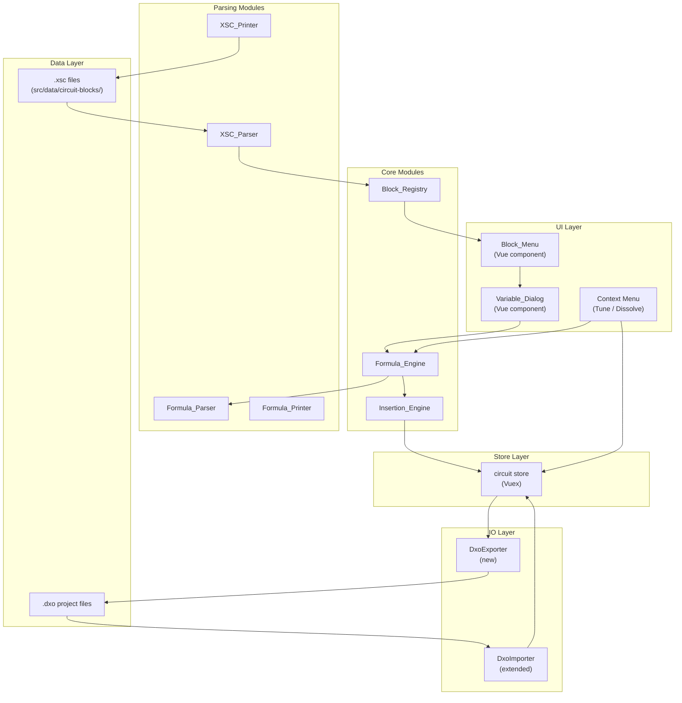

# Design Document: Circuit Blocks Menu

## Overview

The Circuit Blocks Menu feature adds a parametric circuit block system to xoxo. It enables users to insert pre-built passive crossover filter topologies (e.g., Low Pass 2nd Order, L-Pad, Shunt Notch) into their schematic as grouped entities with formula-driven component values. The system is data-driven: block definitions live in `.xsc` files parsed at runtime, formulas are evaluated by a dedicated engine, and blocks persist across save/load cycles via the DXO file format's Subckt mechanism.

The architecture introduces five core modules:
1. **XSC_Parser / XSC_Printer** — reads and writes the `.xsc` block definition format
2. **Formula_Parser / Formula_Printer / Formula_Engine** — parses, prints, and evaluates parametric expressions
3. **Block_Registry** — discovers and indexes all available block definitions
4. **Insertion_Engine** — instantiates a block into the circuit as a Block_Group
5. **DXO Subckt handling** — extends the existing DXO importer/exporter for block persistence

The UI layer adds a Block_Menu panel and a Variable_Dialog modal, both driven entirely by data from the registry and block definitions.

## Architecture



### Design Decisions

1. **Pure parsing modules** — XSC_Parser, Formula_Parser, and their printers are pure functions (string → data, data → string) with no side effects. This makes them trivially testable with property-based tests.

2. **Formula AST** — Rather than using `eval()` or `mathjs` for formula evaluation, we build a small recursive-descent parser that produces an AST. This gives us round-trip fidelity, clear error messages, and avoids security concerns. The AST is simple (5 node types) and the grammar is small.

3. **Block_Group as a lightweight overlay** — Rather than creating a new component type, a Block_Group is metadata stored on the Circuit that references existing components by ID. Components themselves remain standard Resistor/Capacitor/Inductor instances. This avoids changes to the simulation engine.

4. **Schema-first for new data structures** — New schemas will be created for `circuit-block.schema.json` (the parsed XSC structure) and `formula-ast.schema.json` (the expression tree). The Block_Group data will be added to the existing `circuit.schema.json`.

5. **Vuex store extension** — Block_Group state lives in the circuit store alongside existing component/wire state. New mutations and actions handle group operations (insert, tune, dissolve).

## Components and Interfaces

### XSC_Parser

**Location:** `src/io/XscParser.js`

```javascript
/**
 * Parse a .xsc file content string into a CircuitBlock object.
 * @param {string} content - Raw .xsc file content
 * @returns {{ success: boolean, block?: CircuitBlock, error?: string }}
 */
export function parseXsc(content) { ... }
```

**Returns** a `CircuitBlock` object (see Data Models) or a descriptive error.

### XSC_Printer

**Location:** `src/io/XscPrinter.js`

```javascript
/**
 * Serialize a CircuitBlock object back to .xsc format string.
 * @param {CircuitBlock} block - Structured block definition
 * @returns {string} - .xsc format string
 */
export function printXsc(block) { ... }
```

### Formula_Parser

**Location:** `src/formulas/FormulaParser.js`

```javascript
/**
 * Parse a formula string into an AST.
 * @param {string} formula - e.g. "R/(2*pi*freq*Q)"
 * @returns {{ success: boolean, ast?: FormulaNode, error?: string }}
 */
export function parseFormula(formula) { ... }
```

Grammar (EBNF):
```
Expression  = Term (('+' | '-') Term)*
Term        = Exponent (('*' | '/') Exponent)*
Exponent    = Unary ('^' Unary)*
Unary       = '-' Unary | Atom
Atom        = Number | Identifier | '(' Expression ')'
Number      = [0-9]+ ('.' [0-9]+)? (('e'|'E') ('+'|'-')? [0-9]+)?
Identifier  = [a-zA-Z_][a-zA-Z0-9_]*
```

Special identifiers: `pi` is treated as a numeric constant (Math.PI).

### Formula_Printer

**Location:** `src/formulas/FormulaPrinter.js`

```javascript
/**
 * Serialize a formula AST back to a string.
 * @param {FormulaNode} ast - Formula AST
 * @returns {string} - Formula string
 */
export function printFormula(ast) { ... }
```

### Formula_Engine

**Location:** `src/formulas/FormulaEngine.js`

```javascript
/**
 * Evaluate a formula string with given variable bindings.
 * @param {string} formula - Formula string
 * @param {Object<string, number>} variables - Variable name → value map
 * @returns {{ success: boolean, value?: number, error?: string }}
 */
export function evaluateFormula(formula, variables) { ... }
```

### Block_Registry

**Location:** `src/blocks/BlockRegistry.js`

```javascript
/**
 * Load all .xsc files from the blocks directory.
 * @param {string} blocksDirectory - Path to directory containing .xsc files
 * @returns {{ blocks: Map<string, CircuitBlock>, errors: Array<{file: string, error: string}> }}
 */
export function loadBlockRegistry(blocksDirectory) { ... }

/**
 * Get a block by its identifier (filename without extension).
 * @param {string} identifier
 * @returns {CircuitBlock|undefined}
 */
registry.getBlock(identifier)

/**
 * Get all blocks grouped by category.
 * @returns {Object<string, CircuitBlock[]>}
 */
registry.getBlocksByCategory()
```

Category assignment is based on a static mapping from block title to category:
- **Filters**: Low Pass 1st Order, High Pass 1st Order, Low Pass 2nd Order Q, High Pass 2nd Order Q
- **Phase**: All Pass 1st Order, All Pass 2nd Order
- **Attenuators**: L-Pad
- **Notch Filters**: Series Notch, Shunt Notch

### Insertion_Engine

**Location:** `src/blocks/InsertionEngine.js`

```javascript
/**
 * Insert a circuit block into the active circuit.
 * @param {Circuit} circuit - Target circuit
 * @param {CircuitBlock} block - Block definition
 * @param {Object<string, number>} variables - User-supplied variable values
 * @param {{ x: number, y: number }} insertionPoint - Grid position for placement
 * @returns {{ success: boolean, blockGroup?: BlockGroup, error?: string }}
 */
export function insertBlock(circuit, block, variables, insertionPoint) { ... }
```

### DXO Extensions

**DxoImporter extension** — The existing `parseSubcircuits()` method (currently skipping subcircuits) will be replaced with full parsing that reconstructs Block_Groups.

**DxoExporter** — New module at `src/io/DxoExporter.js` that serializes a Circuit to DXO format, including Subckt sections for Block_Groups.

## Data Models

### CircuitBlock (parsed .xsc structure)

**Schema:** `src/schemas/circuit-block.schema.json`

```javascript
{
  title: "Low Pass 1st Order",        // Display name (line 1 of .xsc)
  identifier: "LowPassFirstOrder",     // Derived from filename
  variables: [                         // 6 slots, some may be empty
    { name: "", description: "", defaultValue: 0 },
    { name: "", description: "", defaultValue: 0 },
    { name: "freq", description: "frequency [Hz]", defaultValue: 1000 },
    { name: "R", description: "Load resistance [Ohms]", defaultValue: 8 },
    { name: "", description: "", defaultValue: 0 },
    { name: "", description: "", defaultValue: 0 }
  ],
  components: [
    {
      partType: 2,                     // 0=resistor, 1=capacitor, 2=inductor
      defaultValue: 0.001,             // Default component value
      esr: 0.48,                       // ESR (ohms)
      rating: 300,                     // Power rating
      position: { x: 0, y: 3 },       // Relative grid position
      isHorizontal: true,              // Orientation
      stepMode: 2,                     // Step mode
      bypassMode: 1,                   // 0=short, 1=value, 2=open
      formula: "R/(2*pi*freq)",        // Value formula
      formulaScale: 1                  // Scale factor (from line after formula)
    }
  ],
  grounds: [
    { x: 0, y: 6 }                    // Relative grid positions
  ],
  wires: [
    { start: { x: -3, y: 5 }, end: { x: 3, y: 5 } }
  ],
  texts: [
    { label: "Low Pass 1st Order", position: { x: 0, y: -3 }, size: 8, color: 8388608 }
  ]
}
```

### FormulaNode (AST)

**Schema:** `src/schemas/formula-ast.schema.json`

```javascript
// Number literal
{ type: "number", value: 3.14159 }

// Identifier (variable reference)
{ type: "identifier", name: "freq" }

// Binary operation
{ type: "binary", operator: "+"|"-"|"*"|"/"|"^", left: FormulaNode, right: FormulaNode }

// Unary operation
{ type: "unary", operator: "-", operand: FormulaNode }

// Parenthesized expression (for printer fidelity)
{ type: "group", expression: FormulaNode }
```

### BlockGroup (circuit-level metadata)

Added to the Circuit model and `circuit.schema.json`:

```javascript
{
  id: "bg-uuid-1234",                 // Unique group ID
  blockIdentifier: "LowPassFirstOrder", // Source block identifier
  blockTitle: "Low Pass 1st Order",    // Display title
  variables: [                         // Current variable values (6 slots)
    { name: "freq", value: 1000, description: "frequency [Hz]" },
    { name: "R", value: 8, description: "Load resistance [Ohms]" },
    // ... (only non-empty slots stored)
  ],
  componentIds: ["comp-uuid-1", "comp-uuid-2"],  // Component IDs in this group
  wireSegmentIds: ["ws-uuid-1"],       // WireSegment IDs in this group
  formulas: [                          // Formula per component (parallel to componentIds)
    "R/(2*pi*freq)",
  ],
  stepModes: [0, 0, 0, 0, 0, 0]       // Step modes for DXO export
}
```

### Category Map (static)

```javascript
const BLOCK_CATEGORIES = {
  'Filters': [
    'Low Pass 1st Order',
    'High Pass 1st Order', 
    'Low Pass 2nd Order Q',
    'High Pass 2nd Order Q'
  ],
  'Phase': [
    'All Pass 1st Order',
    'All Pass 2nd Order'
  ],
  'Attenuators': [
    'L-Pad'
  ],
  'Notch Filters': [
    'Series Notch',
    'Shunt Notch'
  ]
};
```

## Data Models — Schema Updates

### circuit.schema.json additions

A new `blockGroups` array will be added to the top-level circuit schema:

```json
{
  "blockGroups": {
    "type": "array",
    "items": { "$ref": "#/definitions/blockGroup" },
    "default": []
  }
}
```

With the `blockGroup` definition:

```json
{
  "blockGroup": {
    "type": "object",
    "required": ["id", "blockTitle", "variables", "componentIds", "formulas"],
    "properties": {
      "id": { "type": "string" },
      "blockIdentifier": { "type": "string" },
      "blockTitle": { "type": "string" },
      "variables": {
        "type": "array",
        "items": {
          "type": "object",
          "required": ["name", "value", "description"],
          "properties": {
            "name": { "type": "string" },
            "value": { "type": "number" },
            "description": { "type": "string" }
          }
        }
      },
      "componentIds": {
        "type": "array",
        "items": { "type": "string" }
      },
      "wireSegmentIds": {
        "type": "array",
        "items": { "type": "string" },
        "default": []
      },
      "formulas": {
        "type": "array",
        "items": { "type": "string" }
      },
      "stepModes": {
        "type": "array",
        "items": { "type": "integer" },
        "minItems": 6,
        "maxItems": 6
      }
    }
  }
}
```

## Correctness Properties

*A property is a characteristic or behavior that should hold true across all valid executions of a system — essentially, a formal statement about what the system should do. Properties serve as the bridge between human-readable specifications and machine-verifiable correctness guarantees.*

### Property 1: XSC parse/print round-trip

*For any* valid CircuitBlock object (with arbitrary title, variable slots, component definitions, wires, grounds, and text annotations), printing it to XSC format and then parsing the result SHALL produce a structurally equivalent CircuitBlock object.

**Validates: Requirements 2.1, 2.2, 2.3, 2.4, 2.5, 2.7, 2.8**

### Property 2: Formula parse/print round-trip

*For any* valid formula AST (containing numbers, identifiers, binary operators, unary negation, and parenthesized groups), printing it to a string and then parsing the result SHALL produce a semantically equivalent AST (evaluates to the same value for all variable bindings).

**Validates: Requirements 7.1, 7.3, 7.4**

### Property 3: Formula evaluation determinism

*For any* valid formula string and valid variable bindings (all referenced variables present, all values positive finite numbers), evaluating the formula SHALL produce a finite positive number.

**Validates: Requirements 3.1, 3.3**

### Property 4: Formula operator precedence

*For any* formula containing mixed operators (+, -, *, /, ^) and parentheses, the Formula_Parser SHALL produce an AST that, when evaluated, gives the same result as the mathematically correct evaluation with standard precedence (parentheses > exponentiation > multiplication/division > addition/subtraction).

**Validates: Requirements 7.2**

### Property 5: Block insertion creates correct components

*For any* valid CircuitBlock with N components and M wire definitions, and any valid variable bindings, inserting the block into a Circuit SHALL: (a) increase the circuit's passive component count by exactly N, (b) create wire segments matching the block's wiring topology, (c) position each component at the insertion point offset by the block's relative position, and (d) set each component's value to the formula evaluation result.

**Validates: Requirements 6.1, 6.2, 6.3, 6.9**

### Property 6: Block insertion assigns sequential labels

*For any* Circuit with existing components and any inserted CircuitBlock, the Insertion_Engine SHALL assign labels that continue sequentially from the highest existing label of each component type (e.g., if R3 exists, new resistors start at R4).

**Validates: Requirements 6.4**

### Property 7: Block dissolution preserves component state

*For any* Block_Group in a Circuit, dissolving it SHALL: (a) not change the value, position, label, rotation, or ESR of any component that was in the group, and (b) remove the Block_Group entity from the circuit so those components are no longer associated with any group.

**Validates: Requirements 9.3, 9.4**

### Property 8: Block tuning recalculates all components

*For any* Block_Group with N components and new valid variable values, tuning the block SHALL update every component's value to exactly match the formula evaluation with the new variables, while preserving component positions, labels, and ESR values.

**Validates: Requirements 8.3, 8.4**

### Property 9: DXO Subckt round-trip

*For any* Circuit containing Block_Groups (with variable definitions, component formula associations, and subcircuit indices), exporting to DXO format and then importing the result SHALL produce a Circuit with equivalent Block_Groups — same titles, same variable values, same component-to-subcircuit associations, and same formula strings.

**Validates: Requirements 10.1, 10.2, 10.3, 10.4, 10.5, 10.8, 11.1, 11.2, 11.3, 11.4, 11.5, 11.6**

### Property 10: Variable filtering shows only non-empty slots

*For any* CircuitBlock with K non-empty variable slots (where 0 ≤ K ≤ 6), the variable filtering logic SHALL return exactly K variables, each with a non-empty name string.

**Validates: Requirements 5.2**

## Error Handling

### XSC_Parser Errors
- **Truncated file**: If the file ends before all expected sections are read, return error with the section name and line number where parsing stopped.
- **Invalid numeric value**: If a line expected to contain a number cannot be parsed, return error identifying the field and line.
- **Missing sections**: If a required section header (Passives, Grounds, Wires, Texts) is missing, return error.

### Formula_Parser Errors
- **Unexpected token**: Report the character position and what was expected vs. found.
- **Unclosed parenthesis**: Report the position of the opening parenthesis.
- **Empty expression**: Report that the formula string is empty or whitespace-only.

### Formula_Engine Errors
- **Undefined variable**: Report which variable name is referenced but not provided.
- **Division by zero**: Report the formula and variable values that caused it.
- **Non-finite result**: Report NaN/Infinity with the component index and formula.
- **Negative result**: Report when a component value evaluates to negative (physically invalid).

### Block_Registry Errors
- **File read failure**: Log warning with filename, continue loading other files.
- **Parse failure**: Log warning with filename and parser error message, continue.

### Insertion_Engine Errors
- **No active circuit**: Return error indicating a circuit must be open.
- **Formula evaluation failure**: Return error identifying which component's formula failed and why.

### DXO Import Errors
- **Subckt title not in registry**: Log warning, reconstruct Block_Group from embedded data (graceful degradation).
- **Missing formula on block component**: Log warning, import component as independent.

## Testing Strategy

### Property-Based Tests (fast-check)

The project already has `fast-check` (v4.5.3) as a dev dependency. Each correctness property maps to a single property-based test with minimum 100 iterations.

**Test file locations:**
- `tests/unit/io/XscParser.spec.js` — Property 1 (XSC round-trip)
- `tests/unit/formulas/FormulaParser.spec.js` — Property 2 (formula AST round-trip), Property 4 (precedence)
- `tests/unit/formulas/FormulaEngine.spec.js` — Property 3 (evaluation determinism)
- `tests/unit/blocks/InsertionEngine.spec.js` — Property 5 (insertion correctness), Property 6 (label sequencing)
- `tests/unit/blocks/BlockDissolution.spec.js` — Property 7 (dissolution preserves state)
- `tests/unit/blocks/BlockTuning.spec.js` — Property 8 (tuning recalculates)
- `tests/unit/io/DxoSubckt.spec.js` — Property 9 (DXO Subckt round-trip)
- `tests/unit/blocks/VariableFiltering.spec.js` — Property 10 (variable filtering)

**Generators needed:**
- `circuitBlockGenerator()` — generates valid CircuitBlock objects with random titles, 0-6 non-empty variable slots, 1-8 components with valid formulas, random wires and grounds
- `formulaAstGenerator(maxDepth)` — generates valid formula ASTs (recursive, bounded depth ≤ 4 to avoid explosion)
- `variableBindingsGenerator(ast)` — extracts identifier names from an AST and generates positive finite number bindings for each
- `blockGroupGenerator()` — generates a Circuit with 1-3 Block_Groups, each with 1-8 components and valid formulas/variables
- `circuitWithComponentsGenerator()` — generates a Circuit with existing labeled components for testing label sequencing

**Configuration:**
- Minimum 100 iterations per property test
- Each test tagged with comment: `// Feature: circuit-blocks-menu, Property N: <title>`
- Use `fc.assert(fc.property(...), { numRuns: 100 })` pattern

### Unit Tests (example-based)

**XSC Parser:**
- Parse each of the 9 shipped .xsc files and verify structure matches expected values
- Verify error handling: truncated file, missing sections, non-numeric values

**Formula Engine:**
- Evaluate known formulas with hand-calculated expected results:
  - `R/(2*pi*freq)` with R=8, freq=1000 → 0.001273...
  - `R*(1-(10^(-(dB+0.001)/20)))` with R=8, dB=6 → expected value
  - `(Q*8)/(6.28*f)` with Q=1, f=1000 → 0.001274...
- Error cases: undefined variable, division by zero, empty formula

**Block Registry:**
- Load all 9 shipped blocks and verify titles match expected list
- Verify category assignment for all 9 blocks
- Verify graceful handling of malformed .xsc file among valid ones

**Variable Dialog logic:**
- Verify filtering: block with 2 non-empty slots → 2 fields shown
- Verify validation: non-numeric input rejected, empty input rejected

**Block operations:**
- Insert Low Pass 1st Order with freq=1000, R=8 → verify inductor value ≈ 1.27mH
- Tune block with new freq=2000 → verify value halves
- Dissolve block → verify components independent, no Block_Group remains

### Integration Tests

- Full workflow: load Block_Registry → select block → enter variables → insert → verify circuit state → save DXO → reload → verify Block_Group preserved
- DXO round-trip with the real `shunt-notch.dxo` file from `research/circuit-block-examples/`
- Import DXO with unknown block title → verify graceful degradation (Block_Group still created from embedded data)
