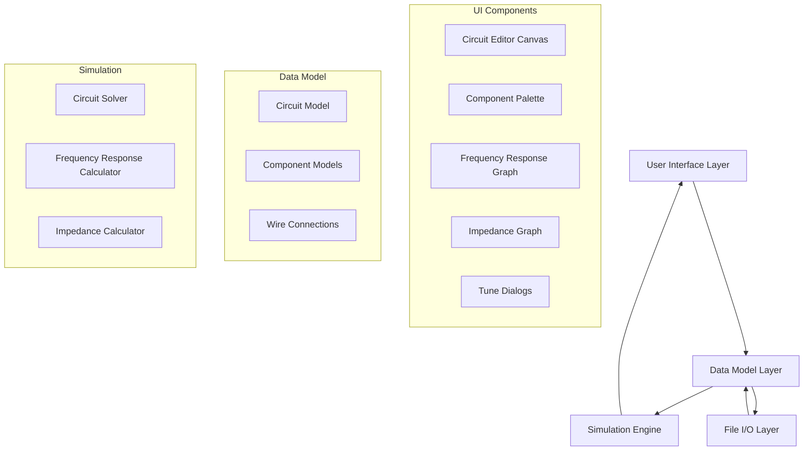

# Design Document: Crossover Network Simulator

## Overview

The crossover network simulator is a cross-platform desktop application for designing and analyzing loudspeaker crossover networks. The application provides a visual circuit editor, real-time simulation engine, and frequency response visualization tools. Users can design passive crossover networks using standard electronic components (resistors, capacitors, inductors) and loudspeaker drivers with imported measurement data.

The system architecture follows a Model-View-Controller pattern with clear separation between the circuit data model, simulation engine, and user interface components. The application will be built using Electron for cross-platform desktop deployment, Vue 3 for the UI framework, and a custom JavaScript-based circuit simulation engine.

### Key Design Decisions

1. **Electron + Vue 3**: Provides cross-platform desktop capabilities with modern reactive UI framework
2. **Canvas-based circuit editor**: HTML5 Canvas for high-performance rendering of circuits with many components
3. **JSON file format**: Human-readable, version-control friendly, extensible for future features
4. **Modular simulation engine**: Separate from UI for testability and potential future web worker optimization
5. **Grid-based layout**: Simplifies wire routing and component alignment (6-dot spacing for passive components)

## Architecture

### High-Level Architecture



### Application Structure

```
src/
├── main/                    # Electron main process
│   ├── index.js            # Application entry point
│   ├── menu.js             # Application menu definitions
│   └── fileHandlers.js     # File operations (save, load, import)
├── renderer/               # Electron renderer process (UI)
│   ├── main.js            # Vue app initialization
│   ├── App.vue            # Root Vue component
│   ├── components/        # Vue components
│   │   ├── CircuitEditor.vue
│   │   ├── ComponentPalette.vue
│   │   ├── FrequencyResponseGraph.vue
│   │   ├── ImpedanceGraph.vue
│   │   ├── TuneDialog.vue
│   │   └── ...
│   ├── store/             # Vuex state management
│   │   ├── index.js
│   │   ├── circuit.js     # Circuit state module
│   │   ├── simulation.js  # Simulation state module
│   │   └── ui.js          # UI state module
│   └── utils/             # Utility functions
├── models/                # Data models
│   ├── Circuit.js
│   ├── Component.js
│   ├── Wire.js
│   ├── Node.js
│   └── ...
├── simulation/            # Simulation engine
│   ├── CircuitSolver.js
│   ├── FrequencyAnalyzer.js
│   ├── ImpedanceCalculator.js
│   └── HilbertTransform.js
├── io/                    # File I/O
│   ├── JsonSerializer.js
│   ├── DxoImporter.js
│   ├── FrdParser.js
│   └── ZmaParser.js
└── lib/                   # Third-party libraries
    └── complex.js         # Complex number math
```

## Components and Interfaces

### Core Data Models

#### Circuit Model

The Circuit class represents the complete crossover network design.

```javascript
class Circuit {
	constructor() {
		this.components = [];      // Array of Component instances
		this.wires = [];          // Array of Wire instances
		this.nodes = [];          // Array of Node instances
		this.annotations = [];    // Array of TextAnnotation instances
		this.metadata = {
			name: '',
			created: null,
			modified: null,
			version: '1.0'
		};
	}

	addComponent(component) { /* ... */ }
	removeComponent(componentId) { /* ... */ }
	addWire(wire) { /* ... */ }
	removeWire(wireId) { /* ... */ }
	findConnectedComponents(startComponent) { /* ... */ }
	validate() { /* ... */ }
	toJSON() { /* ... */ }
	static fromJSON(json) { /* ... */ }
}
```

#### Component Model

Base class for all circuit components with common properties and behavior.

```javascript
class Component {
	constructor(type, x, y) {
		this.id = generateUniqueId();
		this.type = type;           // 'resistor', 'capacitor', 'inductor', 'speaker', 'ground', 'source'
		this.label = '';            // Auto-assigned (R1, C1, L1, S1, etc.)
		this.x = x;                 // Grid position X
		this.y = y;                 // Grid position Y
		this.rotation = 0;          // 0, 90, 180, 270 degrees
		this.terminals = [];        // Array of terminal positions
		this.parameters = {};       // Component-specific parameters
	}

	getTerminalPosition(terminalIndex) { /* ... */ }
	rotate(degrees) { /* ... */ }
	validate() { /* ... */ }
	toJSON() { /* ... */ }
}
```

#### Passive Component Models

```javascript
class Resistor extends Component {
	constructor(x, y) {
		super('resistor', x, y);
		this.parameters = {
			resistance: 8.0,        // Ohms
			tolerance: 5,           // Percentage
			state: 'normal'         // 'normal', 'open', 'short'
		};
	}
}

class Capacitor extends Component {
	constructor(x, y) {
		super('capacitor', x, y);
		this.parameters = {
			capacitance: 10e-6,     // Farads
			tolerance: 10,          // Percentage
			esr: 0.0,              // Equivalent Series Resistance (Ohms)
			state: 'normal'         // 'normal', 'open', 'short'
		};
	}
}

class Inductor extends Component {
	constructor(x, y) {
		super('inductor', x, y);
		this.parameters = {
			inductance: 1e-3,       // Henries
			tolerance: 10,          // Percentage
			esr: 0.0,              // Equivalent Series Resistance (Ohms)
			state: 'normal'         // 'normal', 'open', 'short'
		};
	}
}
```

#### Loudspeaker Component Model

```javascript
class Speaker extends Component {
	constructor(x, y) {
		super('speaker', x, y);
		this.parameters = {
			name: '',
			sensitivity: 0.0,       // dB adjustment
			delay: 0.0,            // Milliseconds
			inverted: false,
			muted: false,
			frdFile: null,         // Primary on-axis FRD file path
			zmaFile: null,         // Impedance file path
			phaseSource: 'derived', // 'measured' or 'derived' (minimum phase)
			offAxisFiles: []       // Array of {angle: number, frdPath: string}
		};
		this.frdData = null;       // Parsed frequency response data
		this.zmaData = null;       // Parsed impedance data
		this.offAxisData = [];     // Parsed off-axis data
	}

	loadFrdFile(filePath) { /* ... */ }
	loadZmaFile(filePath) { /* ... */ }
	addOffAxisFile(angle, filePath) { /* ... */ }
}
```

#### Voltage Source Model

```javascript
class VoltageSource extends Component {
	constructor(x, y) {
		super('source', x, y);
		this.parameters = {
			power: 1.0,            // Watts
			impedance: 8.0,        // Ohms (reference)
			delay: 0.0,            // Milliseconds
			inverted: false
		};
	}

	getVoltage() {
		// V = sqrt(P * Z)
		return Math.sqrt(this.parameters.power * this.parameters.impedance);
	}
}
```

#### Wire and Node Models

```javascript
class Wire {
	constructor(startNode, endNode) {
		this.id = generateUniqueId();
		this.startNode = startNode;  // Node instance or component terminal reference
		this.endNode = endNode;      // Node instance or component terminal reference
		this.segments = [];          // Array of {x, y} points for multi-segment wires
	}

	addSegment(x, y) { /* ... */ }
	removeSegment(index) { /* ... */ }
	toJSON() { /* ... */ }
}

class Node {
	constructor(x, y) {
		this.id = generateUniqueId();
		this.x = x;                  // Grid position X
		this.y = y;                  // Grid position Y
		this.connectedWires = [];    // Array of Wire IDs
	}

	toJSON() { /* ... */ }
}
```

#### Text Annotation Model

```javascript
class TextAnnotation {
	constructor(x, y, text) {
		this.id = generateUniqueId();
		this.x = x;
		this.y = y;
		this.text = text;
		this.fontSize = 12;
	}

	toJSON() { /* ... */ }
}
```

### Simulation Engine

#### Circuit Solver

The circuit solver uses Modified Nodal Analysis (MNA) to solve the circuit network at each frequency point.

```javascript
class CircuitSolver {
	constructor(circuit) {
		this.circuit = circuit;
		this.nodeMap = new Map();     // Maps nodes to matrix indices
		this.frequencyPoints = [];    // Logarithmically spaced from 1 Hz to 100 kHz
	}

	buildNodeMap() {
		// Assign unique indices to all circuit nodes
		// Exclude components in 'open' state
		// Treat components in 'short' state as zero-resistance connections
	}

	buildMNAMatrix(frequency) {
		// Build Modified Nodal Analysis matrix for given frequency
		// Returns {A: matrix, b: vector}
		// A * x = b, where x contains node voltages and branch currents
	}

	solve(frequency) {
		// Solve circuit at given frequency
		// Returns node voltages and branch currents as complex numbers
	}

	solveAllFrequencies() {
		// Solve circuit across all frequency points
		// Returns frequency response data
	}

	generateFrequencyPoints(startFreq, endFreq, pointsPerDecade) {
		// Generate logarithmically spaced frequency points
	}
}
```

#### Frequency Response Analyzer

```javascript
class FrequencyAnalyzer {
	constructor(circuit, solverResults) {
		this.circuit = circuit;
		this.solverResults = solverResults;
	}

	calculateSPL(speakerComponent, frequency) {
		// Calculate SPL for a speaker at given frequency
		// Combines electrical response with speaker's FRD data
		// Applies sensitivity adjustments and delay
	}

	calculateSystemResponse() {
		// Calculate combined SPL response from all speakers
		// Accounts for phase, delay, and polarity
	}

	calculateImpedance(frequency) {
		// Calculate input impedance at given frequency
	}

	applySmoothing(data, smoothingType) {
		// Apply fractional octave smoothing to frequency response
		// Types: none, 1/24, 1/12, 1/6, 1/3, 1/2, 1, ERB
	}
}
```

#### Hilbert Transform

```javascript
class HilbertTransform {
	static calculateMinimumPhase(magnitudeData) {
		// Apply Hilbert Transform to derive minimum phase from magnitude
		// Used when phase source is set to 'derived'
		// Returns phase data array
	}
}
```

### User Interface Components

#### Circuit Editor Component

```vue
<template>
	<div class="circuit-editor">
		<canvas
			ref="canvas"
			@mousedown="handleMouseDown"
			@mousemove="handleMouseMove"
			@mouseup="handleMouseUp"
			@wheel="handleWheel"
			@contextmenu="handleContextMenu"
		/>
		<div class="toolbar">
			<button @click="zoomIn">Zoom In</button>
			<button @click="zoomOut">Zoom Out</button>
			<input v-model="zoomPercent" type="number" @change="setZoom" />
		</div>
	</div>
</template>

<script>
export default {
	data() {
		return {
			canvas: null,
			context: null,
			zoomPercent: 100,
			scrollX: 0,
			scrollY: 0,
			gridSize: 10,           // Pixels per grid dot
			selectedComponent: null,
			dragMode: null,         // 'move', 'wire', 'scroll'
			wireStart: null
		};
	},
	methods: {
		renderCircuit() {
			// Clear canvas
			// Draw grid dots
			// Draw wires
			// Draw components
			// Draw selection highlights
		},
		handleMouseDown(event) {
			// Detect click on component, wire, or empty space
			// Enter appropriate drag mode
		},
		handleMouseMove(event) {
			// Update component position, wire routing, or scroll position
		},
		handleMouseUp(event) {
			// Complete drag operation
			// Exit drag mode
		},
		snapToGrid(x, y) {
			// Snap coordinates to nearest grid point
		}
	}
};
</script>
```

#### Component Palette Component

```vue
<template>
	<div class="component-palette">
		<div
			v-for="componentType in componentTypes"
			:key="componentType.type"
			class="palette-item"
			draggable="true"
			@dragstart="startDrag(componentType)"
		>
			
			<span>{{ componentType.label }}</span>
		</div>
	</div>
</template>

<script>
export default {
	data() {
		return {
			componentTypes: [
				{ type: 'resistor', label: 'Resistor', icon: '/icons/resistor.svg' },
				{ type: 'capacitor', label: 'Capacitor', icon: '/icons/capacitor.svg' },
				{ type: 'inductor', label: 'Inductor', icon: '/icons/inductor.svg' },
				{ type: 'speaker', label: 'Speaker', icon: '/icons/speaker.svg' },
				{ type: 'ground', label: 'Ground', icon: '/icons/ground.svg' }
			]
		};
	},
	methods: {
		startDrag(componentType) {
			// Set drag data for component creation
		}
	}
};
</script>
```

#### Frequency Response Graph Component

```vue
<template>
	<div class="frequency-response-graph">
		<div class="graph-menu">
			<button @click="toggleCurvesMenu">Curves</button>
			<button @click="toggleScaleMenu">Scale</button>
			<button @click="toggleFileMenu">File</button>
			<button @click="toggleHold">Hold</button>
		</div>
		<canvas ref="graphCanvas" />
	</div>
</template>

<script>
export default {
	data() {
		return {
			curves: [],              // Array of curve data to display
			heldCurves: null,        // Snapshot of curves when Hold is active
			scaleSettings: {
				minFreq: 20,
				maxFreq: 20000,
				centerValue: 0,
				stepSize: 5
			}
		};
	},
	methods: {
		renderGraph() {
			// Draw frequency axis (logarithmic)
			// Draw magnitude axis (linear dB)
			// Draw grid lines
			// Draw curves
			// Draw held curves in gray if active
		},
		exportFRD() {
			// Export system response as FRD file
		},
		exportSnapshot() {
			// Save graph as image file
		}
	}
};
</script>
```

#### Tune Dialog Component

```vue
<template>
	<div v-if="visible" class="tune-dialog-overlay" @click.self="close">
		<div class="tune-dialog">
			<h3>Tune {{ component.label }}</h3>
			
			<!-- Passive component parameters -->
			<div v-if="isPassiveComponent">
				<label>Value:</label>
				<input v-model="parameters.value" type="text" @input="parseEngineering" />
				<button @click="incrementValue">▲</button>
				<button @click="decrementValue">▼</button>
				
				<label>Tolerance (%):</label>
				<input v-model="parameters.tolerance" type="number" />
				
				<label v-if="hasESR">ESR (Ω):</label>
				<input v-if="hasESR" v-model="parameters.esr" type="number" />
				
				<label>State:</label>
				<select v-model="parameters.state">
					<option value="normal">Normal</option>
					<option value="open">Open</option>
					<option value="short">Short</option>
				</select>
			</div>
			
			<!-- Speaker parameters -->
			<div v-if="component.type === 'speaker'">
				<label>Name:</label>
				<input v-model="parameters.name" type="text" />
				
				<label>Sensitivity (dB):</label>
				<input v-model="parameters.sensitivity" type="number" step="0.25" />
				
				<label>Delay:</label>
				<input v-model="parameters.delay" type="number" />
				
				<label>
					<input v-model="parameters.inverted" type="checkbox" />
					Invert Polarity
				</label>
				
				<label>
					<input v-model="parameters.muted" type="checkbox" />
					Mute
				</label>
				
				<label>FRD File:</label>
				<button @click="selectFrdFile">Choose File</button>
				<span>{{ parameters.frdFile }}</span>
				
				<label>ZMA File:</label>
				<button @click="selectZmaFile">Choose File</button>
				<span>{{ parameters.zmaFile }}</span>
				
				<label>Phase Source:</label>
				<label><input v-model="parameters.phaseSource" type="radio" value="measured" /> As Measured</label>
				<label><input v-model="parameters.phaseSource" type="radio" value="derived" /> Derived (Minimum Phase)</label>
				
				<h4>Off-Axis Measurements</h4>
				<div v-for="(offAxis, index) in parameters.offAxisFiles" :key="index">
					<input v-model="offAxis.angle" type="number" />°
					<button @click="selectOffAxisFile(index)">Choose File</button>
					<span>{{ offAxis.frdPath }}</span>
					<button @click="removeOffAxisFile(index)">Remove</button>
				</div>
				<button @click="addOffAxisFile">Add Off-Axis File</button>
			</div>
			
			<!-- Voltage source parameters -->
			<div v-if="component.type === 'source'">
				<label>Power (W):</label>
				<input v-model="parameters.power" type="number" />
				
				<label>at</label>
				
				<label>Impedance (Ω):</label>
				<input v-model="parameters.impedance" type="number" />
				
				<button @click="resetToStandard">Std</button>
				
				<label>Delay:</label>
				<input v-model="parameters.delay" type="number" />
				
				<label>
					<input v-model="parameters.inverted" type="checkbox" />
					Invert Polarity
				</label>
			</div>
			
			<button @click="close">Close</button>
		</div>
	</div>
</template>

<script>
export default {
	props: {
		component: Object,
		visible: Boolean
	},
	data() {
		return {
			parameters: {}
		};
	},
	methods: {
		parseEngineering(value) {
			// Parse engineering notation (4.7k, 10u, 100n)
		},
		incrementValue() {
			// Step through E12/E24 standard values
		},
		close() {
			// Apply changes and close dialog
		}
	}
};
</script>
```

### File I/O

#### JSON Serializer

```javascript
class JsonSerializer {
	static serialize(circuit) {
		// Convert Circuit instance to JSON string
		// Include all components, wires, nodes, annotations
		return JSON.stringify(circuit.toJSON(), null, 2);
	}

	static deserialize(jsonString) {
		// Parse JSON string and reconstruct Circuit instance
		const data = JSON.parse(jsonString);
		return Circuit.fromJSON(data);
	}

	static validate(jsonString) {
		// Validate JSON structure before deserializing
		// Check for required fields and valid data types
	}
}
```

#### DXO Importer

```javascript
class DxoImporter {
	static import(dxoFilePath) {
		// Parse XSim .dxo file format
		// Convert to internal Circuit representation
		// Return Circuit instance
	}

	static parseComponent(dxoComponentData) {
		// Convert DXO component format to internal Component
	}

	static parseConnection(dxoConnectionData) {
		// Convert DXO connection format to internal Wire
	}
}
```

#### FRD Parser

```javascript
class FrdParser {
	static parse(frdFilePath) {
		// Parse FRD file (frequency response data)
		// Format: frequency(Hz) magnitude(dB) phase(degrees)
		// Returns: {frequencies: [], magnitudes: [], phases: []}
	}

	static validate(data) {
		// Validate frequency data is monotonically increasing
		// Check for valid numeric values
	}

	static export(frequencies, magnitudes, phases, outputPath) {
		// Export frequency response data to FRD file
	}
}
```

#### ZMA Parser

```javascript
class ZmaParser {
	static parse(zmaFilePath) {
		// Parse ZMA file (impedance data)
		// Format: frequency(Hz) impedance(Ohms) phase(degrees)
		// Returns: {frequencies: [], impedances: [], phases: []}
	}

	static export(frequencies, impedances, phases, outputPath) {
		// Export impedance data to ZMA file
	}
}
```

## Data Models

### JSON Schema Definitions

All data models are defined using JSON Schema for validation and documentation. These schemas can be used to validate circuit files, component parameters, and imported measurement data.

#### Circuit Schema

```json
{
	"$schema": "http://json-schema.org/draft-07/schema#",
	"$id": "circuit.schema.json",
	"type": "object",
	"required": ["version", "metadata", "components", "wires"],
	"properties": {
		"version": {
			"type": "string",
			"pattern": "^\\d+\\.\\d+$",
			"description": "Schema version"
		},
		"metadata": {
			"type": "object",
			"required": ["name", "created", "modified"],
			"properties": {
				"name": {
					"type": "string",
					"description": "Circuit name"
				},
				"created": {
					"type": "string",
					"format": "date-time",
					"description": "Creation timestamp"
				},
				"modified": {
					"type": "string",
					"format": "date-time",
					"description": "Last modification timestamp"
				}
			}
		},
		"components": {
			"type": "array",
			"items": {
				"$ref": "#/definitions/component"
			}
		},
		"wires": {
			"type": "array",
			"items": {
				"$ref": "#/definitions/wire"
			}
		},
		"annotations": {
			"type": "array",
			"items": {
				"$ref": "#/definitions/annotation"
			},
			"default": []
		}
	},
	"definitions": {
		"component": {
			"type": "object",
			"required": ["id", "type", "x", "y", "rotation", "parameters"],
			"properties": {
				"id": {
					"type": "string",
					"description": "Unique component identifier"
				},
				"type": {
					"type": "string",
					"enum": ["resistor", "capacitor", "inductor", "speaker", "ground", "source"],
					"description": "Component type"
				},
				"label": {
					"type": "string",
					"description": "Component label (e.g., R1, C2, L3)"
				},
				"x": {
					"type": "integer",
					"description": "Grid position X coordinate"
				},
				"y": {
					"type": "integer",
					"description": "Grid position Y coordinate"
				},
				"rotation": {
					"type": "integer",
					"enum": [0, 90, 180, 270],
					"description": "Rotation in degrees"
				},
				"parameters": {
					"oneOf": [
						{"$ref": "#/definitions/resistorParameters"},
						{"$ref": "#/definitions/capacitorParameters"},
						{"$ref": "#/definitions/inductorParameters"},
						{"$ref": "#/definitions/speakerParameters"},
						{"$ref": "#/definitions/groundParameters"},
						{"$ref": "#/definitions/sourceParameters"}
					]
				}
			}
		},
		"resistorParameters": {
			"type": "object",
			"required": ["resistance", "tolerance", "state"],
			"properties": {
				"resistance": {
					"type": "number",
					"minimum": 0,
					"exclusiveMinimum": true,
					"description": "Resistance in ohms"
				},
				"tolerance": {
					"type": "number",
					"minimum": 0,
					"maximum": 100,
					"description": "Tolerance percentage"
				},
				"state": {
					"type": "string",
					"enum": ["normal", "open", "short"],
					"description": "Component state"
				}
			}
		},
		"capacitorParameters": {
			"type": "object",
			"required": ["capacitance", "tolerance", "esr", "state"],
			"properties": {
				"capacitance": {
					"type": "number",
					"minimum": 0,
					"exclusiveMinimum": true,
					"description": "Capacitance in farads"
				},
				"tolerance": {
					"type": "number",
					"minimum": 0,
					"maximum": 100,
					"description": "Tolerance percentage"
				},
				"esr": {
					"type": "number",
					"minimum": 0,
					"description": "Equivalent Series Resistance in ohms"
				},
				"state": {
					"type": "string",
					"enum": ["normal", "open", "short"],
					"description": "Component state"
				}
			}
		},
		"inductorParameters": {
			"type": "object",
			"required": ["inductance", "tolerance", "esr", "state"],
			"properties": {
				"inductance": {
					"type": "number",
					"minimum": 0,
					"exclusiveMinimum": true,
					"description": "Inductance in henries"
				},
				"tolerance": {
					"type": "number",
					"minimum": 0,
					"maximum": 100,
					"description": "Tolerance percentage"
				},
				"esr": {
					"type": "number",
					"minimum": 0,
					"description": "Equivalent Series Resistance in ohms"
				},
				"state": {
					"type": "string",
					"enum": ["normal", "open", "short"],
					"description": "Component state"
				}
			}
		},
		"speakerParameters": {
			"type": "object",
			"required": ["name", "sensitivity", "delay", "inverted", "muted", "phaseSource"],
			"properties": {
				"name": {
					"type": "string",
					"description": "Speaker name"
				},
				"sensitivity": {
					"type": "number",
					"description": "Sensitivity adjustment in dB"
				},
				"delay": {
					"type": "number",
					"minimum": 0,
					"description": "Delay in milliseconds"
				},
				"inverted": {
					"type": "boolean",
					"description": "Polarity inversion flag"
				},
				"muted": {
					"type": "boolean",
					"description": "Mute flag"
				},
				"frdFile": {
					"type": ["string", "null"],
					"description": "Path to FRD file"
				},
				"zmaFile": {
					"type": ["string", "null"],
					"description": "Path to ZMA file"
				},
				"phaseSource": {
					"type": "string",
					"enum": ["measured", "derived"],
					"description": "Phase data source"
				},
				"offAxisFiles": {
					"type": "array",
					"items": {
						"$ref": "#/definitions/offAxisFile"
					},
					"default": []
				}
			}
		},
		"offAxisFile": {
			"type": "object",
			"required": ["angle", "frdPath"],
			"properties": {
				"angle": {
					"type": "number",
					"minimum": 0,
					"maximum": 180,
					"description": "Off-axis angle in degrees"
				},
				"frdPath": {
					"type": "string",
					"description": "Path to off-axis FRD file"
				}
			}
		},
		"groundParameters": {
			"type": "object",
			"description": "Ground has no parameters"
		},
		"sourceParameters": {
			"type": "object",
			"required": ["power", "impedance", "delay", "inverted"],
			"properties": {
				"power": {
					"type": "number",
					"minimum": 0,
					"exclusiveMinimum": true,
					"description": "Power in watts"
				},
				"impedance": {
					"type": "number",
					"minimum": 0,
					"exclusiveMinimum": true,
					"description": "Reference impedance in ohms"
				},
				"delay": {
					"type": "number",
					"minimum": 0,
					"description": "Delay in milliseconds"
				},
				"inverted": {
					"type": "boolean",
					"description": "Polarity inversion flag"
				}
			}
		},
		"wire": {
			"type": "object",
			"required": ["id", "startNode", "endNode"],
			"properties": {
				"id": {
					"type": "string",
					"description": "Unique wire identifier"
				},
				"startNode": {
					"$ref": "#/definitions/nodeReference",
					"description": "Start node reference"
				},
				"endNode": {
					"$ref": "#/definitions/nodeReference",
					"description": "End node reference"
				},
				"segments": {
					"type": "array",
					"items": {
						"$ref": "#/definitions/point"
					},
					"default": []
				}
			}
		},
		"nodeReference": {
			"type": "object",
			"required": ["componentId", "terminal"],
			"properties": {
				"componentId": {
					"type": "string",
					"description": "Component ID"
				},
				"terminal": {
					"type": "integer",
					"minimum": 0,
					"description": "Terminal index"
				}
			}
		},
		"point": {
			"type": "object",
			"required": ["x", "y"],
			"properties": {
				"x": {
					"type": "integer",
					"description": "X coordinate"
				},
				"y": {
					"type": "integer",
					"description": "Y coordinate"
				}
			}
		},
		"annotation": {
			"type": "object",
			"required": ["id", "x", "y", "text"],
			"properties": {
				"id": {
					"type": "string",
					"description": "Unique annotation identifier"
				},
				"x": {
					"type": "integer",
					"description": "X coordinate"
				},
				"y": {
					"type": "integer",
					"description": "Y coordinate"
				},
				"text": {
					"type": "string",
					"description": "Annotation text"
				},
				"fontSize": {
					"type": "integer",
					"minimum": 8,
					"maximum": 72,
					"default": 12,
					"description": "Font size in points"
				}
			}
		}
	}
}
```

#### FRD Data Schema

```json
{
	"$schema": "http://json-schema.org/draft-07/schema#",
	"$id": "frd-data.schema.json",
	"type": "object",
	"required": ["frequencies", "magnitudes", "phases"],
	"properties": {
		"frequencies": {
			"type": "array",
			"items": {
				"type": "number",
				"minimum": 0,
				"exclusiveMinimum": true
			},
			"minItems": 1,
			"description": "Frequency points in Hz (must be monotonically increasing)"
		},
		"magnitudes": {
			"type": "array",
			"items": {
				"type": "number"
			},
			"description": "Magnitude values in dB"
		},
		"phases": {
			"type": "array",
			"items": {
				"type": "number",
				"minimum": -180,
				"maximum": 180
			},
			"description": "Phase values in degrees"
		}
	}
}
```

#### ZMA Data Schema

```json
{
	"$schema": "http://json-schema.org/draft-07/schema#",
	"$id": "zma-data.schema.json",
	"type": "object",
	"required": ["frequencies", "impedances", "phases"],
	"properties": {
		"frequencies": {
			"type": "array",
			"items": {
				"type": "number",
				"minimum": 0,
				"exclusiveMinimum": true
			},
			"minItems": 1,
			"description": "Frequency points in Hz (must be monotonically increasing)"
		},
		"impedances": {
			"type": "array",
			"items": {
				"type": "number",
				"minimum": 0,
				"exclusiveMinimum": true
			},
			"description": "Impedance values in ohms"
		},
		"phases": {
			"type": "array",
			"items": {
				"type": "number",
				"minimum": -180,
				"maximum": 180
			},
			"description": "Phase values in degrees"
		}
	}
}
```

#### Simulation Results Schema

```json
{
	"$schema": "http://json-schema.org/draft-07/schema#",
	"$id": "simulation-results.schema.json",
	"type": "object",
	"required": ["frequencyResponse", "impedanceResponse", "timestamp"],
	"properties": {
		"frequencyResponse": {
			"type": "object",
			"required": ["frequencies", "spl", "phase"],
			"properties": {
				"frequencies": {
					"type": "array",
					"items": {"type": "number"}
				},
				"spl": {
					"type": "array",
					"items": {"type": "number"},
					"description": "Combined SPL in dB"
				},
				"phase": {
					"type": "array",
					"items": {"type": "number"},
					"description": "Phase in degrees"
				},
				"speakerResponses": {
					"type": "object",
					"additionalProperties": {
						"type": "object",
						"properties": {
							"spl": {"type": "array", "items": {"type": "number"}},
							"phase": {"type": "array", "items": {"type": "number"}}
						}
					},
					"description": "Individual speaker responses keyed by component ID"
				}
			}
		},
		"impedanceResponse": {
			"type": "object",
			"required": ["frequencies", "impedances", "phases"],
			"properties": {
				"frequencies": {
					"type": "array",
					"items": {"type": "number"}
				},
				"impedances": {
					"type": "array",
					"items": {"type": "number"}
				},
				"phases": {
					"type": "array",
					"items": {"type": "number"}
				}
			}
		},
		"timestamp": {
			"type": "string",
			"format": "date-time",
			"description": "Simulation execution timestamp"
		},
		"angle": {
			"type": "number",
			"minimum": 0,
			"maximum": 180,
			"description": "Off-axis angle used for simulation"
		}
	}
}
```

### Using JSON Schema in Code

The JSON Schema definitions should be used throughout the application for validation:

```javascript
// Example: Validating a circuit before saving
import Ajv from 'ajv';
import circuitSchema from '/circuit.schema.json';

const ajv = new Ajv();
const validateCircuit = ajv.compile(circuitSchema);

function saveCircuit(circuit, filePath) {
	const circuitData = circuit.toJSON();
	
	if (!validateCircuit(circuitData)) {
		throw new Error(`Invalid circuit data: ${JSON.stringify(validateCircuit.errors)}`);
	}
	
	// Proceed with saving
	fs.writeFileSync(filePath, JSON.stringify(circuitData, null, 2));
}

// Example: Validating FRD data after parsing
import frdDataSchema from '/frd-data.schema.json';

const validateFrdData = ajv.compile(frdDataSchema);

function parseFrdFile(filePath) {
	const data = parseFrdFileContent(filePath);
	
	if (!validateFrdData(data)) {
		throw new Error(`Invalid FRD data: ${JSON.stringify(validateFrdData.errors)}`);
	}
	
	// Validate monotonic frequency requirement
	for (let i = 1; i < data.frequencies.length; i++) {
		if (data.frequencies[i] <= data.frequencies[i - 1]) {
			throw new Error(`Non-monotonic frequencies at index ${i}`);
		}
	}
	
	return data;
}
```

### Circuit Document Structure (JSON)

```json
{
	"version": "1.0",
	"metadata": {
		"name": "2-Way Crossover",
		"created": "2024-01-15T10:30:00Z",
		"modified": "2024-01-15T14:45:00Z"
	},
	"components": [
		{
			"id": "comp-001",
			"type": "source",
			"label": "",
			"x": 10,
			"y": 20,
			"rotation": 0,
			"parameters": {
				"power": 1.0,
				"impedance": 8.0,
				"delay": 0.0,
				"inverted": false
			}
		},
		{
			"id": "comp-002",
			"type": "capacitor",
			"label": "C1",
			"x": 30,
			"y": 20,
			"rotation": 0,
			"parameters": {
				"capacitance": 10e-6,
				"tolerance": 10,
				"esr": 0.1,
				"state": "normal"
			}
		},
		{
			"id": "comp-003",
			"type": "speaker",
			"label": "S1",
			"x": 60,
			"y": 20,
			"rotation": 0,
			"parameters": {
				"name": "Tweeter",
				"sensitivity": 0.0,
				"delay": 0.0,
				"inverted": false,
				"muted": false,
				"frdFile": "/path/to/tweeter.frd",
				"zmaFile": "/path/to/tweeter.zma",
				"phaseSource": "derived",
				"offAxisFiles": [
					{"angle": 15, "frdPath": "/path/to/tweeter-15deg.frd"},
					{"angle": 30, "frdPath": "/path/to/tweeter-30deg.frd"}
				]
			}
		}
	],
	"wires": [
		{
			"id": "wire-001",
			"startNode": {"componentId": "comp-001", "terminal": 0},
			"endNode": {"componentId": "comp-002", "terminal": 0},
			"segments": [
				{"x": 15, "y": 20},
				{"x": 25, "y": 20}
			]
		}
	],
	"annotations": [
		{
			"id": "anno-001",
			"x": 50,
			"y": 10,
			"text": "High-pass filter",
			"fontSize": 12
		}
	]
}
```

### FRD File Format

```
# Frequency Response Data
# Frequency(Hz) Magnitude(dB) Phase(degrees)
20.0 85.5 -45.2
25.0 86.2 -42.8
31.5 87.1 -40.5
...
```

### ZMA File Format

```
# Impedance Data
# Frequency(Hz) Impedance(Ohms) Phase(degrees)
20.0 7.8 -5.2
25.0 7.9 -4.8
31.5 8.1 -4.2
...
```

### State Management (Vuex Store)

```javascript
// store/circuit.js
export default {
	state: {
		circuit: null,
		selectedComponents: [],
		clipboard: null,
		undoStack: [],
		redoStack: [],
		isDirty: false
	},
	mutations: {
		SET_CIRCUIT(state, circuit) { /* ... */ },
		ADD_COMPONENT(state, component) { /* ... */ },
		REMOVE_COMPONENT(state, componentId) { /* ... */ },
		UPDATE_COMPONENT(state, {componentId, parameters}) { /* ... */ },
		ADD_WIRE(state, wire) { /* ... */ },
		REMOVE_WIRE(state, wireId) { /* ... */ },
		PUSH_UNDO(state, action) { /* ... */ },
		POP_UNDO(state) { /* ... */ },
		SET_DIRTY(state, isDirty) { /* ... */ }
	},
	actions: {
		createNewCircuit({commit}) { /* ... */ },
		loadCircuit({commit}, filePath) { /* ... */ },
		saveCircuit({state}, filePath) { /* ... */ },
		undo({commit, state}) { /* ... */ },
		redo({commit, state}) { /* ... */ }
	}
};

// store/simulation.js
export default {
	state: {
		isSimulating: false,
		autoSimulate: true,
		currentAngle: 0,           // Current off-axis angle
		frequencyResponse: null,
		impedanceResponse: null,
		lastSimulationTime: null
	},
	mutations: {
		SET_SIMULATING(state, isSimulating) { /* ... */ },
		SET_AUTO_SIMULATE(state, autoSimulate) { /* ... */ },
		SET_CURRENT_ANGLE(state, angle) { /* ... */ },
		SET_FREQUENCY_RESPONSE(state, data) { /* ... */ },
		SET_IMPEDANCE_RESPONSE(state, data) { /* ... */ }
	},
	actions: {
		async runSimulation({commit, rootState}) {
			commit('SET_SIMULATING', true);
			const solver = new CircuitSolver(rootState.circuit.circuit);
			const results = await solver.solveAllFrequencies();
			const analyzer = new FrequencyAnalyzer(rootState.circuit.circuit, results);
			const freqResponse = analyzer.calculateSystemResponse();
			const impedance = analyzer.calculateImpedance();
			commit('SET_FREQUENCY_RESPONSE', freqResponse);
			commit('SET_IMPEDANCE_RESPONSE', impedance);
			commit('SET_SIMULATING', false);
		}
	}
};
```


## Correctness Properties

A property is a characteristic or behavior that should hold true across all valid executions of a system—essentially, a formal statement about what the system should do. Properties serve as the bridge between human-readable specifications and machine-verifiable correctness guarantees.

### Property Reflection

After analyzing all acceptance criteria, I identified several areas where properties could be combined or where one property subsumes another:

- Component placement and wire creation properties can be combined into a single "circuit modification" property
- Label uniqueness and sequential numbering can be combined into a comprehensive labeling property
- Multiple serialization properties (save includes all data, load reconstructs circuit) can be combined into a single round-trip property
- Component state properties (normal/open/short) can be tested together rather than separately
- Off-axis angle switching properties can be combined into a single angle management property

### Core Properties

#### Property 1: Circuit Modification Preserves Validity

For any valid circuit, adding or removing components, wires, or annotations should result in a valid circuit that can be serialized and deserialized without data loss.

**Validates: Requirements 1.2, 1.3, 1.4, 1.7**

#### Property 2: Undo/Redo Inverse Operations

For any sequence of editing actions on a circuit, applying undo followed by redo should restore the circuit to its state before the undo operation.

**Validates: Requirements 1.5**

#### Property 3: Wire Connectivity Invariant

For any component with connected wires, moving the component to a new position should maintain all wire connections to the correct component terminals.

**Validates: Requirements 1.6**

#### Property 4: Annotation Simulation Independence

For any circuit, adding, removing, or modifying text annotations should not change the simulation results (frequency response, impedance, SPL).

**Validates: Requirements 1.9**

#### Property 5: Grid Snapping Invariant

For any component or wire endpoint placed on the canvas, its position coordinates should always be integer multiples of the grid size, regardless of zoom level.

**Validates: Requirements 1.11, 1.18**

#### Property 6: Multi-Segment Wire Validity

For any wire with multiple segments, each segment endpoint should be at a valid grid point, and segments should form a connected path from start to end node.

**Validates: Requirements 1.12, 1.13**

#### Property 7: Component Labeling Uniqueness and Sequence

For any circuit, all passive components of the same type should have unique labels with sequential numbering (R1, R2, R3 for resistors; C1, C2, C3 for capacitors; etc.), and no two components should share the same label.

**Validates: Requirements 2.6, 2.7, 2.8**

#### Property 8: Default Parameter Assignment

For any newly created component, all required parameters should be initialized with valid default values appropriate for the component type.

**Validates: Requirements 2.3**

#### Property 9: Engineering Notation Parsing

For any valid engineering notation string (e.g., "4.7k", "10u", "100n"), parsing should produce the correct numeric value, and formatting that value back to engineering notation should produce an equivalent string.

**Validates: Requirements 3.1**

#### Property 10: Parameter Validation

For any component parameter, attempting to set an invalid value (negative resistance, zero capacitance, out-of-range tolerance) should be rejected, and the parameter should retain its previous valid value.

**Validates: Requirements 3.2**

#### Property 11: Serialization Round-Trip

For any valid circuit with components, wires, and annotations, serializing to JSON and then deserializing should produce a circuit equivalent to the original, preserving all component parameters, positions, connections, and annotations.

**Validates: Requirements 3.5, 6.1, 6.2, 6.3**

#### Property 12: ESR Simulation Impact

For any circuit containing capacitors or inductors with non-zero ESR, the simulation results should differ from the same circuit with zero ESR, demonstrating that ESR is included in calculations.

**Validates: Requirements 3.6, 3.7**

#### Property 13: Component State Simulation Behavior

For any component set to "open" state, the simulation should treat it as disconnected (infinite impedance). For any component set to "short" state, the simulation should treat it as a zero-resistance connection. Components in "normal" state should use their specified parameter values.

**Validates: Requirements 3.11, 3.12, 3.13**

#### Property 14: Simulation Frequency Range

For any circuit, simulation results should include frequency response data covering the range from 1 Hz to 100 kHz with logarithmically spaced frequency points.

**Validates: Requirements 4.1**

#### Property 15: Simulation Completeness

For any circuit with valid connections, simulation results should include voltage, current, and impedance data for all nodes in the circuit.

**Validates: Requirements 4.2**

#### Property 16: Invalid Circuit Error Reporting

For any circuit with invalid connections (floating nodes, short circuits, missing ground), attempting to simulate should produce specific error messages identifying the problem rather than crashing or producing invalid results.

**Validates: Requirements 4.7**

#### Property 17: Minimum Phase Derivation

For any loudspeaker component with phase source set to "derived", the simulation should calculate minimum phase from magnitude data using Hilbert Transform, and the result should differ from "as measured" phase.

**Validates: Requirements 4.8**

#### Property 18: Disconnected Component Exclusion

For any circuit containing components not connected to the path between voltage source and loudspeakers, simulation should exclude those components and produce the same results as if they were not present.

**Validates: Requirements 4.17**

#### Property 19: Invalid File Rejection

For any corrupted or invalid JSON file, attempting to load should produce an error message and prevent loading, leaving the current circuit unchanged.

**Validates: Requirements 6.4**

#### Property 20: Unsaved Changes Tracking

For any circuit, making modifications (adding/removing/editing components) should set the "dirty" flag, and saving should clear it. Loading a new file or closing with unsaved changes should trigger a prompt.

**Validates: Requirements 6.5**

#### Property 21: FRD/ZMA Parsing

For any valid FRD or ZMA file with frequency-value pairs, parsing should produce arrays of frequencies and values, and the frequencies should be monotonically increasing.

**Validates: Requirements 7.4, 7.6**

#### Property 22: Invalid Data Error Reporting

For any FRD or ZMA file with invalid values (non-numeric, negative frequencies, non-monotonic), parsing should produce specific error messages identifying the problem.

**Validates: Requirements 7.5**

#### Property 23: Off-Axis Angle Switching

For any circuit with loudspeakers that have off-axis measurement data, switching to a different angle should update all loudspeakers simultaneously to use their corresponding off-axis FRD data for that angle.

**Validates: Requirements 13.6, 13.7**

#### Property 24: Component Rotation Preserves Connections

For any component with connected wires, rotating the component by 90 degrees should update terminal positions and maintain all wire connections to the correct terminals.

**Validates: Requirements 12.1, 12.3**

#### Property 25: Voltage Source Calculation

For any voltage source with power P watts and reference impedance Z ohms, the calculated voltage should equal sqrt(P * Z) volts RMS.

**Validates: Requirements 17.1, 17.2, 17.3**

#### Property 26: Polarity Inversion

For any loudspeaker or voltage source component with polarity inverted, the terminal labels should swap (+ becomes -, - becomes +), and simulation should reflect the phase inversion.

**Validates: Requirements 13.26, 13.27, 17.8**

### Edge Cases

The following edge cases should be handled by the property-based test generators:

- Empty circuits (no components)
- Circuits with only a voltage source and ground
- Circuits with disconnected component islands
- Very large circuits (100+ components)
- Wire segments with zero length
- Components at the same position
- Extreme parameter values (very small capacitance, very large resistance)
- FRD files with single frequency point
- FRD files with gaps in frequency data
- Off-axis angles not in the standard set (15°, 30°, 45°, 60°, 75°, 90°)

## Error Handling

### Circuit Validation Errors

The system should detect and report the following circuit errors:

1. **Floating nodes**: Nodes not connected to ground or voltage source
2. **Short circuits**: Direct connections between voltage source terminals
3. **Missing ground**: Circuit without a ground reference
4. **Invalid component states**: Components with invalid parameter values
5. **Disconnected speakers**: Loudspeakers not in the signal path

Error messages should be specific and actionable, indicating which components or connections are problematic.

### File I/O Errors

The system should handle the following file errors gracefully:

1. **File not found**: Display error message with file path
2. **Permission denied**: Display error message indicating access issue
3. **Corrupted JSON**: Display error message with parsing details
4. **Invalid file format**: Display error message indicating expected format
5. **Missing required fields**: Display error message listing missing fields

### Data Import Errors

The system should validate imported measurement data:

1. **Non-numeric values**: Report line number and invalid value
2. **Negative frequencies**: Report line number and invalid frequency
3. **Non-monotonic frequencies**: Report line numbers where order breaks
4. **Empty files**: Display error message indicating no data found
5. **Mismatched file format**: Display error message indicating expected format

### Simulation Errors

The system should handle simulation failures:

1. **Singular matrix**: Indicate circuit topology issue
2. **Numerical instability**: Suggest parameter adjustments
3. **Missing speaker data**: Indicate which speaker lacks FRD/ZMA files
4. **Incompatible off-axis angle**: Indicate which speaker lacks data for selected angle

## Testing Strategy

### Dual Testing Approach

The testing strategy employs both unit tests and property-based tests as complementary approaches:

- **Unit tests**: Verify specific examples, edge cases, and error conditions
- **Property tests**: Verify universal properties across all inputs

Both are necessary for comprehensive coverage. Unit tests catch concrete bugs in specific scenarios, while property tests verify general correctness across a wide range of inputs.

### Unit Testing

Unit tests should focus on:

1. **Specific examples**: Known circuit designs with expected outputs
2. **Edge cases**: Empty circuits, single components, extreme values
3. **Error conditions**: Invalid inputs, corrupted files, missing data
4. **Integration points**: Component interactions, file I/O, simulation pipeline

Example unit tests:

- Test that a new circuit initializes with a voltage source
- Test that loading a specific JSON file produces expected circuit structure
- Test that parsing a specific FRD file produces expected frequency/magnitude arrays
- Test that a simple RC circuit produces expected frequency response at specific frequencies

### Property-Based Testing

Property-based tests should use a JavaScript PBT library (fast-check recommended) to verify universal properties.

**Configuration**:
- Minimum 100 iterations per property test
- Each test tagged with: `Feature: crossover-network-simulator, Property {number}: {property_text}`

**Generators needed**:

1. **Circuit generator**: Creates random valid circuits with components and wires
2. **Component generator**: Creates random components with valid parameters
3. **Engineering notation generator**: Creates random engineering notation strings
4. **FRD data generator**: Creates random frequency response data
5. **ZMA data generator**: Creates random impedance data
6. **Parameter value generator**: Creates random valid parameter values

Example property tests:

```javascript
// Property 11: Serialization Round-Trip
test('Feature: crossover-network-simulator, Property 11: Serialization round-trip', () => {
	fc.assert(
		fc.property(circuitGenerator(), (circuit) => {
			const json = JsonSerializer.serialize(circuit);
			const restored = JsonSerializer.deserialize(json);
			expect(restored).toEqual(circuit);
		}),
		{ numRuns: 100 }
	);
});

// Property 9: Engineering Notation Parsing
test('Feature: crossover-network-simulator, Property 9: Engineering notation parsing', () => {
	fc.assert(
		fc.property(engineeringNotationGenerator(), (notation) => {
			const value = parseEngineering(notation);
			const formatted = formatEngineering(value);
			const reparsed = parseEngineering(formatted);
			expect(reparsed).toBeCloseTo(value, 10);
		}),
		{ numRuns: 100 }
	);
});

// Property 7: Component Labeling Uniqueness
test('Feature: crossover-network-simulator, Property 7: Component labeling uniqueness', () => {
	fc.assert(
		fc.property(fc.array(componentTypeGenerator(), { minLength: 1, maxLength: 50 }), (types) => {
			const circuit = new Circuit();
			const components = types.map(type => {
				const comp = createComponent(type, 0, 0);
				circuit.addComponent(comp);
				return comp;
			});
			
			const labels = components.map(c => c.label).filter(l => l !== '');
			const uniqueLabels = new Set(labels);
			expect(uniqueLabels.size).toBe(labels.length);
		}),
		{ numRuns: 100 }
	);
});
```

### Integration Testing

Integration tests should verify:

1. **End-to-end workflows**: Create circuit → simulate → save → load → simulate again
2. **Cross-component interactions**: Component changes trigger simulation updates
3. **File format compatibility**: Import DXO files and verify circuit structure
4. **UI state synchronization**: Changes in one panel reflect in others

### Validation Testing

Validation tests compare simulation results against XSim reference implementation:

1. Load reference .dxo files and source FRD/ZMA files
2. Simulate and generate frequency response and impedance curves
3. Compare against XSim's exported FRD and ZMA files
4. Assert curves match within tolerance (±0.5 dB magnitude, ±5° phase)

Reference projects should include:
- 2-way crossover (Butterworth 12 dB/octave)
- 3-way crossover (Linkwitz-Riley 24 dB/octave)
- Edge case design (parallel components, complex topology)

## Implementation Notes

### Technology Stack

- **Electron**: Cross-platform desktop framework
- **Vue 3**: Reactive UI framework with Composition API
- **Vuex**: State management
- **HTML5 Canvas**: Circuit editor rendering and graph visualization
- **complex.js**: Complex number arithmetic for AC circuit analysis
- **mathjs**: Matrix operations (LU decomposition, linear system solving)
- **fast-check**: Property-based testing library
- **Jest**: Unit testing framework
- **ESLint**: Code quality (Airbnb style guide with custom rules)
- **Ajv**: JSON Schema validator for runtime validation

### Package Decisions

**Circuit Computation:**

We have two options for implementing the circuit simulation engine:

**Option 1: Custom Implementation (Recommended)**
- **complex.js** (`npm install complex.js`): Lightweight library for complex number operations needed for AC circuit analysis
- **mathjs** (`npm install mathjs`): Comprehensive math library with matrix operations, LU decomposition, and linear system solvers for MNA
- **Reference implementation**: The C# code in `research/transition/` provides a complete working reference for:
  - Modified Nodal Analysis (MNA) implementation
  - Complex number operations for AC analysis
  - Matrix solver using LU decomposition (Doolittle factorization)
  - Circuit building and node analysis
  - Component admittance calculations

**Why custom implementation:**
- Full control over the simulation algorithm
- Can optimize specifically for passive crossover networks
- Reference C# code provides proven algorithms to port
- Smaller bundle size (only include what we need)
- Better understanding and maintainability
- Can add crossover-specific optimizations

**Option 2: Existing Libraries (Not Recommended)**
- **CircuitJS1**: Browser-based circuit simulator (originally by Paul Falstad)
  - Written in Java, compiled to JavaScript via GWT
  - Large bundle size, not designed as a library
  - Includes UI components we don't need
  - Difficult to integrate into our architecture
- **ngspice.js**: SPICE compiled to WebAssembly
  - Very large bundle size (several MB)
  - Overkill for passive crossover networks
  - Complex API not suited for our use case
  - Includes transistor models and features we don't need

**Recommendation**: Implement custom MNA solver using the C# reference code as a guide. The algorithms are well-documented and the reference implementation is proven to work correctly.

**Graph Visualization:**
- **HTML5 Canvas (native)**: Direct canvas rendering for both circuit editor and graphs
  - Provides maximum control over rendering
  - Better performance for real-time updates
  - Simpler integration with circuit editor (same rendering approach)
  - No additional dependencies for graph rendering
  - Custom implementation allows precise control over logarithmic axes and curve rendering

**Why not Chart.js or D3.js:**
- Chart.js: Limited control over logarithmic frequency axes and custom curve rendering
- D3.js: Adds significant bundle size and complexity for features we can implement directly
- Canvas approach: Consistent with circuit editor, better performance, full control

### Schema Files Organization

JSON Schema files should be stored in `server/schemas/`:

```
server/schemas/
├── circuit.schema.json          # Main circuit document schema
├── frd-data.schema.json         # Frequency response data schema
├── zma-data.schema.json         # Impedance data schema
└── simulation-results.schema.json  # Simulation output schema
```

These schemas serve multiple purposes:
- Runtime validation of loaded/saved files
- Documentation for file formats
- Type hints for AI tools and code editors
- Test data generation constraints

### Performance Considerations

1. **Simulation optimization**: Cache results when circuit hasn't changed
2. **Canvas rendering**: Use requestAnimationFrame for smooth updates
3. **Large circuits**: Implement viewport culling for off-screen components
4. **Frequency response**: Pre-calculate logarithmic frequency points
5. **File I/O**: Use streaming for large FRD/ZMA files

### Future Enhancements (Non-MVP)

The following features are documented in requirements but marked as non-MVP:

1. Active components (op-amps, buffers, summers) - Requirement 16
2. Specialized components (transformers, potentiometers, FDNR) - Requirement 18
3. FRD/ZMA file editing within the application - Requirement 13.20, 13.22
4. Acoustic effect files - Requirement 13.21
5. Circuit block templates with tunable parameters - Requirement 11.7, 11.8

These should be designed with extensibility in mind but not implemented in the initial release.

### Development Workflow

1. Set up Electron + Vue 3 project structure
2. Implement core data models (Circuit, Component, Wire)
3. Implement JSON serialization/deserialization
4. Build circuit editor canvas with basic component placement
5. Implement component palette and drag-and-drop
6. Add wire routing and connection logic
7. Implement undo/redo system
8. Build simulation engine (MNA solver)
9. Implement frequency response calculation
10. Build graph visualization components
11. Implement file I/O (save, load, import DXO)
12. Add FRD/ZMA parsing
13. Implement Tune dialogs for all component types
14. Add off-axis measurement support
15. Implement graph export features
16. Add validation testing against XSim
17. Polish UI and add keyboard shortcuts
18. Cross-platform testing and packaging
