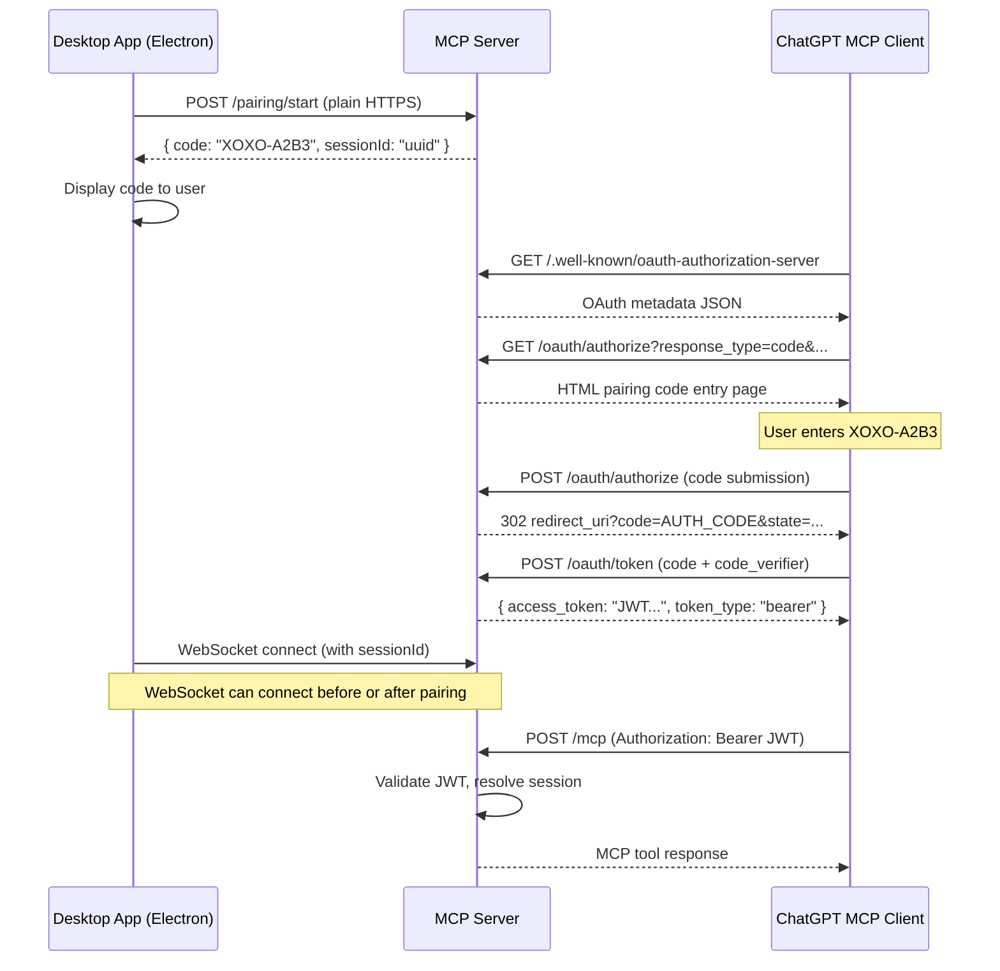

# Design Document: Desktop Pairing OAuth

## Overview

This design replaces the external OAuth provider (Auth0/JWKS-based RS256 validation) with a self-contained OAuth 2.1 authorization server built directly into the xoxo MCP server. Authentication is based on short-lived desktop pairing codes rather than user accounts.

The flow:
1. Desktop app requests a pairing code via plain HTTPS POST to `/pairing/start` (no WebSocket required)
2. Server generates a human-readable code (XOXO-XXXX-XXXX) and creates a session placeholder for it
3. ChatGPT's MCP client discovers OAuth metadata at `/.well-known/oauth-authorization-server`
4. ChatGPT navigates to `/oauth/authorize`, user enters the pairing code
5. Server issues an authorization code, redirects back to ChatGPT
6. ChatGPT exchanges the authorization code for a self-issued HS256 JWT access token
7. Subsequent MCP tool calls use the JWT, which maps to the paired session
8. Desktop app establishes WebSocket connection independently (before or after pairing), associating itself with the same session ID

Key design decisions:
- **Self-issued HS256 JWTs** — no external JWKS endpoints, no RS256 key management
- **Pairing codes as the authentication factor** — no user accounts, passwords, or external identity providers
- **Decoupled pairing and WebSocket** — the pairing code request is a plain HTTPS POST; the WebSocket connection is established independently and linked to the same session
- **Server-side PKCE validation** — standard OAuth 2.1 security without client secrets
- **Session linking via JWT `sub` claim** — the token's subject maps directly to the desktop session ID in the existing session store

## Architecture



### Module Layout

```
server/
├── auth/
│   ├── middleware.js          (MODIFIED: HS256 self-issued validation)
│   └── token.js               (NEW: JWT signing/verification helpers)
├── oauth/
│   ├── metadata.js            (NEW: /.well-known/oauth-authorization-server)
│   ├── authorize.js           (NEW: /oauth/authorize GET + POST)
│   ├── token-endpoint.js      (NEW: /oauth/token POST)
│   └── views/
│       └── authorize.html     (NEW: pairing code entry page)
├── pairing/
│   ├── store.js               (NEW: in-memory pairing code store)
│   ├── generator.js           (NEW: code generation logic)
│   └── routes.js              (NEW: POST /pairing/start)
├── session/
│   ├── store.js               (EXISTING: unchanged)
│   └── manager.js             (EXISTING: unchanged)
├── ws/
│   └── handler.js             (MODIFIED: HS256 token verification)
└── index.js                   (MODIFIED: mount new routes)
```

## Components and Interfaces

### 1. OAuth Metadata Endpoint (`server/oauth/metadata.js`)

Serves the RFC 8414 metadata document at `/.well-known/oauth-authorization-server`.

```javascript
// GET /.well-known/oauth-authorization-server
// Response: 200 application/json
{
  issuer: "https://aix.reflect.systems",
  authorization_endpoint: "https://aix.reflect.systems/oauth/authorize",
  token_endpoint: "https://aix.reflect.systems/oauth/token",
  response_types_supported: ["code"],
  grant_types_supported: ["authorization_code"],
  code_challenge_methods_supported: ["S256"]
}
```

Also serves the RFC 9728 Protected Resource Metadata at `/.well-known/oauth-protected-resource`:

```javascript
// GET /.well-known/oauth-protected-resource
// Response: 200 application/json
{
  resource: "https://aix.reflect.systems/mcp",
  authorization_servers: ["https://aix.reflect.systems"]
}
```

The auth middleware returns a `WWW-Authenticate` header on 401 responses:
```
WWW-Authenticate: Bearer realm="https://aix.reflect.systems", resource_metadata="https://aix.reflect.systems/.well-known/oauth-protected-resource"
```

### 2. Pairing Code Generator (`server/pairing/generator.js`)

Generates human-readable codes in the format `XOXO-XXXX-XXXX` using a restricted character set that excludes visually ambiguous characters (0, O, 1, I, L).

```javascript
// Character set: A B C D E F G H J K M N P Q R S T U V W X Y Z 2 3 4 5 6 7 8 9
// (26 letters - O, I, L = 23 letters) + (10 digits - 0, 1 = 8 digits) = 31 characters
// 31^4 = 923,521 possible codes

generatePairingCode() → "XOXO-XXXX-XXXX"
```

### 3. Pairing Store (`server/pairing/store.js`)

In-memory store for active pairing codes. Each entry maps a code to a desktop session ID with an expiration timestamp.

```javascript
// Interface
create(code, sessionId, expiresAt) → void
consume(code) → { sessionId } | null   // returns and removes
get(code) → { sessionId, expiresAt } | null
isExpired(code) → boolean
cleanup() → void                        // remove expired entries
```

### 4. Authorization Code Store (within `server/oauth/authorize.js`)

Temporary store for authorization codes issued after successful pairing code entry.

```javascript
// Each authorization code entry:
{
  code: "base64url-random-32-bytes",
  sessionId: "desktop-session-id",
  codeChallenge: "S256-challenge-from-request",
  redirectUri: "https://chatgpt.com/callback",
  clientId: "chatgpt-mcp-client",
  expiresAt: Date.now() + 60000,  // 60 seconds
}
```

### 5. Token Issuer (`server/auth/token.js`)

Signs and verifies self-issued HS256 JWTs.

```javascript
// Interface
signAccessToken(sessionId) → jwtString
verifyAccessToken(jwtString) → { sub, iss, exp, iat } | throws
```

JWT payload:
```json
{
  "sub": "desktop-session-id",
  "iss": "https://aix.reflect.systems",
  "aud": "https://aix.reflect.systems/mcp",
  "iat": 1700000000,
  "exp": 1700003600
}
```

### 6. Authorization Endpoint (`server/oauth/authorize.js`)

- **GET /oauth/authorize** — validates OAuth parameters, serves HTML page with pairing code input
- **POST /oauth/authorize** — validates submitted pairing code, issues authorization code, redirects

### 7. Token Endpoint (`server/oauth/token-endpoint.js`)

- **POST /oauth/token** — validates authorization code + PKCE code_verifier, issues JWT access token

### 8. Updated Auth Middleware (`server/auth/middleware.js`)

Replaces RS256/JWKS validation with HS256 self-issued validation. Removes `AUTH_DISABLED` bypass. Validates:
- JWT structure (3 parts, valid base64url)
- Algorithm is HS256 (reject others)
- Signature matches server secret
- Token not expired
- Issuer matches `https://aix.reflect.systems`

### 9. Pairing Routes (`server/pairing/routes.js`)

- **POST /pairing/start** — plain HTTPS endpoint (no WebSocket or auth required), generates a pairing code and creates a session placeholder. Returns the code and session ID so the desktop app can later connect its WebSocket to that session.

### 10. Desktop App Changes (`src/main/chatgpt-config.js`, `src/main/chatgpt-oauth.js`)

- Update `chatgpt-config.js` to point OAuth endpoints at `https://aix.reflect.systems`
- Update `chatgpt-oauth.js` to use the server's own token endpoint URL
- Add pairing code request/display logic to the integration module
- Add WebSocket listener for `pairing:success` notification

## Data Models

### Pairing Code Entry

```json
{
  "code": "XOXO-A2B3",
  "sessionId": "uuid-of-desktop-session",
  "createdAt": 1700000000000,
  "expiresAt": 1700000300000
}
```

Constraints:
- `code`: string, format `XOXO-[A-HJ-NP-Z2-9]{4}`, unique among active codes
- `sessionId`: string, must reference an existing session in `session/store.js`
- `expiresAt`: number (epoch ms), 5 minutes after `createdAt`

### Authorization Code Entry

```json
{
  "code": "url-safe-base64-string-32-bytes",
  "sessionId": "uuid-of-desktop-session",
  "codeChallenge": "base64url-sha256-hash",
  "codeChallengeMethod": "S256",
  "redirectUri": "https://chatgpt.com/aip/.../oauth/callback",
  "clientId": "chatgpt-mcp-client",
  "createdAt": 1700000000000,
  "expiresAt": 1700000060000
}
```

Constraints:
- `code`: string, 32 cryptographically random bytes, base64url-encoded
- `expiresAt`: 60 seconds after creation
- Single-use: consumed on token exchange

### Access Token JWT Payload

```json
{
  "sub": "uuid-of-desktop-session",
  "iss": "https://aix.reflect.systems",
  "aud": "https://aix.reflect.systems/mcp",
  "iat": 1700000000,
  "exp": 1700003600
}
```

Constraints:
- Signed with HS256 using server secret (≥32 bytes)
- `exp` is 60 minutes after `iat`
- `sub` must map to a valid session in the session store
- `aud` must match the MCP server's resource URI

### OAuth Metadata Document

```json
{
  "issuer": "https://aix.reflect.systems",
  "authorization_endpoint": "https://aix.reflect.systems/oauth/authorize",
  "token_endpoint": "https://aix.reflect.systems/oauth/token",
  "response_types_supported": ["code"],
  "grant_types_supported": ["authorization_code"],
  "code_challenge_methods_supported": ["S256"]
}
```

### Environment Variables (additions)

| Variable | Purpose | Constraints |
|----------|---------|-------------|
| `JWT_SECRET` | HS256 signing secret | ≥32 bytes, not committed to repo |
| `OAUTH_ISSUER` | Self-issued issuer URL | `https://aix.reflect.systems` |
| `OAUTH_AUDIENCE` | Resource URI for token audience binding | `https://aix.reflect.systems/mcp` |

### Environment Variables (removals)

| Variable | Reason |
|----------|--------|
| `AUTH_DISABLED` | Replaced by self-issued token validation |
| `OAUTH_JWKS_URI` | No external JWKS; using HS256 |
| `OAUTH_CLIENT_SECRET` | PKCE replaces client secrets |
| `OAUTH_CLIENT_ID` | Not hardcoded; accept any client_id from ChatGPT |


## Correctness Properties

*A property is a characteristic or behavior that should hold true across all valid executions of a system — essentially, a formal statement about what the system should do. Properties serve as the bridge between human-readable specifications and machine-verifiable correctness guarantees.*

### Property 1: Pairing code format validity

*For any* generated pairing code, it SHALL match the format `XOXO-[A-HJ-NP-Z2-9]{4}` — that is, the prefix "XOXO-" followed by exactly 4 characters drawn from the set of uppercase letters excluding O, I, L and digits excluding 0, 1.

**Validates: Requirements 2.2, 9.6**

### Property 2: Pairing code expiration

*For any* pairing code with a creation timestamp, if the current time exceeds the creation timestamp by more than 5 minutes, the code SHALL be treated as expired and rejected by the pairing store.

**Validates: Requirements 2.6**

### Property 3: Pairing code uniqueness

*For any* set of concurrently active (unexpired) pairing codes in the store, no two codes SHALL have the same value.

**Validates: Requirements 2.8**

### Property 4: Pairing code single-use

*For any* valid pairing code, after it has been successfully consumed (used in the authorization flow), a subsequent attempt to consume the same code SHALL fail.

**Validates: Requirements 3.6**

### Property 5: Pairing-to-session round trip

*For any* desktop session ID, if a pairing code is generated for that session and then submitted at the authorization endpoint, the resulting authorization code SHALL be associated with the same desktop session ID.

**Validates: Requirements 2.3, 3.3**

### Property 6: Invalid pairing code rejection

*For any* string that does not correspond to a valid, unexpired, unconsumed pairing code in the store, submitting it at the authorization endpoint SHALL produce an error response.

**Validates: Requirements 3.4**

### Property 7: Missing OAuth parameter rejection

*For any* request to the authorization endpoint that is missing at least one required OAuth parameter (response_type, client_id, redirect_uri, code_challenge, code_challenge_method), the server SHALL return an error rather than rendering the pairing code input page.

**Validates: Requirements 3.7**

### Property 8: PKCE code verifier round trip

*For any* random code_verifier string, if the code_challenge stored during authorization equals `BASE64URL(SHA256(code_verifier))`, then the token exchange SHALL succeed. If the code_challenge does NOT equal `BASE64URL(SHA256(code_verifier))`, the token exchange SHALL fail with `invalid_grant`.

**Validates: Requirements 4.1, 4.2**

### Property 9: Authorization code single-use and expiration

*For any* authorization code, after it has been successfully exchanged for a token, a subsequent exchange attempt SHALL return `invalid_grant`. Additionally, *for any* authorization code where the current time exceeds creation time + 60 seconds, an exchange attempt SHALL return `invalid_grant`.

**Validates: Requirements 3.5, 4.3, 4.9**

### Property 10: Issued JWT correctness

*For any* access token issued by the token endpoint, decoding the JWT SHALL reveal: `alg` header equal to `HS256`, `sub` claim equal to the paired desktop session ID, `iss` claim equal to `https://aix.reflect.systems`, and `exp - iat` equal to 3600 seconds. The token SHALL be verifiable using the server's signing secret.

**Validates: Requirements 4.4, 4.5, 4.6, 4.7, 9.1**

### Property 11: Token validation rejects invalid tokens

*For any* string presented as a Bearer token that is either (a) not a valid 3-part JWT structure, (b) signed with a different secret, (c) uses an algorithm other than HS256, (d) has an expired `exp` claim, or (e) has an `iss` claim not matching `https://aix.reflect.systems`, the auth middleware SHALL return a 401 response.

**Validates: Requirements 5.1, 5.2, 5.3, 5.4, 9.4, 9.5**

### Property 12: Valid token resolves to correct session

*For any* valid access token with `sub` = S, when presented to the auth middleware, the middleware SHALL attach the session data for session ID S to the request, enabling downstream handlers to access the correct desktop session.

**Validates: Requirements 5.5, 6.1**

### Property 13: Authorization code entropy

*For any* generated authorization code, decoding it from base64url SHALL yield at least 32 bytes of data.

**Validates: Requirements 9.7**

### Property 14: Read tools bypass desktop confirmation

*For any* read tool invocation (get_circuit_layout, get_frequency_response, get_impedance_response, get_user_loaded_frds) with a valid access token, the server SHALL return a response directly from the session store without forwarding a confirmation request to the desktop app's WebSocket.

**Validates: Requirements 7.7**

## Error Handling

### Token Validation Errors

| Condition | HTTP Status | Error Code | Message |
|-----------|-------------|------------|---------|
| Missing Authorization header | 401 | `malformed` | Missing or malformed Authorization header |
| Invalid JWT structure | 401 | `malformed` | Token is not a valid JWT structure |
| Invalid signature | 401 | `malformed` | Token signature verification failed |
| Wrong algorithm (not HS256) | 401 | `malformed` | Token uses unsupported algorithm |
| Expired token | 401 | `expired` | Token has expired |
| Wrong issuer | 401 | `unrecognized` | Token issuer is invalid |
| Session not found | 502 | `session_not_found` | No desktop session associated with this token |
| Desktop disconnected (write tool) | 502 | `desktop_disconnected` | Desktop app is not connected |

### Pairing Errors

| Condition | HTTP Status | Error Code | Message |
|-----------|-------------|------------|---------|
| Pairing code invalid/expired | 200 (HTML) | — | Error displayed on authorization page |

### Token Endpoint Errors

| Condition | HTTP Status | Error Code |
|-----------|-------------|------------|
| Invalid code_verifier (PKCE mismatch) | 400 | `invalid_grant` |
| Authorization code expired | 400 | `invalid_grant` |
| Authorization code already used | 400 | `invalid_grant` |
| Missing required parameters | 400 | `invalid_request` |

### Authorization Endpoint Errors

| Condition | Behavior |
|-----------|----------|
| Missing required OAuth params | Error page with description of missing params |
| Invalid pairing code | Re-render form with error message, allow retry |
| Expired pairing code | Re-render form with expiration message, allow retry |

### WebSocket Errors

| Condition | Behavior |
|-----------|----------|
| Write tool timeout (30s) | Return timeout error to MCP caller |
| User rejects write operation | Return rejection error to MCP caller |
| Desktop reconnects | Re-associate WebSocket, resume normal operation |

## Testing Strategy

### Property-Based Testing

This feature is well-suited for property-based testing because it involves:
- Token generation/validation (round-trip properties)
- Code generation with format constraints (invariant properties)
- PKCE challenge/verifier relationships (round-trip properties)
- Single-use semantics (idempotence properties)
- Input validation across many possible inputs (error condition properties)

**Library**: `fast-check` (already in devDependencies)
**Minimum iterations**: 100 per property test
**Tag format**: `Feature: desktop-pairing-oauth, Property {N}: {title}`

### Unit Tests (Example-Based)

- OAuth metadata endpoint returns correct static document
- Authorization page renders with valid parameters
- Token endpoint response format (token_type, expires_in)
- Desktop pairing UI flow (menu items, notifications)
- Session re-association on WebSocket reconnect

### Integration Tests

- Full pairing flow: generate code → submit code → exchange token → call MCP tool
- Write tool confirmation flow: invoke tool → desktop receives request → accept/reject → response
- Multiple concurrent sessions operating independently
- Desktop disconnect/reconnect with active MCP session

### Smoke Tests

- Server starts without `AUTH_DISABLED`
- `JWT_SECRET` environment variable is read and validated (≥32 bytes)
- No outbound JWKS/external OAuth calls
- OAuth metadata endpoint accessible without auth
- Token endpoint accessible without auth
