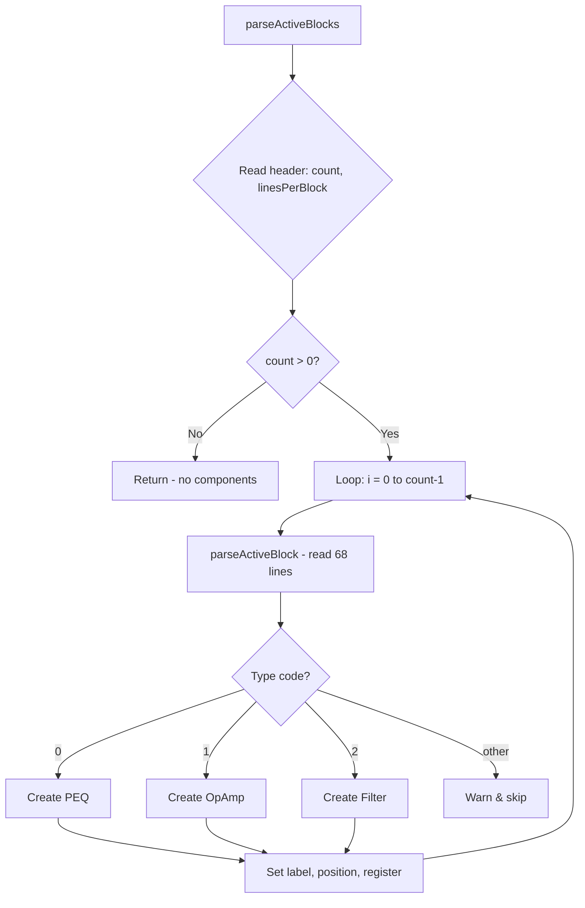

# Design Document: DXO Active Component Import

## Overview

This feature extends the existing `DxoImporter` class to parse "Active blocks" from DXO files and create the corresponding internal component models (PEQ, Filter, OpAmp). Currently, the importer skips active blocks with a warning. The implementation replaces that skip logic with actual parsing, mapping DXO field values to internal model parameters.

The design is straightforward: modify `parseActiveBlocks()` to iterate over blocks, dispatch to a `parseActiveBlock()` method based on type code, and create the appropriate component with mapped parameters. Terminal position calculation is added to `calculateTerminalPositions()` for the three new component types.

## Architecture

The change is contained entirely within `src/io/DxoImporter.js`. No new files or classes are needed.



## Components and Interfaces

### Modified: `DxoImporter` class (`src/io/DxoImporter.js`)

**New imports:**
```javascript
import { PEQ } from '../models/PEQ';
import { Filter } from '../models/Filter';
import { OpAmp } from '../models/OpAmp';
```

**Modified method: `parseActiveBlocks()`**
- Reads the header (count + linesPerBlock)
- Validates header values are valid integers
- Loops over blocks, calling `parseActiveBlock()` for each
- Maintains a shared label counter (`activeIndex`) across all block types

**New method: `parseActiveBlock(index)`**
- Reads all 68 lines of a single active block
- Extracts common fields: type, position, scalar gain, turn frequency, delay, DSP rate
- Extracts biquad sections (10 sections × 5 lines each)
- Dispatches to component creation based on type code:
  - Type 0 → `createPEQFromBlock(blockData, index)`
  - Type 1 → `createOpAmpFromBlock(blockData, index)`
  - Type 2 → `createFilterFromBlock(blockData, index)`
  - Other → warning, skip

**New method: `createPEQFromBlock(blockData, index)`**
- Creates a `PEQ` at the block's (x, y) position
- Sets `gain = 0` (unity in DXO = 0 dB)
- Sets `delay` from adjustable delay field (clamped to ≥ 0)
- Sets `dspRate` from DSP sample rate field
- Filters biquad sections to only those with `UnBypassed === "T"`
- Maps biquad type codes to internal strings
- Sets frequency, Q, gain for each section
- Assigns label `A{index}`
- Registers position and adds to circuit

**New method: `createOpAmpFromBlock(blockData, index)`**
- Creates an `OpAmp` at the block's (x, y) position
- Converts scalar gain to dB: `dcGain = 20 * Math.log10(scalarGain)`
- Falls back to 100 dB if scalar gain ≤ 0
- Sets `cornerFrequency` from turn frequency field
- Assigns label `A{index}`
- Registers position and adds to circuit

**New method: `createFilterFromBlock(blockData, index)`**
- Creates a `Filter` at the block's (x, y) position
- Maps filter shape code: 0→"butterworth", 1→"linkwitzRiley", 2→"bessel"
- Maps filter type code: 0→"lowPass", 1→"highPass", 2→"bandpass"
- Sets `filterOrder`, `turnFrequency`, `gain = 0`, `delay` (clamped to ≥ 0)
- Assigns label `A{index}`
- Registers position and adds to circuit

**Modified method: `calculateTerminalPositions(component, x, y)`**
- Adds cases for `component.type === 'peq'`, `'filter'`, `'opamp'`
- Returns 4 terminals at offsets: `(x-2, y-2)`, `(x-2, y+2)`, `(x+2, y-2)`, `(x+2, y+2)`
- These match the terminal definitions in the PEQ, Filter, and OpAmp model classes

## Data Models

No new data models are introduced. The feature uses existing models:

### Active Block Data (intermediate, not persisted)

The parsed block data is a transient object used during import:

```javascript
{
  type: number,          // 0=PEQ, 1=OpAmp, 2=Filter
  x: number,            // Grid position X
  y: number,            // Grid position Y
  inverted: boolean,    // T/F (not used by current models)
  inputR: number,       // Input resistance (not used)
  outputR: number,      // Output resistance (not used)
  scalarGain: number,   // Linear gain value
  turnFrequency: number,// Corner/crossover frequency
  bandpassBandwidth: number, // (not used for PEQ/OpAmp)
  chebychevError: number,    // (not used)
  filterShape: number,  // 0=BW, 1=LR, 2=Bessel
  filterType: number,   // 0=LP, 1=HP, 2=BP
  filterOrder: number,  // Filter order
  adjustableDelay: number, // Delay in seconds
  inherentDelay: number,   // (not used)
  dspModel: number,     // (not used)
  dspRate: number,      // DSP sample rate (Hz)
  biquadCount: number,  // Always 10
  biquads: [            // Array of 10 biquad sections
    {
      unbypassed: boolean, // T = active, F = bypassed
      frequency: number,   // Hz
      q: number,           // Q factor
      gain: number,        // dB
      type: number         // Biquad type code 0-7
    }
  ]
}
```

### Biquad Type Code Mapping

| DXO Code | Internal String |
|----------|----------------|
| 0 | "peaking" |
| 1 | "highShelf" |
| 2 | "lowShelf" |
| 3 | "lowPass1" |
| 4 | "highPass1" |
| 5 | "lowPass2" |
| 6 | "highPass2" |
| 7 | "allPass" |

### Filter Shape Code Mapping

| DXO Code | Internal String |
|----------|----------------|
| 0 | "butterworth" |
| 1 | "linkwitzRiley" |
| 2 | "bessel" |

### Filter Type Code Mapping

| DXO Code | Internal String |
|----------|----------------|
| 0 | "lowPass" |
| 1 | "highPass" |
| 2 | "bandpass" |

## Correctness Properties

*A property is a characteristic or behavior that should hold true across all valid executions of a system — essentially, a formal statement about what the system should do. Properties serve as the bridge between human-readable specifications and machine-verifiable correctness guarantees.*

### Property 1: Active block type code determines component type

*For any* active block with a valid type code (0, 1, or 2), the importer SHALL create a component whose internal type matches the mapping: 0→"peq", 1→"opamp", 2→"filter".

**Validates: Requirements 2.1, 3.1, 4.1**

### Property 2: PEQ biquad bypass filtering

*For any* active block of type PEQ with an arbitrary combination of bypassed ("F") and unbypassed ("T") biquad sections, the created PEQ component SHALL contain exactly the sections marked "T", and no sections marked "F".

**Validates: Requirements 2.2**

### Property 3: PEQ biquad parameters are preserved

*For any* unbypassed biquad section in a PEQ active block, the created PEQ section SHALL have the same frequency, Q, gain, and correctly mapped filter type string as the source DXO values.

**Validates: Requirements 2.3, 2.4, 2.5, 8.1**

### Property 4: OpAmp gain conversion

*For any* active block of type OpAmp with a positive scalar gain value, the created OpAmp component's dcGain SHALL equal `20 × log10(scalarGain)`, and its cornerFrequency SHALL equal the turn frequency field.

**Validates: Requirements 3.2, 3.3**

### Property 5: Filter parameters are correctly mapped

*For any* active block of type Filter with valid shape code (0–2), type code (0–2), and positive filter order, the created Filter component SHALL have the correctly mapped filterShape string, filterType string, filterOrder, and turnFrequency matching the source DXO values.

**Validates: Requirements 4.2, 4.3, 4.4, 4.5, 8.2**

### Property 6: Active component terminal positions

*For any* active component (PEQ, Filter, or OpAmp) placed at grid position (x, y), the calculated terminal positions SHALL be exactly: (x-2, y-2), (x-2, y+2), (x+2, y-2), (x+2, y+2).

**Validates: Requirements 5.1, 5.3, 6.1, 6.2**

### Property 7: Sequential shared "A" labeling

*For any* sequence of N active blocks (regardless of type), the created components SHALL receive labels A0, A1, ..., A(N-1) in the order they appear in the file, sharing a single counter across all component types.

**Validates: Requirements 7.1, 7.2, 7.3**

### Property 8: Unknown type blocks don't interrupt subsequent parsing

*For any* sequence of active blocks where one or more blocks have an unknown type code (not 0, 1, or 2), all subsequent blocks with valid type codes SHALL still be parsed and create the correct components.

**Validates: Requirements 9.1, 9.3**

## Error Handling

| Condition | Behavior |
|-----------|----------|
| Active block count is not a valid integer | Throw descriptive error |
| Lines-per-block is not a valid integer | Throw descriptive error |
| Unknown active block type (not 0, 1, 2) | Emit warning with type value and block index, skip block, continue |
| Biquad type code outside 0–7 | Emit warning, skip that biquad section |
| Scalar gain ≤ 0 for OpAmp | Emit warning, default dcGain to 100 dB |
| Filter shape code outside 0–2 | Emit warning, default to "butterworth" |
| Filter type code outside 0–2 | Emit warning, default to "lowPass" |
| Negative adjustable delay | Clamp to 0, emit warning |

All warnings are collected in the existing `this.warnings` array and logged at the end of import. Errors (malformed header) throw immediately to prevent cascading parse failures.

## Testing Strategy

### Test Fixtures

Use the real DXO files from `research/filters/` as test fixtures. Copy them to `tests/fixtures/projects/` for the test suite:
- `research/filters/peq/orbs-peq.dxo` → PEQ import test
- `research/filters/opamp/orbs-opamp.dxo` → OpAmp import test
- `research/filters/filter/orbs-filter.dxo` → Filter import test
- `research/filters/peq/orbs-peq.FRD` → PEQ frequency response reference
- `research/filters/opamp/orbs-opamp.FRD` → OpAmp frequency response reference
- `research/filters/filter/orbs-filter.FRD` → Filter frequency response reference

### Property-Based Tests

Use `fast-check` for property-based testing. Each property test runs a minimum of 100 iterations.

**Generators needed:**
- Active block content generator (68 lines of valid DXO format)
- Biquad section generator (5 lines: bypass flag, freq, Q, gain, type)
- Full DXO file generator (wraps active blocks in minimal valid DXO structure)

Each property test is tagged with:
```
Feature: dxo-active-component-import, Property {N}: {property_text}
```

### Unit Tests (Example-Based)

- Import `orbs-peq.dxo` → verify PEQ created with 2 active sections (BQ1 peaking + BQ5 highShelf)
- Import `orbs-opamp.dxo` → verify OpAmp with dcGain ≈ 100 dB, cornerFrequency = 50
- Import `orbs-filter.dxo` → verify Filter with shape=butterworth, type=bandpass, order=1, freq=4000
- Zero active blocks → no components created
- Malformed header → throws error

### Integration Tests (Frequency Response Verification)

- Import `orbs-peq.dxo`, evaluate transfer function at FRD frequencies, compare magnitudes within ±0.1 dB
- Import `orbs-opamp.dxo`, evaluate transfer function at FRD frequencies, compare magnitudes within ±0.1 dB
- Import `orbs-filter.dxo`, evaluate transfer function at FRD frequencies, compare magnitudes within ±0.1 dB

### Edge Case Tests

- Biquad type code = 99 → warning, section skipped
- Scalar gain = 0 for OpAmp → warning, dcGain defaults to 100 dB
- Negative delay → clamped to 0, warning
- Unknown block type (e.g., type=5) → warning, block skipped, subsequent blocks still parsed
- All 10 biquads bypassed → PEQ created with empty sections array
