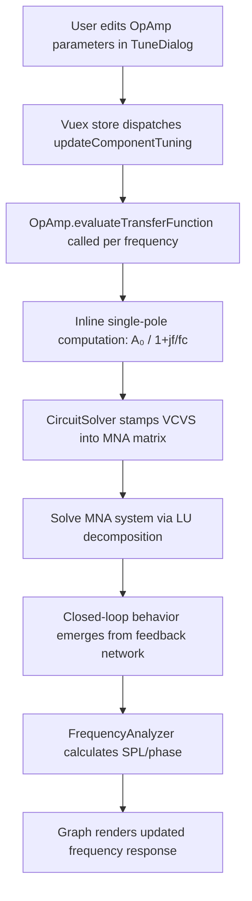
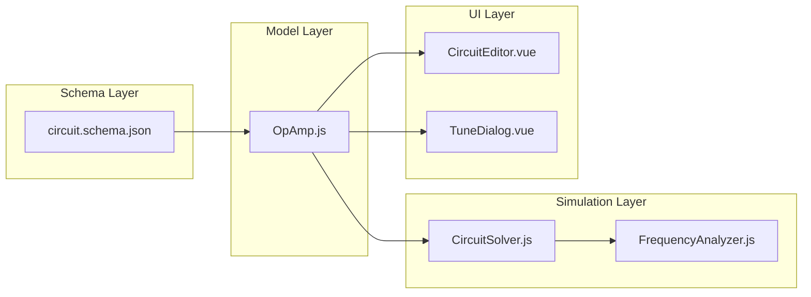

# Design Document: OpAmp Component

## Overview

The OpAmp (Operational Amplifier) is an active component modeled as a **Voltage-Controlled Voltage Source (VCVS)** with a frequency-dependent open-loop gain following a single-pole model. Unlike PEQ and Active Filter which apply fixed DSP transfer functions, the OpAmp's actual closed-loop behavior depends entirely on the external feedback network (resistors, capacitors) that users wire around it. The MNA solver handles the closed-loop math automatically.

Key characteristics:
- **Same 4-terminal VCVS architecture** as PEQ and Filter (+in, -in, +out, -out)
- **Simple single-pole transfer function**: `A(f) = A₀ / (1 + j×f/f_c)` — computed inline, no separate calculator module needed
- **Only 2 parameters**: dcGain (dB) and cornerFrequency (Hz)
- **No mute parameter**: Muting an OpAmp in a feedback circuit would break the topology
- **Shared "A" label prefix** with PEQ and Filter
- **Identical solver integration**: Uses the same `stampPEQ()` VCVS stamping mechanism
- **Renders with "Op" text** inside the amplifier triangle symbol

The interesting behavior comes from external feedback networks — users build inverting amplifiers, non-inverting amplifiers, Sallen-Key filters, multiple feedback filters, etc. by connecting passive components between the OpAmp's output and input terminals.

## Architecture

### High-Level Data Flow



### Component Integration Points



### VCVS MNA Stamping (Identical to PEQ and Filter)

The OpAmp uses the same VCVS stamping as PEQ. For gain `G = A(f)`:

- **Input terminals**: +in (node `ni+`), -in (node `ni-`)
- **Output terminals**: +out (node `no+`), -out (node `no-`)
- **Constraint**: V(no+) - V(no-) = G × [V(ni+) - V(ni-)]

MNA stamps (one extra row/column for branch current `I_vcvs`):

| Row/Col | no+ | no- | ni+ | ni- | I_vcvs |
|---------|-----|-----|-----|-----|--------|
| no+     |     |     |     |     | +1     |
| no-     |     |     |     |     | -1     |
| I_vcvs  | +1  | -1  | -G  | +G  |        |

The solver already handles this via `stampPEQ()`. The OpAmp component simply implements `evaluateTransferFunction(frequency)` returning `{ re, im }`, and the solver treats it identically to PEQ.

### Transfer Function Computation

The open-loop gain is a single-pole model computed inline:

```
A₀ = 10^(dcGain / 20)           // DC gain in linear units
f_c = cornerFrequency            // corner frequency in Hz

At frequency f:
  ratio = f / f_c
  denomMagSquared = 1 + ratio²
  re = A₀ / denomMagSquared
  im = -A₀ × ratio / denomMagSquared
```

This is derived from:
```
A(f) = A₀ / (1 + j × f / f_c)

Multiply numerator and denominator by conjugate of denominator:
A(f) = A₀ × (1 - j × f/f_c) / (1 + (f/f_c)²)
     = A₀ / (1 + ratio²) - j × A₀ × ratio / (1 + ratio²)
```

No separate calculator module is needed — this is 5 lines of arithmetic.

## Components and Interfaces

### New Files

| File | Purpose |
|------|---------|
| `src/models/OpAmp.js` | OpAmp component model extending Component |

### Modified Files

| File | Changes |
|------|---------|
| `src/schemas/circuit.schema.json` | Add "opamp" to type enum, add `opampParameters` definition, add conditional validation |
| `src/simulation/CircuitSolver.js` | Include "opamp" type alongside "peq" in VCVS handling paths |
| `src/renderer/components/CircuitEditor.vue` | Add `renderOpAmp()` method, update label assignment to include "opamp" in shared "A" prefix |
| `src/renderer/components/TuneDialog.vue` | Add OpAmp parameter editing section with dcGain, cornerFrequency, and computed GBW display |
| `src/models/Circuit.js` | Import OpAmp, add "opamp" case in `fromJSON` switch |
| `src/models/Component.js` | Add "opamp" to validTypes array |

### Key Interfaces

#### OpAmp Model

```javascript
import { Component } from './Component';

class OpAmp extends Component {
  constructor(x, y) {
    super('opamp', x, y);
    this.parameters = {
      dcGain: 100,          // dB (default: 100 dB = 100,000× linear)
      cornerFrequency: 50,  // Hz (default: 50 Hz)
    };
    this.terminals = [
      { x: -2, y: -2 },  // Terminal 0: +in (top-left)
      { x: -2, y:  2 },  // Terminal 1: -in (bottom-left)
      { x:  2, y: -2 },  // Terminal 2: +out (top-right)
      { x:  2, y:  2 },  // Terminal 3: -out (bottom-right)
    ];
  }

  /**
   * Evaluate the open-loop transfer function A(f) at a given frequency.
   * Single-pole model: A(f) = A₀ / (1 + j×f/f_c)
   * @param {number} frequency - Evaluation frequency in Hz
   * @returns {{ re: number, im: number }} Complex transfer function value
   */
  evaluateTransferFunction(frequency) {
    const linearGain = Math.pow(10, this.parameters.dcGain / 20);
    const ratio = frequency / this.parameters.cornerFrequency;
    const denomMagSquared = 1 + ratio * ratio;
    return {
      re: linearGain / denomMagSquared,
      im: -linearGain * ratio / denomMagSquared,
    };
  }

  validate() {}
  toJSON() {}
  static fromJSON(json) {}
}
```

## Data Models

### OpAmp Parameters Schema

```json
{
  "opampParameters": {
    "type": "object",
    "required": ["dcGain", "cornerFrequency"],
    "properties": {
      "dcGain": {
        "type": "number",
        "default": 100,
        "description": "Open-loop DC gain in decibels"
      },
      "cornerFrequency": {
        "type": "number",
        "exclusiveMinimum": 0,
        "default": 50,
        "description": "Open-loop corner frequency in hertz (3 dB point)"
      }
    }
  }
}
```

### OpAmp Default Parameters

```javascript
{
  dcGain: 100,          // 100 dB ≈ 100,000× linear gain
  cornerFrequency: 50   // 50 Hz corner → GBW ≈ 5 MHz
}
```

### Terminal Layout (Same as PEQ and Filter)

```
Terminal 0: +in  → { x: -2, y: -2 }  (top-left)
Terminal 1: -in  → { x: -2, y:  2 }  (bottom-left)
Terminal 2: +out → { x:  2, y: -2 }  (top-right)
Terminal 3: -out → { x:  2, y:  2 }  (bottom-right)
```

### Schema Changes to circuit.schema.json

1. **Add "opamp" to the component type enum**:
```json
"type": {
  "type": "string",
  "enum": ["resistor", "capacitor", "inductor", "speaker", "ground", "source", "wire-segment", "peq", "opamp"]
}
```

2. **Add `opampParameters` definition** (as shown above)

3. **Add conditional validation rule**:
```json
{
  "if": {
    "properties": { "type": { "const": "opamp" } }
  },
  "then": {
    "properties": {
      "parameters": { "$ref": "#/definitions/opampParameters" }
    }
  }
}
```

### CircuitSolver Integration

The solver changes are minimal because the OpAmp implements the same `evaluateTransferFunction(frequency)` interface as PEQ:

1. **In `buildNodeMap()`**: Include `'opamp'` alongside `'peq'` when assigning VCVS branch current indices to `peqCurrentMap`
2. **In `buildMNAMatrix()`**: Include `'opamp'` alongside `'peq'` in the VCVS stamping path (call `stampPEQ()`)
3. **In `solveAllFrequencies()`**: Include `'opamp'` components in the `peqCache` array

Since both PEQ and OpAmp implement `evaluateTransferFunction(frequency) → { re, im }`, the solver code is polymorphic — no type-specific branching needed beyond the type check that routes to the VCVS path.

### Label Assignment (Shared "A" Prefix)

The label assignment in `CircuitEditor.vue` must be updated:

```javascript
const prefix = {
  resistor: 'R', capacitor: 'C', inductor: 'L', speaker: 'S', peq: 'A', opamp: 'A',
}[componentType] || '';

// For shared "A" prefix, count across all active component types
const typesToCount = prefix === 'A' ? ['peq', 'opamp'] : [componentType];
const existingNumbers = circuit.components
  .filter((c) => typesToCount.includes(c.type) && c.label)
  .map((c) => {
    const match = c.label.match(new RegExp(`^${prefix}(\\d+)$`));
    return match ? parseInt(match[1], 10) : -1;
  })
  .filter((n) => n >= 0);
const startNumber = 0;
const nextNumber = existingNumbers.length > 0 ? Math.max(...existingNumbers) + 1 : startNumber;
```

### TuneDialog OpAmp Section

The TuneDialog will display:
- **DC Gain (dB)**: Numeric input, default 100
- **Corner Frequency (Hz)**: Numeric input, default 50, min > 0
- **Unity-Gain Frequency (GBW)**: Read-only computed field showing `10^(dcGain/20) × cornerFrequency` formatted in engineering notation (e.g., "5.00 MHz")

### Rendering (CircuitEditor)

The `renderOpAmp()` method follows the same pattern as `renderPEQ()`:
- Draw outer rectangle (4×4 grid units)
- Draw amplifier triangle inside
- Draw **"Op"** text inside the triangle (instead of "PEQ")
- Draw +/- terminal labels
- Draw terminal connection dots at the 4 corners
- Draw component label above the symbol

## Correctness Properties

*A property is a characteristic or behavior that should hold true across all valid executions of a system — essentially, a formal statement about what the system should do. Properties serve as the bridge between human-readable specifications and machine-verifiable correctness guarantees.*

### Property 1: OpAmp Serialization Round-Trip

*For any* valid OpAmp instance with arbitrary dcGain (finite number) and cornerFrequency (positive number), serializing via `toJSON()` then deserializing via `fromJSON()` shall produce an OpAmp instance with identical parameters to the original.

**Validates: Requirements 2.6, 2.7, 2.8, 8.1, 8.2, 8.3**

### Property 2: OpAmp Validation Correctness

*For any* OpAmp parameter object, `validate()` shall return `valid: true` if and only if dcGain is a finite number AND cornerFrequency is a positive number. Conversely, if either constraint is violated, `validate()` shall return `valid: false` with appropriate error messages.

**Validates: Requirements 2.4, 2.5**

### Property 3: Transfer Function Formula Correctness

*For any* valid OpAmp parameters (dcGain finite, cornerFrequency > 0) and *for any* non-negative evaluation frequency f, the transfer function shall return a complex value where:
- `re = A₀ / (1 + (f/f_c)²)`
- `im = -A₀ × (f/f_c) / (1 + (f/f_c)²)`

where `A₀ = 10^(dcGain/20)` and `f_c = cornerFrequency`.

**Validates: Requirements 3.1, 3.2**

### Property 4: DC Gain Magnitude

*For any* valid OpAmp with dcGain G dB, evaluating the transfer function at frequency 0 shall produce a magnitude equal to `10^(G/20)` (within floating-point tolerance).

**Validates: Requirements 3.3**

### Property 5: Corner Frequency -3 dB Point

*For any* valid OpAmp with dcGain G dB and cornerFrequency f_c, evaluating the transfer function at frequency f_c shall produce a magnitude that is approximately 3.01 dB below the DC gain magnitude (within ±0.01 dB tolerance).

**Validates: Requirements 3.4**

### Property 6: High-Frequency Roll-Off Rate

*For any* valid OpAmp and *for any* two frequencies f₁ and f₂ where f₂ = 10×f₁ and both are well above the corner frequency (f₁ ≥ 10×cornerFrequency), the magnitude at f₂ shall be approximately 20 dB below the magnitude at f₁ (within ±1 dB tolerance to account for the single-pole approximation not being perfectly asymptotic near the corner).

**Validates: Requirements 3.5**

### Property 7: Circuit-Level Serialization Round-Trip

*For any* valid circuit containing one or more OpAmp components with arbitrary valid parameters, serializing the circuit via `Circuit.toJSON()` then deserializing via `Circuit.fromJSON()` shall produce OpAmp components with identical parameters to the originals.

**Validates: Requirements 8.1, 8.2, 8.3**

## Error Handling

### OpAmp Model

| Error Condition | Handling |
|----------------|----------|
| dcGain is NaN or Infinity | `validate()` returns error; `evaluateTransferFunction` still computes (may produce NaN/Infinity in output) |
| cornerFrequency ≤ 0 | `validate()` returns error |
| cornerFrequency is NaN | `validate()` returns error |
| frequency = 0 in evaluateTransferFunction | Returns `{ re: A₀, im: 0 }` (denominator = 1, no division by zero) |
| Very high frequency (f >> f_c) | Gain approaches zero gracefully — no numerical issues |

### Circuit Solver Integration

| Error Condition | Handling |
|----------------|----------|
| OpAmp with fewer than 4 connected terminals | Skip during simulation, log warning (same as PEQ behavior) |
| OpAmp in disconnected island | Excluded by existing `groundedReps` reachability check |
| evaluateTransferFunction returns NaN | Treat as unity gain for that frequency point, log warning |

### UI Error Handling

| Error Condition | Handling |
|----------------|----------|
| User enters non-numeric dcGain | Revert to previous valid value on blur |
| User enters cornerFrequency ≤ 0 | Revert to previous valid value on blur |
| User enters non-numeric cornerFrequency | Revert to previous valid value on blur |

### Backward Compatibility

| Scenario | Handling |
|----------|----------|
| Loading a circuit file without OpAmp components | Works without changes — no "opamp" case encountered in switch |
| Loading a circuit file with unknown component type | Existing `Circuit.fromJSON` throws error for unknown types — this is existing behavior |

## Testing Strategy

### Unit Tests (Jest)

Unit tests cover specific examples, edge cases, and integration points:

- **OpAmp Model**: Test constructor defaults, terminal positions, validation edge cases
- **Transfer Function**: Test known values (DC gain, corner frequency, high frequency)
- **Schema Validation**: Test that valid OpAmp JSON passes and invalid JSON fails
- **Label Assignment**: Test shared "A" counter between PEQ and OpAmp
- **Solver Integration**: Test OpAmp in simple circuit produces correct output voltage
- **Serialization**: Test toJSON/fromJSON with specific parameter values

### Property-Based Tests (fast-check)

Property-based tests verify universal correctness properties across randomized inputs. Each property test runs a minimum of 100 iterations.

**Library**: `fast-check` (already available as dev dependency)

**Test Configuration**:
- Minimum 100 iterations per property
- Each test tagged with: `Feature: opamp-component, Property N: <title>`

**Properties to implement**:

1. **Serialization round-trip** — Generate random valid OpAmp instances (dcGain: any finite number, cornerFrequency: positive number), verify `fromJSON(toJSON(opamp))` produces equivalent parameters
2. **Validation correctness** — Generate both valid and invalid parameter objects, verify `validate()` correctly classifies them
3. **Transfer function formula** — Generate random valid parameters and frequencies, verify output matches the analytical formula
4. **DC gain magnitude** — Generate random dcGain values, evaluate at f=0, verify magnitude equals 10^(dcGain/20)
5. **Corner frequency -3 dB** — Generate random parameters, evaluate at f=cornerFrequency, verify magnitude is -3.01 dB below DC
6. **High-frequency roll-off** — Generate random parameters, pick two frequencies a decade apart above corner, verify ~20 dB difference
7. **Circuit-level round-trip** — Generate random valid OpAmp configurations within a circuit, verify Circuit.fromJSON(Circuit.toJSON(circuit)) preserves OpAmp parameters

### Integration Tests

- Full circuit simulation with OpAmp: verify open-loop VCVS behavior (output = gain × input differential)
- OpAmp with resistive feedback (inverting amplifier): verify closed-loop gain ≈ -R_f/R_in at low frequencies
- OpAmp with no feedback (open-loop): verify output saturates to large gain × input
- Save/load circuit with OpAmp: verify file round-trip
- Shared label assignment: verify PEQ and OpAmp share "A" counter correctly

### Test File Structure

```
tests/unit/
├── OpAmp.spec.js                    # Unit + property tests for OpAmp model
├── OpAmp-integration.spec.js        # Integration tests with CircuitSolver
└── (existing files updated)
    ├── TuneDialog.spec.js           # Add OpAmp dialog tests (if exists)
    └── CircuitEditor.spec.js        # Add OpAmp rendering tests (if exists)
```
