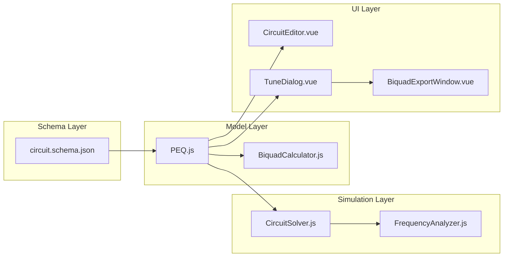

# Design Document: PEQ Parametric Equalizer

## Overview

The PEQ (Parametric Equalizer) is an active DSP component that applies cascaded biquad filter sections to shape the frequency response of a signal path within the crossover network simulator. Unlike passive components (resistor, capacitor, inductor) which are modeled as admittance elements stamped directly into the MNA matrix, the PEQ operates as a **Voltage-Controlled Voltage Source (VCVS)** whose gain is the complex transfer function H(f) evaluated at each simulation frequency.

The PEQ supports:
- 1–10 cascaded biquad filter sections (peaking, highShelf, lowShelf, lowPass1, highPass1, lowPass2, highPass2, allPass)
- Global gain (dB) and signal delay (seconds)
- Per-section bypass and mute
- Configurable DSP sample rate for bilinear transform coefficient calculation
- Biquad coefficient export for programming external DSP hardware

The component has 4 differential terminals (+in, -in, +out, -out) and is rendered as an amplifier-style triangle symbol spanning approximately 4×4 grid units.

## Architecture

### High-Level Data Flow

```mermaid
graph TD
    A[User edits PEQ parameters in TuneDialog] --> B[Vuex store dispatches updateComponentTuning]
    B --> C[CircuitSolver.solveAllFrequencies]
    C --> D[For each frequency: evaluate PEQ H(f)]
    D --> E[Stamp VCVS into MNA matrix]
    E --> F[Solve MNA system via LU decomposition]
    F --> G[FrequencyAnalyzer calculates SPL/phase]
    G --> H[Graph renders updated frequency response]
    
    I[User clicks View/Export BiQuads] --> J[BiquadExportWindow opens]
    J --> K[BiquadCalculator computes coefficients for all sections]
    K --> L[Display formatted coefficients with Save/Copy actions]
```

### Component Integration Points



### VCVS MNA Stamping Approach

The PEQ is modeled as an ideal VCVS (Voltage-Controlled Voltage Source) in the MNA framework. For a VCVS with gain `G = H(f)`:

- **Input terminals**: +in (node `ni+`), -in (node `ni-`)
- **Output terminals**: +out (node `no+`), -out (node `no-`)
- **Constraint**: V(no+) - V(no-) = G × [V(ni+) - V(ni-)]

This requires adding one extra row/column to the MNA matrix for the VCVS branch current `I_vcvs`. The MNA stamps are:

| Row/Col | no+ | no- | ni+ | ni- | I_vcvs |
|---------|-----|-----|-----|-----|--------|
| no+     |     |     |     |     | +1     |
| no-     |     |     |     |     | -1     |
| I_vcvs  | +1  | -1  | -G  | +G  |        |

Where G is the complex transfer function H(f) at the current frequency. The VCVS row enforces: V(no+) - V(no-) - G·[V(ni+) - V(ni-)] = 0, and the current stamps enforce KCL at the output nodes.

## Components and Interfaces

### New Files

| File | Purpose |
|------|---------|
| `src/models/PEQ.js` | PEQ component model extending Component |
| `src/simulation/BiquadCalculator.js` | Biquad coefficient computation and transfer function evaluation |
| `src/renderer/components/BiquadExportWindow.vue` | Separate window for biquad coefficient export |

### Modified Files

| File | Changes |
|------|---------|
| `server/schemas/circuit.schema.json` | Add "peq" type, peqParameters, filterSection definitions |
| `src/simulation/CircuitSolver.js` | Add VCVS stamping for PEQ components |
| `src/renderer/components/CircuitEditor.vue` | Add renderPEQ method, label prefix "A", component creation |
| `src/renderer/components/TuneDialog.vue` | Add PEQ parameter editing section with dynamic filter sections |
| `src/models/Circuit.js` | Import PEQ in fromJSON for deserialization |

### Key Interfaces

#### BiquadCalculator

```javascript
class BiquadCalculator {
  /**
   * Compute biquad coefficients for a filter section.
   * @param {Object} section - { filterType, frequency, q, gain }
   * @param {number} dspRate - Sample rate in Hz
   * @returns {{ b0, b1, b2, a1, a2 }} Normalized coefficients (a0 = 1)
   */
  static computeCoefficients(section, dspRate) {}

  /**
   * Evaluate the transfer function H(z) of a single biquad at a given frequency.
   * @param {{ b0, b1, b2, a1, a2 }} coeffs - Biquad coefficients
   * @param {number} frequency - Evaluation frequency in Hz
   * @param {number} dspRate - Sample rate in Hz
   * @returns {{ re: number, im: number }} Complex transfer function value
   */
  static evaluateTransferFunction(coeffs, frequency, dspRate) {}

  /**
   * Compute the combined transfer function for all non-bypassed sections.
   * Includes global gain and delay.
   * @param {Object} params - PEQ parameters { gain, delay, dspRate, muted, sections }
   * @param {number} frequency - Evaluation frequency in Hz
   * @returns {{ re: number, im: number }} Combined complex H(f)
   */
  static evaluatePEQ(params, frequency) {}
}
```

#### PEQ Model

```javascript
class PEQ extends Component {
  constructor(x, y) {}
  
  /**
   * Evaluate the combined transfer function at a frequency.
   * Delegates to BiquadCalculator.evaluatePEQ.
   * @param {number} frequency - Hz
   * @returns {{ re: number, im: number }}
   */
  evaluateTransferFunction(frequency) {}
  
  validate() {}
  toJSON() {}
  static fromJSON(json) {}
}
```

## Data Models

### PEQ Parameters Schema

```json
{
  "peqParameters": {
    "type": "object",
    "required": ["gain", "delay", "dspRate", "sections", "muted"],
    "properties": {
      "gain": {
        "type": "number",
        "description": "Global gain in dB"
      },
      "delay": {
        "type": "number",
        "minimum": 0,
        "description": "Signal delay in seconds"
      },
      "dspRate": {
        "type": "number",
        "exclusiveMinimum": 0,
        "description": "DSP sample rate in samples per second"
      },
      "muted": {
        "type": "boolean",
        "description": "Mute flag"
      },
      "sections": {
        "type": "array",
        "minItems": 1,
        "maxItems": 10,
        "items": { "$ref": "#/definitions/filterSection" }
      }
    }
  }
}
```

### Filter Section Schema

```json
{
  "filterSection": {
    "type": "object",
    "required": ["filterType", "frequency", "q", "bypass"],
    "properties": {
      "filterType": {
        "type": "string",
        "enum": ["peaking", "highShelf", "lowShelf", "lowPass1", "highPass1", "lowPass2", "highPass2", "allPass"]
      },
      "frequency": {
        "type": "number",
        "exclusiveMinimum": 0,
        "description": "Center/corner frequency in Hz"
      },
      "q": {
        "type": "number",
        "exclusiveMinimum": 0,
        "description": "Quality factor"
      },
      "gain": {
        "type": "number",
        "description": "Section gain in dB (used for peaking, highShelf, lowShelf)"
      },
      "bypass": {
        "type": "boolean",
        "description": "Bypass flag for this section"
      }
    }
  }
}
```

### PEQ Default Parameters

```javascript
{
  gain: 0,          // dB
  delay: 0,         // seconds
  dspRate: 48000,   // samples/second
  muted: false,
  sections: [{
    filterType: 'peaking',
    frequency: 1000,
    q: 0.707,
    gain: 0,
    bypass: false
  }]
}
```

### Terminal Layout

The PEQ has 4 terminals arranged for differential input/output:

```
Terminal 0: +in  → { x: -2, y: -2 }  (top-left)
Terminal 1: -in  → { x: -2, y:  2 }  (bottom-left)
Terminal 2: +out → { x:  2, y: -2 }  (top-right)
Terminal 3: -out → { x:  2, y:  2 }  (bottom-right)
```

### Biquad Coefficient Formulas

All formulas use the bilinear transform with frequency pre-warping:

```
ω₀ = 2π × f / dspRate
w = tan(ω₀ / 2)          // pre-warped frequency
A = 10^(gain_dB / 40)    // amplitude (for peaking/shelf)
```

**Peaking EQ:**
```
b0 = 1 + w/(Q) × A
b1 = -2 × cos(ω₀)       // using: (1 - w²) / (1 + w²) ≈ cos(ω₀) for normalized form
b2 = 1 - w/(Q) × A
a0 = 1 + w/(Q) / A
a1 = -2 × cos(ω₀)
a2 = 1 - w/(Q) / A
```

More precisely, using the Audio EQ Cookbook formulations:

```
α = sin(ω₀) / (2×Q)
A = 10^(gain_dB / 40)

Peaking:
  b0 =  1 + α×A
  b1 = -2×cos(ω₀)
  b2 =  1 - α×A
  a0 =  1 + α/A
  a1 = -2×cos(ω₀)
  a2 =  1 - α/A

High Shelf:
  b0 =    A×[(A+1) + (A-1)×cos(ω₀) + 2×√A×α]
  b1 = -2×A×[(A-1) + (A+1)×cos(ω₀)]
  b2 =    A×[(A+1) + (A-1)×cos(ω₀) - 2×√A×α]
  a0 =        (A+1) - (A-1)×cos(ω₀) + 2×√A×α
  a1 =    2×[(A-1) - (A+1)×cos(ω₀)]
  a2 =        (A+1) - (A-1)×cos(ω₀) - 2×√A×α

Low Shelf:
  b0 =    A×[(A+1) - (A-1)×cos(ω₀) + 2×√A×α]
  b1 =  2×A×[(A-1) - (A+1)×cos(ω₀)]
  b2 =    A×[(A+1) - (A-1)×cos(ω₀) - 2×√A×α]
  a0 =        (A+1) + (A-1)×cos(ω₀) + 2×√A×α
  a1 =   -2×[(A-1) + (A+1)×cos(ω₀)]
  a2 =        (A+1) + (A-1)×cos(ω₀) - 2×√A×α

Low Pass 2nd order (LPF):
  b0 = (1 - cos(ω₀)) / 2
  b1 =  1 - cos(ω₀)
  b2 = (1 - cos(ω₀)) / 2
  a0 =  1 + α
  a1 = -2×cos(ω₀)
  a2 =  1 - α

High Pass 2nd order (HPF):
  b0 = (1 + cos(ω₀)) / 2
  b1 = -(1 + cos(ω₀))
  b2 = (1 + cos(ω₀)) / 2
  a0 =  1 + α
  a1 = -2×cos(ω₀)
  a2 =  1 - α

All Pass (APF):
  b0 =  1 - α
  b1 = -2×cos(ω₀)
  b2 =  1 + α
  a0 =  1 + α
  a1 = -2×cos(ω₀)
  a2 =  1 - α

Low Pass 1st order:
  K = tan(π × f / dspRate)
  b0 = K / (K + 1)
  b1 = K / (K + 1)
  b2 = 0
  a0 = 1
  a1 = (K - 1) / (K + 1)
  a2 = 0

High Pass 1st order:
  K = tan(π × f / dspRate)
  b0 = 1 / (K + 1)
  b1 = -1 / (K + 1)
  b2 = 0
  a0 = 1
  a1 = (K - 1) / (K + 1)
  a2 = 0
```

All coefficients are normalized by dividing by a0 so that the stored a0 is implicitly 1.

### Transfer Function Evaluation

For each biquad section at frequency f:
```
ω = 2π × f / dspRate
z = e^(jω) = cos(ω) + j×sin(ω)

H(z) = (b0 + b1×z⁻¹ + b2×z⁻²) / (1 + a1×z⁻¹ + a2×z⁻²)
```

Expanding with z⁻¹ = cos(ω) - j×sin(ω) and z⁻² = cos(2ω) - j×sin(2ω):

```
Numerator:   N = b0 + b1×(cos(ω) - j×sin(ω)) + b2×(cos(2ω) - j×sin(2ω))
Denominator: D = 1  + a1×(cos(ω) - j×sin(ω)) + a2×(cos(2ω) - j×sin(2ω))

H = N / D  (complex division)
```

Combined PEQ transfer function:
```
H_total(f) = G × e^(-j×2π×f×delay) × ∏ H_section_i(f)
```
where G = 10^(gain_dB/20) and the product is over all non-bypassed sections.

</text>
</invoke>


## Correctness Properties

*A property is a characteristic or behavior that should hold true across all valid executions of a system — essentially, a formal statement about what the system should do. Properties serve as the bridge between human-readable specifications and machine-verifiable correctness guarantees.*

### Property 1: PEQ Serialization Round-Trip

*For any* valid PEQ component instance with arbitrary parameters (gain, delay, dspRate, muted, and 1–10 filter sections with valid types/frequencies/Q/gain/bypass), serializing via `toJSON()` then deserializing via `fromJSON()` shall produce a PEQ instance with identical parameters to the original.

**Validates: Requirements 2.11, 10.3**

### Property 2: PEQ Validation Correctness

*For any* PEQ parameter object, `validate()` shall return `valid: true` if and only if: gain is a finite number, delay is non-negative, dspRate is positive, sections has 1–10 entries, and each section has a valid filterType, positive frequency, positive Q, and boolean bypass. Conversely, if any constraint is violated, `validate()` shall return `valid: false` with appropriate error messages.

**Validates: Requirements 2.4, 2.5, 2.6, 2.7, 2.8**

### Property 3: Peaking Filter Gain at Center Frequency

*For any* peaking filter section with center frequency f₀, Q > 0, and gain G dB (where f₀ < Nyquist), the magnitude of the transfer function evaluated at f₀ shall equal G dB (within ±0.1 dB tolerance due to bilinear transform warping at high frequencies).

**Validates: Requirements 3.1**

### Property 4: Shelf Filter Asymptotic Gain

*For any* highShelf filter section with gain G dB, the magnitude at frequencies well above the transition frequency shall approach G dB. Similarly, *for any* lowShelf filter section with gain G dB, the magnitude at frequencies well below the transition frequency shall approach G dB. (Tolerance: ±0.5 dB at 10× the transition frequency.)

**Validates: Requirements 3.2, 3.3**

### Property 5: Low-Pass Filter DC Passthrough

*For any* lowPass1 or lowPass2 filter section with corner frequency f₀ > 0, the magnitude of the transfer function at DC (f → 0) shall be unity (0 dB), and the magnitude at frequencies well above f₀ shall be significantly attenuated.

**Validates: Requirements 3.4, 3.6**

### Property 6: High-Pass Filter DC Blocking

*For any* highPass1 or highPass2 filter section with corner frequency f₀ > 0, the magnitude of the transfer function at DC (f → 0) shall approach zero, and the magnitude at frequencies well above f₀ shall approach unity (0 dB).

**Validates: Requirements 3.5, 3.7**

### Property 7: All-Pass Unity Magnitude

*For any* allPass filter section with frequency f₀ and Q > 0, and *for any* evaluation frequency f (where 0 < f < Nyquist), the magnitude |H(f)| shall equal 1.0 (0 dB) within floating-point tolerance (±1e-10).

**Validates: Requirements 3.8**

### Property 8: Combined Transfer Function Equals Product of Non-Bypassed Sections

*For any* PEQ configuration with N sections (some bypassed, some not) and *for any* evaluation frequency f, the combined transfer function (excluding global gain and delay) shall equal the product of the individual transfer functions of all non-bypassed sections. Bypassed sections shall contribute unity (1+0j) to the product.

**Validates: Requirements 4.1, 4.2**

### Property 9: Global Gain Scales Magnitude

*For any* PEQ configuration and *for any* evaluation frequency f, changing the global gain from 0 dB to G dB shall scale the transfer function magnitude by exactly 10^(G/20), without affecting the relative phase contribution of the filter sections.

**Validates: Requirements 4.4**

### Property 10: Delay Preserves Magnitude

*For any* PEQ configuration with delay D > 0 and *for any* evaluation frequency f, the magnitude |H(f)| shall be identical whether delay is 0 or D. Delay shall only affect the phase component of the transfer function.

**Validates: Requirements 4.5**

### Property 11: Mute Produces Zero Output

*For any* PEQ configuration with `muted = true` and *for any* evaluation frequency f, the transfer function shall return zero magnitude (both real and imaginary parts equal to zero).

**Validates: Requirements 4.6**

### Property 12: Biquad Export Format and Normalization

*For any* set of filter sections with valid parameters, the exported biquad text shall contain one block per section with header "biquadN," (N starting from 1) followed by lines "b0=value,", "b1=value,", "b2=value,", "a1=value,", "a2=value," where the coefficients are normalized (a0 = 1 implicitly). The number of blocks shall equal the total number of sections.

**Validates: Requirements 8.3, 8.4**

### Property 13: Bypassed Sections Export as Unity

*For any* PEQ configuration containing bypassed sections, the exported biquad coefficients for each bypassed section shall be exactly: b0=1, b1=0, b2=0, a1=0, a2=0 (unity transfer function).

**Validates: Requirements 8.6**

## Error Handling

### Biquad Coefficient Calculation

| Error Condition | Handling |
|----------------|----------|
| Frequency ≥ Nyquist (dspRate/2) | Clamp to 95% of Nyquist, log warning via `console.warn` |
| Q = 0 or negative | Rejected by validation; if reached at runtime, clamp to minimum 0.001 |
| dspRate = 0 or negative | Rejected by validation; if reached at runtime, fall back to 48000 |
| NaN/Infinity in coefficients | Return unity coefficients (b0=1, others=0) and log error |

### Transfer Function Evaluation

| Error Condition | Handling |
|----------------|----------|
| Frequency ≤ 0 | Return unity (1+0j) |
| No non-bypassed sections | Return global gain only (no filter contribution) |
| Muted PEQ | Return zero (0+0j) immediately without computing sections |
| Division by zero in H(z) denominator | Should not occur with valid coefficients; if detected, return unity and log error |

### Circuit Solver Integration

| Error Condition | Handling |
|----------------|----------|
| PEQ with fewer than 4 connected terminals | Skip PEQ during simulation, log warning (consistent with existing excluded-component behavior) |
| PEQ in disconnected island | Excluded by existing `groundedReps` reachability check |
| H(f) returns NaN | Treat as unity gain for that frequency point, log warning |

### UI Error Handling

| Error Condition | Handling |
|----------------|----------|
| User enters frequency > Nyquist in TuneDialog | Display orange warning indicator on the section row; do not prevent entry |
| User attempts to remove last section | Disable remove button when sections.length === 1 |
| User enters non-numeric value | Revert to previous valid value on blur (consistent with existing TuneDialog behavior) |
| Biquad export window fails to open | Show toast error notification |

## Testing Strategy

### Unit Tests (Jest)

Unit tests cover specific examples, edge cases, and integration points:

- **BiquadCalculator**: Test each filter type with known reference values (e.g., Butterworth Q=0.707 at corner frequency should be -3dB)
- **PEQ Model**: Test constructor defaults, validation edge cases, terminal positions
- **Schema Validation**: Test that valid PEQ JSON passes and invalid JSON fails
- **Export Formatting**: Test output format with known coefficient values
- **Label Assignment**: Test A0, A1, A2 assignment and reuse after deletion

### Property-Based Tests (fast-check)

Property-based tests verify universal correctness properties across randomized inputs. Each property test runs a minimum of 100 iterations.

**Library**: `fast-check` (already available or to be added as dev dependency)

**Test Configuration**:
- Minimum 100 iterations per property
- Each test tagged with: `Feature: peq-parametric-equalizer, Property N: <title>`

**Properties to implement**:

1. **Serialization round-trip** — Generate random valid PEQ instances, verify `fromJSON(toJSON(peq))` produces equivalent parameters
2. **Validation correctness** — Generate both valid and invalid parameter objects, verify `validate()` correctly classifies them
3. **Peaking filter gain at center frequency** — Generate random peaking params, verify |H(f₀)| ≈ gain_dB
4. **Shelf filter asymptotic gain** — Generate random shelf params, verify gain at extreme frequencies
5. **Low-pass DC passthrough** — Generate random LP params, verify |H(0)| ≈ 1
6. **High-pass DC blocking** — Generate random HP params, verify |H(0)| ≈ 0
7. **All-pass unity magnitude** — Generate random AP params and frequencies, verify |H(f)| = 1
8. **Combined TF = product of non-bypassed sections** — Generate multi-section PEQs, verify product property
9. **Global gain scales magnitude** — Generate PEQs with varying gain, verify scaling
10. **Delay preserves magnitude** — Generate PEQs with delay, verify magnitude unchanged
11. **Mute produces zero** — Generate muted PEQs, verify H(f) = 0
12. **Export format correctness** — Generate random sections, verify export text format
13. **Bypassed sections export as unity** — Generate PEQs with bypassed sections, verify unity export

### Integration Tests

- Full circuit simulation with PEQ: verify output voltage = input × H(f)
- Multiple PEQs in series: verify cascaded effect
- PEQ with passive components: verify correct interaction in MNA solution
- Save/load circuit with PEQ: verify file round-trip

### Test File Structure

```
tests/unit/
├── BiquadCalculator.spec.js      # Unit + property tests for coefficient calculation
├── PEQ.spec.js                   # Unit + property tests for PEQ model
├── PEQ-integration.spec.js       # Integration tests with CircuitSolver
└── BiquadExport.spec.js          # Unit + property tests for export formatting
```
