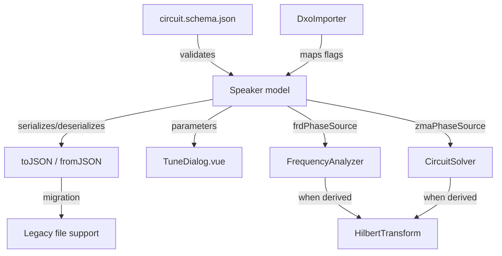

# Design Document: Per-File Phase Source

## Overview

This feature replaces the single global `phaseSource` property on the Speaker model with per-file phase source settings (`frdPhaseSource`, `zmaPhaseSource`, and `phaseSource` on each off-axis entry). It also wires the existing `HilbertTransform.calculateMinimumPhase()` into the simulation pipeline so that selecting "derived" actually computes minimum phase from magnitude data, rather than being a no-op.

### Current State

- `Speaker.parameters.phaseSource` is a single string (`'measured'` or `'derived'`).
- The setting is stored and serialized but never consumed — `FrequencyAnalyzer.calculateSPL()` always uses `frdData.phases` regardless of the setting.
- `CircuitSolver.calculateAdmittance()` always uses `zmaData.phases` regardless of the setting.
- `HilbertTransform.calculateMinimumPhase(frequencies, magnitudes)` exists and returns phase values in degrees.
- The DXO format has separate `useHilbert` (FRD) and `zPhaseHilbert` (ZMA) flags per driver, but the importer currently only reads `useHilbert` and maps it to the global `phaseSource`. The `zPhaseHilbert` flag is skipped in the 19-line block.
- Off-axis file entries are `{ angle, frdPath }` with no phase source field.

### Design Goals

1. Per-file granularity: independent phase source for FRD, ZMA, and each off-axis FRD.
2. Simulation integration: derived phase is computed on demand via `HilbertTransform`.
3. Backward compatibility: legacy files with global `phaseSource` migrate transparently.
4. DXO fidelity: `useHilbert` → `frdPhaseSource`, `zPhaseHilbert` → `zmaPhaseSource`.
5. Conditional UI: phase source controls appear only when the corresponding file is loaded.

## Architecture

The change touches four layers of the application:



### Data Flow for Derived Phase

When a phase source is set to `'derived'`:

1. **FRD path**: `FrequencyAnalyzer.calculateSPL()` checks `speakerComponent.parameters.frdPhaseSource`. If `'derived'`, it calls `HilbertTransform.calculateMinimumPhase(frdData.frequencies, frdData.magnitudes)` to get phase values, then interpolates from those instead of `frdData.phases`.
2. **Off-axis path**: Same logic, but checks the off-axis entry's `phaseSource` and uses the off-axis FRD magnitudes.
3. **ZMA path**: `CircuitSolver.calculateAdmittance()` (speaker case) and the standalone `interpolateZMA()` function check `component.parameters.zmaPhaseSource`. If `'derived'`, it calls `HilbertTransform.calculateMinimumPhase(zmaData.frequencies, zmaData.impedances)` to get phase values, then uses those instead of `zmaData.phases`. Note: ZMA magnitudes are in ohms, not dB — the Hilbert transform expects dB, so we convert impedance to dB scale (`20 * log10(impedance)`) before calling it, then use the returned phase directly.

### Key Design Decision: ZMA Magnitude Conversion

The `HilbertTransform.calculateMinimumPhase()` expects magnitudes in dB. FRD magnitudes are already in dB (SPL). ZMA impedances are in ohms (linear). Before calling the Hilbert transform for ZMA data, we convert impedance to dB: `20 * Math.log10(impedance)`. This is the standard approach for deriving minimum phase from impedance magnitude data.

## Components and Interfaces

### 1. Schema (`circuit.schema.json`)

**Changes to `speakerParameters`:**
- Remove `phaseSource` from `required` and `properties`.
- Add `frdPhaseSource` (required, enum `["measured", "derived"]`).
- Add `zmaPhaseSource` (required, enum `["measured", "derived"]`).

**Changes to `offAxisFile`:**
- Add `phaseSource` (required, enum `["measured", "derived"]`).

### 2. Speaker Model (`Speaker.js`)

**Constructor defaults:**
```javascript
this.parameters = {
    // ... existing fields ...
    frdPhaseSource: 'measured',   // replaces phaseSource
    zmaPhaseSource: 'measured',   // new
    offAxisFiles: [],             // entries now include phaseSource
};
```

**`toJSON()`:** Serializes `frdPhaseSource`, `zmaPhaseSource`, and per-entry `phaseSource` on off-axis files. Does not serialize the legacy `phaseSource`.

**`fromJSON(json)`:** Migration logic:
1. If `json.parameters.frdPhaseSource` exists, use it directly.
2. Else if `json.parameters.phaseSource` exists (legacy), apply it to both `frdPhaseSource` and `zmaPhaseSource`.
3. Else default both to `'measured'`.
4. For each off-axis entry: if it has `phaseSource`, use it; else if legacy global `phaseSource` exists, apply it; else default to `'measured'`.
5. Delete the legacy `phaseSource` from the deserialized parameters.

**`validate()`:** Validates `frdPhaseSource` and `zmaPhaseSource` are in `['measured', 'derived']`, and each off-axis entry's `phaseSource` is in `['measured', 'derived']`.

**`addOffAxisFile(angle, filePath)`:** New entries include `phaseSource: 'measured'` by default.

### 3. FrequencyAnalyzer (`FrequencyAnalyzer.js`)

**`calculateSPL(speakerComponent, currentAngle)`:**

Add a helper method `getPhaseData(frdData, phaseSource)` that returns the phase array to use:
- If `phaseSource === 'derived'`: call `HilbertTransform.calculateMinimumPhase(frdData.frequencies, frdData.magnitudes)` and return the result.
- If `phaseSource === 'measured'`: return `frdData.phases`.

For on-axis: use `speakerComponent.parameters.frdPhaseSource`.
For off-axis: look up the matching off-axis entry in `speakerComponent.parameters.offAxisFiles` by angle and use its `phaseSource`.

Import `HilbertTransform` at the top of the file (it uses `module.exports`, so: `const HilbertTransform = require(...)` or convert to ES import).

### 4. CircuitSolver (`CircuitSolver.js`)

**`calculateAdmittance(component, omega)` and `stampComponentAdmittance()`** (speaker case):

When `component.parameters.zmaPhaseSource === 'derived'`:
1. Convert impedance magnitudes to dB: `magnitudes.map(z => 20 * Math.log10(z))`.
2. Call `HilbertTransform.calculateMinimumPhase(zmaData.frequencies, magnitudesInDb)`.
3. Use the derived phase array instead of `zmaData.phases` when interpolating.

To avoid recomputing the Hilbert transform at every frequency point, cache the derived ZMA phase array on the component instance (as a non-serialized transient property, e.g., `component._derivedZmaPhases`). Invalidate the cache when `zmaPhaseSource` changes or ZMA data is reloaded.

**`interpolateZMA(zmaData, frequency)`:** This standalone function needs access to the phase array. Refactor to accept an optional `phases` override parameter, or pass the pre-resolved ZMA data (with derived phases already substituted) into the function.

### 5. DxoImporter (`DxoImporter.js`)

**`parseDriver(index)`:**

Currently the importer reads `useHilbert` and skips 19 lines. The `zPhaseHilbert` flag is at offset +14 within that 19-line block (line 34 of the 39-line driver block). Changes:

1. Instead of skipping 19 lines blindly, read them individually to extract `zPhaseHilbert`.
2. Map: `frdPhaseSource = useHilbert ? 'derived' : 'measured'`.
3. Map: `zmaPhaseSource = zPhaseHilbert ? 'derived' : 'measured'`.
4. Off-axis entries get `phaseSource: 'measured'` (xSim has no per-off-axis Hilbert flag).

### 6. TuneDialog (`TuneDialog.vue`)

**Replace the single phase source radio group with per-file controls:**

- **FRD phase source**: Show radio group (`As Measured` / `Derived (Minimum Phase)`) bound to `localParameters.frdPhaseSource`, visible only when `localParameters.frdFile` is truthy.
- **ZMA phase source**: Show radio group bound to `localParameters.zmaPhaseSource`, visible only when `localParameters.zmaFile` is truthy.
- **Off-axis phase source**: For each off-axis entry, show a radio group bound to `offAxis.phaseSource`, visible only when `offAxis.frdPath` is truthy.
- Remove the old global phase source radio group.

## Data Models

### Speaker Parameters (after migration)

```json
{
    "name": "string",
    "sensitivity": "number",
    "delay": "number",
    "delayUnit": "string",
    "inverted": "boolean",
    "muted": "boolean",
    "frdFile": "string | null",
    "zmaFile": "string | null",
    "frdPhaseSource": "'measured' | 'derived'",
    "zmaPhaseSource": "'measured' | 'derived'",
    "offAxisFiles": [
        {
            "angle": "number (0-180)",
            "frdPath": "string",
            "phaseSource": "'measured' | 'derived'"
        }
    ]
}
```

### Schema Diff (speakerParameters)

**Remove:**
```json
"phaseSource": {
    "type": "string",
    "enum": ["measured", "derived"],
    "description": "Phase data source"
}
```

**Add:**
```json
"frdPhaseSource": {
    "type": "string",
    "enum": ["measured", "derived"],
    "description": "Phase data source for the primary FRD file"
},
"zmaPhaseSource": {
    "type": "string",
    "enum": ["measured", "derived"],
    "description": "Phase data source for the ZMA file"
}
```

**Update `offAxisFile`:**
```json
{
    "type": "object",
    "required": ["angle", "frdPath", "phaseSource"],
    "properties": {
        "angle": { ... },
        "frdPath": { ... },
        "phaseSource": {
            "type": "string",
            "enum": ["measured", "derived"],
            "description": "Phase data source for this off-axis FRD file"
        }
    }
}
```

### Migration Truth Table

| Legacy JSON has | `frdPhaseSource` result | `zmaPhaseSource` result | Off-axis `phaseSource` result |
|---|---|---|---|
| `phaseSource: 'derived'` | `'derived'` | `'derived'` | `'derived'` (if entry lacks own) |
| `phaseSource: 'measured'` | `'measured'` | `'measured'` | `'measured'` (if entry lacks own) |
| No `phaseSource` at all | `'measured'` | `'measured'` | `'measured'` |
| New format (has `frdPhaseSource`) | Use as-is | Use as-is | Use entry's own value |


## Correctness Properties

*A property is a characteristic or behavior that should hold true across all valid executions of a system — essentially, a formal statement about what the system should do. Properties serve as the bridge between human-readable specifications and machine-verifiable correctness guarantees.*

### Property 1: Serialization round-trip preserves per-file phase source settings

*For any* Speaker with arbitrary `frdPhaseSource`, `zmaPhaseSource`, and off-axis `phaseSource` values, serializing via `toJSON()` and deserializing via `fromJSON()` should produce a Speaker with identical per-file phase source settings. The serialized JSON should contain `frdPhaseSource` and `zmaPhaseSource` but not the legacy `phaseSource` key, and should not contain any derived phase arrays.

**Validates: Requirements 3.6, 8.1, 8.2**

### Property 2: Legacy migration propagates global phaseSource to all per-file settings

*For any* legacy Speaker JSON containing a global `phaseSource` value (either `'measured'` or `'derived'`) and any number of off-axis entries that lack their own `phaseSource`, deserializing via `fromJSON()` should set `frdPhaseSource` and `zmaPhaseSource` to the legacy value, and set each off-axis entry's `phaseSource` to the legacy value.

**Validates: Requirements 3.1, 3.2**

### Property 3: Missing phase source fields default to measured

*For any* Speaker JSON that contains neither `frdPhaseSource`, `zmaPhaseSource`, nor a legacy `phaseSource`, and whose off-axis entries lack `phaseSource`, deserializing via `fromJSON()` should default all phase source fields to `'measured'`.

**Validates: Requirements 3.3, 3.4, 3.5**

### Property 4: Schema validates per-file phase source structure

*For any* Speaker parameters object where `frdPhaseSource` and `zmaPhaseSource` are each one of `'measured'` or `'derived'`, and each off-axis entry has a `phaseSource` of `'measured'` or `'derived'`, the circuit schema validation should accept the object. Conversely, if any of these fields has an invalid value, schema validation should reject it.

**Validates: Requirements 2.1, 2.2, 2.3, 2.4**

### Property 5: Validation rejects invalid phase source values

*For any* Speaker where `frdPhaseSource`, `zmaPhaseSource`, or any off-axis entry's `phaseSource` is set to a string that is not `'measured'` or `'derived'`, the Speaker's `validate()` method should return `valid: false` with at least one error message referencing the invalid field.

**Validates: Requirements 9.1, 9.2, 9.3, 9.4, 9.5, 9.6**

### Property 6: Derived FRD phase equals HilbertTransform output

*For any* valid FRD data (on-axis or off-axis) with phase source set to `'derived'`, the phase values used by `FrequencyAnalyzer.calculateSPL()` should equal the output of `HilbertTransform.calculateMinimumPhase(frequencies, magnitudes)` for that FRD data, not the original measured phases.

**Validates: Requirements 5.1, 5.3**

### Property 7: Measured FRD phase is identity

*For any* valid FRD data (on-axis or off-axis) with phase source set to `'measured'`, the phase values used by `FrequencyAnalyzer.calculateSPL()` should be the original measured phase values from the FRD data, unmodified.

**Validates: Requirements 5.2, 5.4**

### Property 8: ZMA phase source controls impedance phase computation

*For any* valid ZMA data, when `zmaPhaseSource` is `'derived'`, the impedance phase used in the solver's admittance calculation should equal the output of `HilbertTransform.calculateMinimumPhase(frequencies, 20*log10(impedances))`. When `zmaPhaseSource` is `'measured'`, the original ZMA phase values should be used unmodified.

**Validates: Requirements 6.1, 6.2**

## Error Handling

### Invalid Phase Source Values

- **Speaker.validate()**: Returns `{ valid: false, errors: [...] }` when `frdPhaseSource`, `zmaPhaseSource`, or any off-axis `phaseSource` is not `'measured'` or `'derived'`.
- **Schema validation**: Rejects saved files with invalid enum values at load time.

### HilbertTransform Errors

- `HilbertTransform.calculateMinimumPhase()` throws if frequencies and magnitudes have different lengths, fewer than 2 points, or non-monotonic frequencies.
- **FrequencyAnalyzer**: If the Hilbert transform throws (e.g., corrupt FRD data), catch the error, log a warning, and fall back to measured phase. This prevents a single bad file from crashing the entire simulation.
- **CircuitSolver**: Same fallback strategy for ZMA Hilbert transform errors.

### ZMA Magnitude Conversion Edge Cases

- If any ZMA impedance value is zero or negative, `20 * Math.log10(impedance)` produces `-Infinity` or `NaN`. The `HilbertTransform` already handles this by clamping to `-100` in its `logMagnitudes` step. No additional handling needed.

### Migration Edge Cases

- If a legacy file has `phaseSource` set to an unexpected value (not `'measured'` or `'derived'`), `fromJSON()` still propagates it. The subsequent `validate()` call will catch it.
- If a legacy file has both `phaseSource` and `frdPhaseSource` (shouldn't happen, but defensive), the new per-file fields take precedence.

## Testing Strategy

### Property-Based Testing

This feature is well-suited for property-based testing because the core logic involves data transformations (serialization, migration, phase computation) with clear universal properties across a wide input space.

**Library**: `fast-check` (already used in the project)
**Minimum iterations**: 100 per property test

Each property test should be tagged with a comment referencing the design property:
```
// Feature: per-file-phase-source, Property N: <property text>
```

**Property tests to implement:**

1. **Serialization round-trip** (Property 1): Generate random Speaker parameters with random phase source values, serialize via `toJSON()`, deserialize via `fromJSON()`, and verify all phase source fields are preserved. Verify no legacy `phaseSource` key in serialized output.

2. **Legacy migration** (Property 2): Generate random legacy Speaker JSON with a global `phaseSource` and random off-axis entries without per-entry `phaseSource`. Deserialize and verify propagation.

3. **Default fallback** (Property 3): Generate random Speaker JSON missing all phase source fields. Deserialize and verify all default to `'measured'`.

4. **Schema validation** (Property 4): Generate random valid speaker parameter objects and verify schema acceptance. Generate objects with invalid phase source values and verify schema rejection.

5. **Model validation** (Property 5): Generate random Speakers with invalid phase source strings and verify `validate()` returns errors.

6. **Derived FRD phase** (Property 6): Use real FRD test fixtures. Set `frdPhaseSource` to `'derived'`, run `calculateSPL()`, and verify the phase output matches `HilbertTransform.calculateMinimumPhase()` applied to the FRD magnitudes.

7. **Measured FRD phase identity** (Property 7): Use real FRD test fixtures. Set `frdPhaseSource` to `'measured'`, run `calculateSPL()`, and verify the phase output uses the original FRD phases.

8. **ZMA phase source** (Property 8): Use real ZMA test fixtures. Verify that when `zmaPhaseSource` is `'derived'`, the admittance calculation uses Hilbert-derived phase from dB-converted impedance magnitudes.

### Unit Tests (Example-Based)

- **Speaker defaults**: New Speaker has `frdPhaseSource: 'measured'`, `zmaPhaseSource: 'measured'`, no legacy `phaseSource`.
- **Off-axis default**: `addOffAxisFile()` creates entries with `phaseSource: 'measured'`.
- **TuneDialog visibility**: FRD phase source radio group visible when `frdFile` is set, hidden when null. Same for ZMA and off-axis.
- **DXO import mapping**: Import real DXO files (`vivace`, `tonic`, `center`) and verify `frdPhaseSource` and `zmaPhaseSource` match the `useHilbert` and `zPhaseHilbert` flags.
- **Schema removal**: Verify the schema no longer defines the legacy `phaseSource` on `speakerParameters`.
- **Derived phase not persisted**: After simulation with derived phase, verify `toJSON()` output has no derived phase arrays.

### Integration Tests

- **End-to-end simulation**: Load a real FRD/ZMA fixture, run simulation with `'measured'`, then with `'derived'`, and verify the results differ (derived phase should produce different SPL/phase curves).
- **DXO round-trip**: Import a DXO file, verify per-file phase source settings, serialize, deserialize, and verify settings are preserved.
- **Phase source toggle**: Change `frdPhaseSource` from `'measured'` to `'derived'` and re-run simulation without reloading files — verify results update.
