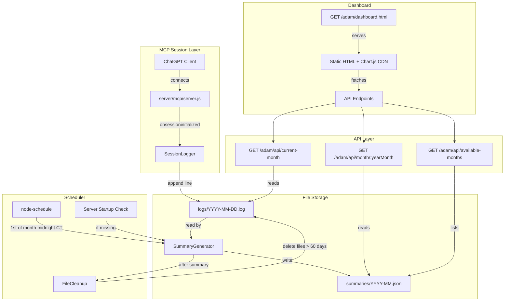
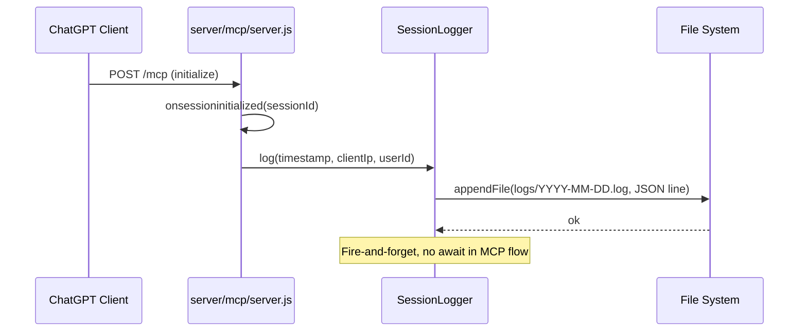
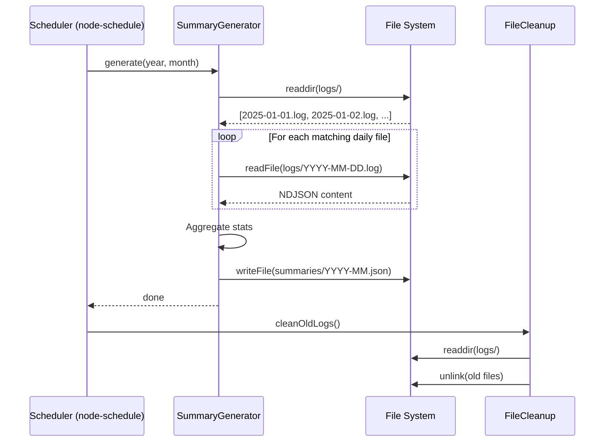
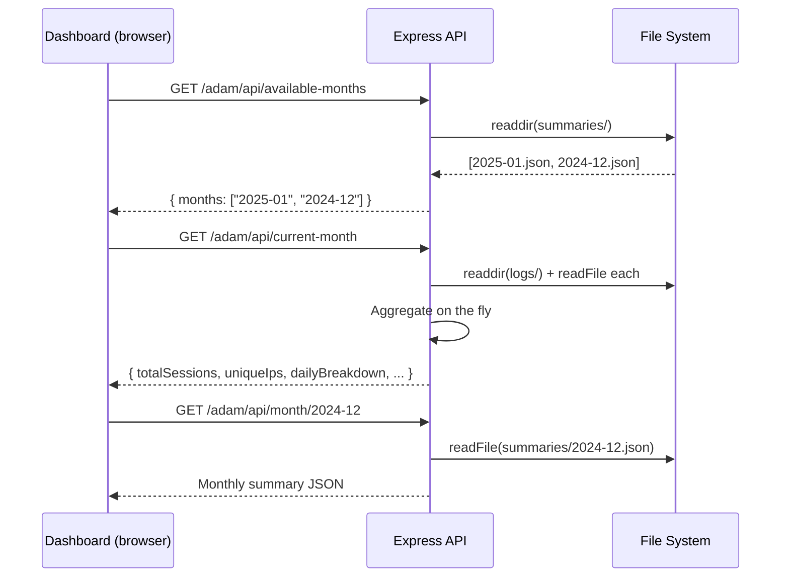

# Design Document: Session Analytics

## Overview

Session Analytics adds lightweight usage tracking to the xoxo MCP server. When ChatGPT connects via MCP, the session event is logged to a daily NDJSON file. A monthly scheduler generates summary JSON files from the daily logs, and a static dashboard (served at an obscure URL) visualizes the data using Chart.js. The feature requires no database — all state lives in flat files on disk.

The system integrates at two points: the `onsessioninitialized` callback in `server/mcp/server.js` for logging, and `server/index.js` for registering the scheduler and dashboard/API routes.

## Architecture



## Components and Interfaces

### Component 1: SessionLogger

**Purpose**: Appends a single NDJSON line to the daily log file when an MCP session is initialized.

```javascript
interface SessionLogger {
  log(timestamp, ip, userId): void
}
```

**Responsibilities**:
- Format timestamp in Central time (America/Chicago)
- Create `logs/` directory if it doesn't exist
- Append one JSON line to `logs/YYYY-MM-DD.log`
- Non-blocking — errors are logged to console but do not break MCP flow

**File Output Format** (`logs/2025-01-15.log`):
```
{"timestamp":"2025-01-15T14:23:07-06:00","ip":"203.0.113.42","userId":"user_abc123"}
{"timestamp":"2025-01-15T15:01:44-06:00","ip":"198.51.100.7","userId":"user_def456"}
```

### Component 2: SummaryGenerator

**Purpose**: Reads all daily log files for a given month and produces a monthly summary JSON file.

```javascript
interface SummaryGenerator {
  generate(year, month): Promise<void>
}
```

**Responsibilities**:
- Read all `logs/YYYY-MM-DD.log` files matching the target month
- Aggregate session counts, unique IPs, daily breakdown, hourly distribution, and returning vs new IPs
- Write result to `summaries/YYYY-MM.json`
- Create `summaries/` directory if it doesn't exist

### Component 3: Scheduler

**Purpose**: Triggers monthly summary generation and cleanup on a cron schedule and at startup.

```javascript
interface Scheduler {
  start(): void
}
```

**Responsibilities**:
- Use `node-schedule` to run at midnight Central on the 1st of each month
- On server startup, check if last month's summary file exists — generate if missing
- After summary generation, trigger file cleanup

### Component 4: FileCleanup

**Purpose**: Deletes daily log files older than 60 days.

```javascript
interface FileCleanup {
  cleanOldLogs(): Promise<void>
}
```

**Responsibilities**:
- List all files in `logs/`
- Parse date from filename (`YYYY-MM-DD.log`)
- Delete files where the date is more than 60 days in the past

### Component 5: Dashboard Routes

**Purpose**: Serves the static HTML dashboard and API endpoints.

```javascript
interface DashboardRoutes {
  register(app): void
}
```

**Responsibilities**:
- Serve static HTML at `GET /adam/dashboard.html`
- No authentication (security by obscurity)
- Register API endpoints for data retrieval

### Component 6: API Endpoints

**Purpose**: Provide aggregated analytics data to the dashboard.

| Endpoint | Method | Description |
|----------|--------|-------------|
| `/adam/api/current-month` | GET | Reads daily log files for the current month, returns aggregated data |
| `/adam/api/month/:yearMonth` | GET | Returns the monthly summary JSON for a past month |
| `/adam/api/available-months` | GET | Returns list of months that have summary files |

## Data Models

### Daily Log Entry (NDJSON line)

```javascript
{
  timestamp: String,  // ISO 8601 with Central time offset, e.g. "2025-01-15T14:23:07-06:00"
  ip: String,         // Client IP from x-forwarded-for or req.ip
  userId: String      // Authenticated user ID from req.auth.sub
}
```

### Monthly Summary (`summaries/YYYY-MM.json`)

```javascript
{
  month: String,              // "2025-01"
  generatedAt: String,        // ISO 8601 timestamp
  totalSessions: Number,      // Total session count for the month
  uniqueIps: Number,          // Count of distinct IPs
  uniqueIpList: [String],     // Array of distinct IP addresses
  dailyBreakdown: [           // One entry per day with data
    {
      date: String,           // "2025-01-15"
      sessions: Number,       // Session count for that day
      uniqueIps: Number       // Distinct IPs for that day
    }
  ],
  hourlyDistribution: {       // Keys "0" through "23"
    "0": Number,              // Sessions in hour 0 (midnight)
    "1": Number,
    // ... through "23"
  },
  returningIps: Number,       // IPs seen in previous months
  newIps: Number              // IPs not seen in previous months
}
```

### API Response: Current Month

Same shape as Monthly Summary, computed on-the-fly from daily log files.

### API Response: Available Months

```javascript
{
  months: [String]  // ["2025-01", "2024-12", ...] sorted descending
}
```

## Sequence Diagrams

### Session Logging Flow



### Monthly Summary Generation



### Dashboard Data Fetch



## Correctness Properties

*A property is a characteristic or behavior that should hold true across all valid executions of a system-essentially, a formal statement about what the system should do. Properties serve as the bridge between human-readable specifications and machine-verifiable correctness guarantees.*

### Property 1: Log Entry Completeness

*For any* session event with valid timestamp, IP, and userId inputs, the NDJSON line written to the daily log file SHALL contain exactly three fields (`timestamp`, `ip`, `userId`), all non-empty strings, with no additional fields.

**Validates: Requirements 1.2**

### Property 2: File Naming by Central Time

*For any* session event timestamp, the daily log filename used SHALL correspond to the Central_Time date of that timestamp, not the UTC date.

**Validates: Requirements 1.1, 1.5**

### Property 3: Summary Totals Consistency

*For any* set of valid daily log entries for a month, `totalSessions` in the generated summary SHALL equal the sum of all `sessions` values in the `dailyBreakdown` array, and `dailyBreakdown` SHALL contain one entry per day that had activity with correct per-day session counts.

**Validates: Requirements 2.2, 2.4, 7.1**

### Property 4: Unique IP Consistency

*For any* set of valid daily log entries and historical IP data, the generated summary SHALL satisfy: `uniqueIps` equals the length of `uniqueIpList`, `uniqueIpList` contains exactly the distinct IPs from the entries, and `returningIps + newIps` equals `uniqueIps`.

**Validates: Requirements 2.3, 2.6, 7.2, 7.3**

### Property 5: Hourly Distribution Completeness

*For any* set of valid daily log entries, the `hourlyDistribution` object in the generated summary SHALL contain exactly 24 keys ("0" through "23"), and the sum of all values SHALL equal `totalSessions`.

**Validates: Requirements 2.5, 7.4**

### Property 6: Cleanup Safety

*For any* set of files in the `logs/` directory and a given current date, FileCleanup SHALL delete only files matching the `YYYY-MM-DD.log` pattern whose date is more than 60 days in the past, and SHALL preserve all other files.

**Validates: Requirements 4.1, 4.2, 4.3**

### Property 7: Idempotent Summary Generation

*For any* set of daily log files, running summary generation multiple times for the same month SHALL produce byte-identical output.

**Validates: Requirements 2.9, 7.5**

### Property 8: Non-blocking Logging

*For any* file system error condition during logging, `SessionLogger.log()` SHALL never throw an exception that propagates to the caller.

**Validates: Requirements 1.4**

### Property 9: Invalid Line Resilience

*For any* daily log file containing a mix of valid and invalid JSON lines, the SummaryGenerator SHALL produce a summary that counts only the valid entries, ignoring malformed lines.

**Validates: Requirements 2.7**

### Property 10: Available Months Sorted Descending

*For any* set of monthly summary files in the `summaries/` directory, the `/adam/api/available-months` endpoint SHALL return them sorted in descending chronological order.

**Validates: Requirements 6.4**

## Error Handling

### Logging Failures

**Condition**: File system write fails during session logging (disk full, permissions)
**Response**: Log error to console. Do not throw — MCP session initialization must not be blocked.
**Recovery**: Next session attempt will retry file creation.

### Missing Log Files During Summary

**Condition**: A daily log file is missing or corrupted (invalid JSON lines)
**Response**: Skip invalid lines, log a warning. Generate summary from available valid data.
**Recovery**: Summary will be incomplete but functional. No data loss for valid entries.

### Summary File Already Exists

**Condition**: Summary generation runs but file already exists (e.g., manual re-run)
**Response**: Overwrite the existing summary file with fresh data.
**Recovery**: N/A — idempotent operation.

### API Endpoint Errors

**Condition**: Requested month has no summary file, or logs directory is empty
**Response**: Return appropriate HTTP status (404 for missing summary, 200 with empty data for current month with no sessions).
**Recovery**: N/A — client handles gracefully.

## Testing Strategy

### Unit Testing Approach

- **SessionLogger**: Mock `fs.appendFileSync`, verify correct file path and JSON format
- **SummaryGenerator**: Provide mock log file contents, verify aggregation logic (totals, unique IPs, hourly distribution, returning vs new)
- **FileCleanup**: Mock `fs.readdirSync` and `fs.unlinkSync`, verify only files > 60 days are deleted
- **API Endpoints**: Use supertest against Express app, mock file system reads

### Integration Testing Approach

- Write real log files to a temp directory, run summary generation, verify output JSON
- Start server, hit API endpoints, verify responses match expected shapes

## Performance Considerations

- Daily log files are append-only (fast writes, no locking needed)
- Summary generation reads all daily files for a month — at most 31 files, each likely small (< 1MB even with thousands of sessions/day)
- Current month API reads and aggregates on every request — acceptable for low-traffic internal dashboard
- No caching needed given expected usage patterns (single admin viewer)

## Security Considerations

- Dashboard at obscure URL (`/adam/dashboard.html`) — no authentication
- API endpoints also under `/adam/api/` — no authentication
- IP addresses and user IDs are stored in plain text on disk
- Log files should be excluded from version control (add to `.gitignore`)

## Dependencies

| Dependency | Purpose | Install |
|------------|---------|---------|
| `node-schedule` | Cron-style scheduling for monthly summary generation | `npm install node-schedule` |
| Chart.js | Dashboard charting | CDN (`<script src="https://cdn.jsdelivr.net/npm/chart.js">`) — no npm install |

## File Structure

```
server/
├── analytics/
│   ├── logger.js          # SessionLogger
│   ├── summary.js         # SummaryGenerator
│   ├── scheduler.js       # Scheduler + startup check
│   ├── cleanup.js         # FileCleanup
│   ├── routes.js          # Dashboard + API routes
│   └── dashboard.html     # Static HTML dashboard
├── logs/                  # Daily NDJSON files (gitignored)
│   ├── 2025-01-15.log
│   └── ...
└── summaries/             # Monthly summary JSON (gitignored)
    ├── 2025-01.json
    └── ...
```

## Integration Points

1. **`server/mcp/server.js`** — In the `onsessioninitialized` callback, call `SessionLogger.log(timestamp, clientIp, userId)` after the existing session setup logic.

2. **`server/index.js`** — After existing route registration:
   - `require('./analytics/routes')` and register with the Express app
   - `require('./analytics/scheduler')` and call `start()` to begin the cron job and run the startup check
