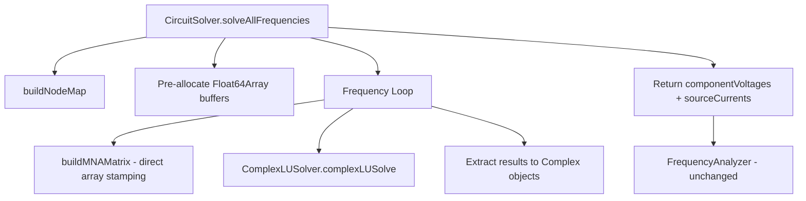

# Design: Simulation Solver Optimization

## Overview

This design replaces the mathjs-based matrix operations in `CircuitSolver` with a custom complex LU decomposition solver operating on flat `Float64Array` buffers. The current implementation spends 88.4% of pipeline time (817ms out of 924ms) in `math.lusolve()` and 6.9% (64ms) in `buildMNAMatrix` — both dominated by mathjs generic API overhead (`math.zeros()`, `math.index()`, `math.subset()`, `math.add()`, `math.subtract()`, `math.complex()`) rather than actual arithmetic.

A prototype LU solver on flat typed arrays achieved 14.3ms for all 251 frequency solves (57× faster than mathjs). This design formalizes that prototype into a production module and refactors `CircuitSolver` to use it, targeting a full pipeline time under 80ms.

### Key Design Decisions

1. **Flat Float64Array storage with split real/imaginary parts**: Complex matrices are stored as two separate `Float64Array` buffers (`Are`, `Aim`) in row-major order. This avoids object allocation per element and enables cache-friendly sequential access. Element `(i,j)` is accessed as `Are[i * n + j] + i * Aim[i * n + j]`. Split storage avoids interleaved access patterns that would halve effective cache line utilization.

2. **In-place LU factorization with partial pivoting**: The solver modifies the input matrix arrays in place during factorization, avoiding intermediate buffer allocation. Partial pivoting (row swaps based on largest column element) ensures numerical stability for the MNA matrices encountered in crossover circuits. A separate pivot index array tracks row permutations.

3. **Buffer pre-allocation and reuse across frequencies**: `solveAllFrequencies` allocates matrix buffers once before the frequency loop and zeros/refills them at each iteration. This eliminates ~500 typed array allocations (251 frequencies × 2 arrays per matrix) per simulation run.

4. **Preserve the `complex.js` result format**: The refactored `solveAllFrequencies` continues to return `{ frequencies, componentVoltages, sourceCurrents }` with `Complex` objects from `complex.js`, so `FrequencyAnalyzer` requires zero changes.

5. **Remove mathjs from CircuitSolver entirely**: The `import { create, all } from 'mathjs'` and `const math = create(all)` are removed from `CircuitSolver.js`. mathjs remains in `package.json` for any other project uses.

## Architecture

The refactored simulation pipeline has two modules in the solver hot path:



### Module Boundaries

- **ComplexLUSolver** (`src/simulation/ComplexLUSolver.js`): Pure math module. Takes flat typed arrays, returns flat typed arrays. No knowledge of circuits, components, or frequencies. Stateless — all state is in the caller's buffers.
- **CircuitSolver** (`src/simulation/CircuitSolver.js`): Orchestrates MNA construction and solving. Owns buffer lifecycle. Converts between circuit domain (components, nodes, admittances) and linear algebra domain (flat arrays). Returns `complex.js` objects for downstream consumption.
- **FrequencyAnalyzer** (`src/simulation/FrequencyAnalyzer.js`): Unchanged. Consumes the same `{ frequencies, componentVoltages, sourceCurrents }` format.

## Components and Interfaces

### ComplexLUSolver Module

**File**: `src/simulation/ComplexLUSolver.js`

```javascript
/**
 * Solve A*x = b for complex-valued A and b using LU decomposition with partial pivoting.
 * Operates on flat Float64Array buffers in row-major order.
 * Modifies Are and Aim in place during factorization.
 *
 * @param {number} n - Matrix dimension
 * @param {Float64Array} Are - Real part of n×n matrix, row-major (MODIFIED IN PLACE)
 * @param {Float64Array} Aim - Imaginary part of n×n matrix, row-major (MODIFIED IN PLACE)
 * @param {Float64Array} bre - Real part of RHS vector, length n
 * @param {Float64Array} bim - Imaginary part of RHS vector, length n
 * @returns {{ xre: Float64Array, xim: Float64Array }} Solution vector
 * @throws {Error} If matrix is singular (pivot magnitude < 1e-12)
 */
export function complexLUSolve(n, Are, Aim, bre, bim) { ... }

/**
 * Format a flat typed array complex matrix as a human-readable string.
 * @param {number} n - Matrix dimension
 * @param {Float64Array} Are - Real part, row-major
 * @param {Float64Array} Aim - Imaginary part, row-major
 * @returns {string} Formatted matrix string
 */
export function formatComplexMatrix(n, Are, Aim) { ... }

/**
 * Format a flat typed array complex vector as a human-readable string.
 * @param {number} n - Vector length
 * @param {Float64Array} bre - Real part
 * @param {Float64Array} bim - Imaginary part
 * @returns {string} Formatted vector string
 */
export function formatComplexVector(n, bre, bim) { ... }
```

**Algorithm**: Standard LU decomposition with partial pivoting:
1. For each column k = 0..n-1:
   - Find pivot: row with maximum |A[i][k]| magnitude for i = k..n-1
   - If pivot magnitude < 1e-12, throw singular matrix error
   - Swap rows k and pivot row in A, record in pivot array
   - Compute multipliers: L[i][k] = A[i][k] / A[k][k] for i = k+1..n-1
   - Update submatrix: A[i][j] -= L[i][k] * A[k][j] for i,j = k+1..n-1
2. Apply pivot permutation to b
3. Forward substitution: solve L*y = Pb
4. Back substitution: solve U*x = y

All complex arithmetic is done inline with scalar real/imaginary operations — no Complex object allocation.

### Refactored CircuitSolver

**File**: `src/simulation/CircuitSolver.js`

Key changes to existing methods:

#### `buildMNAMatrix(frequency, Are, Aim, bre, bim)`

Signature changes: accepts pre-allocated buffers as parameters instead of returning mathjs matrices.

```javascript
// Before (mathjs):
buildMNAMatrix(frequency) {
    const A = math.zeros(matrixSize, matrixSize);
    const b = math.zeros(matrixSize, 1);
    // ... math.index(), math.subset(), math.add(), math.subtract() ...
    return { A, b };
}

// After (flat arrays):
buildMNAMatrix(frequency, Are, Aim, bre, bim) {
    const n = this.matrixSize;
    // Zero the buffers
    Are.fill(0);
    Aim.fill(0);
    bre.fill(0);
    bim.fill(0);
    // ... direct index arithmetic: Are[i * n + j] += value ...
}
```

#### `addPassiveComponent(Are, Aim, admittance, n1, n2, n)`

```javascript
// Before:
addPassiveComponent(A, admittance, n1, n2) {
    A.subset(math.index(n1, n1), math.add(...));
}

// After:
addPassiveComponent(Are, Aim, admittanceRe, admittanceIm, n1, n2, n) {
    if (n1 !== null) {
        Are[n1 * n + n1] += admittanceRe;
        Aim[n1 * n + n1] += admittanceIm;
    }
    // ... etc
}
```

#### `addVoltageSource(Are, Aim, bre, bim, component, n1, n2, n)`

```javascript
// Before:
addVoltageSource(A, b, component, n1, n2) {
    A.subset(math.index(n1, currentIndex), math.complex(1, 0));
    b.subset(math.index(currentIndex, 0), math.complex(voltage, 0));
}

// After:
addVoltageSource(Are, Aim, bre, bim, component, n1, n2, n) {
    if (n1 !== null) {
        Are[n1 * n + currentIndex] = 1;
        Are[currentIndex * n + n1] = 1;
    }
    bre[currentIndex] = actualVoltage;
}
```

#### `solve(frequency, Are, Aim, bre, bim, profiler)`

```javascript
// Before:
solve(frequency, profiler) {
    const { A, b } = this.buildMNAMatrix(frequency);
    const x = math.lusolve(A, b);
    // ... math.index(), math.subset() to extract results ...
}

// After:
solve(frequency, Are, Aim, bre, bim, profiler) {
    this.buildMNAMatrix(frequency, Are, Aim, bre, bim);
    const { xre, xim } = complexLUSolve(this.matrixSize, Are, Aim, bre, bim);
    // ... direct index access: xre[index], xim[index] ...
}
```

#### `solveAllFrequencies(startFrequency, endFrequency, pointsPerDecade, profiler)`

Signature unchanged. Internally pre-allocates buffers:

```javascript
solveAllFrequencies(startFrequency, endFrequency, pointsPerDecade, profiler) {
    this.buildNodeMap();
    const n = this.matrixSize;

    // Pre-allocate buffers ONCE
    const Are = new Float64Array(n * n);
    const Aim = new Float64Array(n * n);
    const bre = new Float64Array(n);
    const bim = new Float64Array(n);

    this.frequencyPoints = this.generateFrequencyPoints(...);

    for (const frequency of this.frequencyPoints) {
        // solve() zeros and refills the buffers each iteration
        const result = this.solve(frequency, Are, Aim, bre, bim, profiler);
        perFrequencyResults.push(result);
    }

    // ... transpose to componentVoltages/sourceCurrents format (unchanged) ...
}
```

### Preserved Interfaces

The following are explicitly unchanged:

- `new CircuitSolver(circuit)` constructor signature
- `solveAllFrequencies(startFrequency, endFrequency, pointsPerDecade, profiler)` parameter list and return format
- `FrequencyAnalyzer` class — zero changes
- `SimulationProfiler` integration — profiler parameter still optional, same `startStage`/`endStage` calls
- `SchemaValidator` — still validates final outputs (per-frequency validation in `solve()` is removed as it was identified as unnecessary overhead in the parent spec's profiling)
- `interpolateZMA` export — still exported from CircuitSolver.js

## Data Models

### Flat Typed Array Matrix Format

The MNA matrix is stored as two `Float64Array` buffers in row-major order:

```
Are = Float64Array(n * n)  // Real parts
Aim = Float64Array(n * n)  // Imaginary parts

Element (i, j):
  real = Are[i * n + j]
  imag = Aim[i * n + j]
```

For the vivace circuit: n = 32 (31 nodes + 1 voltage source current), so each buffer is 32 × 32 = 1024 elements = 8 KB. Total matrix storage: 16 KB for A + 512 bytes for b = ~16.5 KB.

### RHS Vector Format

```
bre = Float64Array(n)  // Real parts
bim = Float64Array(n)  // Imaginary parts
```

### Solution Vector Format (returned by complexLUSolve)

```javascript
{ xre: Float64Array(n), xim: Float64Array(n) }
```

These are newly allocated by `complexLUSolve` (not the same buffers as `bre`/`bim`, since the input b is permuted during forward substitution).

### Unchanged Data Models

The `solveAllFrequencies` return format is unchanged:

```javascript
{
    frequencies: number[],                    // Array of frequency values
    componentVoltages: {
        [componentId: string]: Complex[]      // complex.js Complex objects per frequency
    },
    sourceCurrents: {
        [sourceId: string]: Complex[]         // complex.js Complex objects per frequency
    }
}
```


## Correctness Properties

*A property is a characteristic or behavior that should hold true across all valid executions of a system — essentially, a formal statement about what the system should do. Properties serve as the bridge between human-readable specifications and machine-verifiable correctness guarantees.*

### Property 1: Solver Round-Trip (A × x ≈ b)

*For any* valid non-singular complex matrix A of dimension n (where 1 ≤ n ≤ 64) and any complex vector b of length n, solving A·x = b with `complexLUSolve` and then computing the matrix-vector product A·x SHALL produce a result within 1e-10 of the original b per element.

**Validates: Requirements 1.6, 10.3**

### Property 2: Result Format Preservation

*For any* valid circuit containing at least one voltage source, one ground, and one passive component connected by wires, calling `solveAllFrequencies` SHALL return an object with: (a) a `frequencies` array of numbers, (b) a `componentVoltages` object where each value is an array of `complex.js` Complex instances with the same length as `frequencies`, and (c) a `sourceCurrents` object where each value is an array of `complex.js` Complex instances with the same length as `frequencies`.

**Validates: Requirements 5.1, 5.2**

### Property 3: Pretty Printer Completeness

*For any* complex matrix of dimension n (where 1 ≤ n ≤ 16) stored as flat Float64Arrays, calling `formatComplexMatrix` SHALL produce a string that contains a numeric representation of every element's real and imaginary parts. Similarly, *for any* complex vector of length n, calling `formatComplexVector` SHALL produce a string containing a numeric representation of every element's real and imaginary parts.

**Validates: Requirements 10.1, 10.2**

## Error Handling

### ComplexLUSolver Errors

- **Singular matrix**: When the pivot magnitude falls below 1e-12 during LU factorization, `complexLUSolve` throws an `Error` with a message including the matrix dimension and the pivot index where singularity was detected. Example: `"Singular matrix (n=32): pivot at index 15 has magnitude 2.3e-15"`.
- **Invalid input**: The solver does not validate input types for performance reasons. Callers are responsible for passing correctly sized `Float64Array` buffers. Passing wrong-sized arrays results in undefined behavior (out-of-bounds reads return `undefined`, which becomes `NaN` in arithmetic).

### CircuitSolver Errors

- **No ground node**: `buildNodeMap()` continues to throw `"Circuit must contain a ground node"` if no ground component exists.
- **Solve failure**: If `complexLUSolve` throws (singular matrix), `solve()` catches it and re-throws as `"Failed to solve circuit at {frequency} Hz: {message}"` — same behavior as the current mathjs-based code.
- **Per-frequency errors in solveAllFrequencies**: If `solve()` throws at a particular frequency, the error is logged with `console.error` and that frequency point is skipped — same behavior as current code.

### Preserved Error Behavior

All existing error paths in `CircuitSolver` are preserved:
- Missing ground → Error
- Component in 'open' state → excluded from matrix (no error)
- Component in 'short' state → very high conductance (1e12 siemens)
- Unknown component type → zero admittance (no error)
- Voltage source without matching map entry → silently skipped

## Testing Strategy

### Dual Testing Approach

This feature uses both property-based tests and integration tests:

- **Property-based tests** (fast-check): Verify the ComplexLUSolver's mathematical correctness across randomly generated matrices, the result format preservation across generated circuits, and the pretty printer completeness across random matrices/vectors.
- **Integration tests** (existing): The existing preservation and exploration property tests from the `simulation-performance` spec verify end-to-end numerical correctness against the golden reference and performance targets.

### Property-Based Testing Configuration

- **Library**: fast-check (already in devDependencies)
- **Minimum iterations**: 100 per property test
- **Tag format**: `Feature: simulation-solver-optimization, Property {number}: {property_text}`

### Property Test Plan

**Property 1: Solver Round-Trip**
- Generate random n (1–64), random non-singular n×n complex matrices (real and imaginary parts from uniform distribution), random b vectors
- Call `complexLUSolve(n, Are, Aim, bre, bim)`
- Compute A·x using the original (pre-factorization) matrix values — must snapshot A before calling solve since it modifies in place
- Assert each element of (A·x - b) has magnitude < 1e-10
- Edge cases covered by generator: n=1 (trivial), n=2 (2×2), large n near 64, matrices with large/small values

**Property 2: Result Format Preservation**
- Generate simple circuits (voltage source + resistor + ground, with random resistance values)
- Call `solveAllFrequencies` with a small frequency range
- Assert return has `frequencies` (number[]), `componentVoltages` (object with Complex[]), `sourceCurrents` (object with Complex[])
- Assert all Complex arrays have same length as frequencies array
- Assert each element is a `complex.js` Complex instance (has `.re` and `.im` properties and `.abs()` method)

**Property 3: Pretty Printer Completeness**
- Generate random n (1–16), random complex matrices and vectors
- Call `formatComplexMatrix` / `formatComplexVector`
- Assert the output string contains a numeric substring matching each element's real and imaginary parts (within formatting precision)

### Unit Tests

- **ComplexLUSolver**:
  - Known 2×2 and 3×3 systems with hand-computed solutions
  - Singular matrix detection (zero row, duplicate rows, zero diagonal)
  - Identity matrix solve (x should equal b)
  - Real-only matrix (imaginary parts all zero)
  - Purely imaginary matrix

- **Refactored CircuitSolver**:
  - Existing `CircuitSolver.spec.js` tests pass without modification (regression)
  - `buildMNAMatrix` fills typed array buffers correctly for a simple RC circuit
  - `solve` returns correct node voltages for known circuits
  - Buffer reuse: solving at two different frequencies produces different results (no cross-contamination)

- **No-mathjs verification**:
  - Static check: `CircuitSolver.js` does not contain `import.*mathjs` or `require.*mathjs`

### Integration Tests

- **Existing preservation tests** (`simulation-performance.preservation.property.spec.js`): Verify all outputs match golden reference within tolerance — these run the full pipeline including the refactored solver
- **Existing exploration test** (`simulation-performance.exploration.property.spec.js`): Verify pipeline completes in under 80ms
- **Benchmark verification** (`node benchmarks/simulation-benchmark.js --verify`): Independent golden reference comparison outside Jest
- **Full test suite** (`npm test`): No regressions in any existing tests

### Performance Verification

- Pipeline total < 80ms on vivace circuit (existing exploration test)
- LU solve total < 20ms for 251 frequencies (benchmark profiler output)
- Matrix construction total < 30ms for 251 frequencies (benchmark profiler output)
